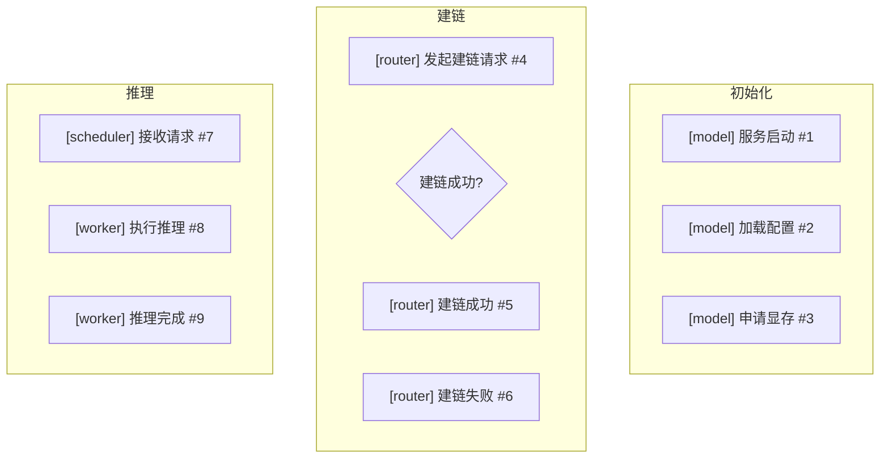
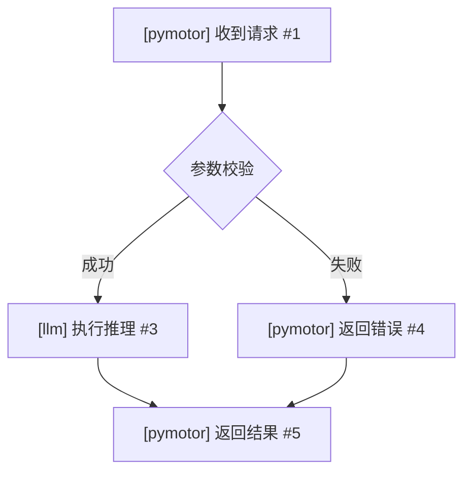

# Markdown 文档生成器

将日志表格转换为带 Mermaid 流程图的 Markdown 文档。

---

## 触发词

生成Markdown、生成文档、日志文档

---

## 输入

| 输入 | 必需 | 说明 |
|------|------|------|
| 校正后的日志表格 | 必需 | log-analysis-correct 输出的 CSV |
| 功能描述 | 必需 | 功能名称，如"缩P保D"、"PD建链" |
| 输出目录 | 必需 | Markdown 文件输出路径 |

---

## 输出

| 输出 | 格式 | 说明 |
|------|------|------|
| Markdown 文档 | .md 文件 | 含表格、流程图、关键说明 |

---

## Markdown 文档结构

```markdown
# [功能名称] 日志整理

## 概述
[功能描述、触发条件、整体流程]

## 涉及仓库与组件
- **repo1**: component1, component2
- **repo2**: component1

## 关键配置
| 配置项 | 值 | 说明 |
|--------|-----|------|
| ... | ... | ... |

---

## 日志表格
| 编号 | 出现场景 | 组件 | 日志级别 | 日志内容 | 出现阶段 | 含义 | 下一步走向 | 代码位置 |
|------|----------|------|---------|----------|----------|------|-----------|---------|
| ... | ... | ... | ... | ... | ... | ... | ... | ... |

---

## 逻辑流程图
[Mermaid flowchart]

---

## 关键说明
[触发条件、核心组件职责、典型场景示例]

---

## 校正报告（如有）
[仅当提供了实际日志时输出]

---

## 故障模式库
[摘要表格 + 关联图，仅当 log-analysis-fault-mode 完成后补充]
```

---

## Mermaid 流程图设计原则

### 4.1 按阶段分子图（subgraph）

每个 subgraph 对应表格中的一个"出现阶段"，节点标注 `函数名 #日志编号`：



### 4.2 颜色编码

| 颜色 | 含义 | 用于 |
|------|------|------|
| `#ffcccc`（浅红） | 错误、故障 | ERROR 日志节点 |
| `#ffcc99`（浅橙） | 判断点、告警 | 条件判断节点 |
| `#99ff99`（浅绿） | 成功、完成 | 正常结束节点 |
| `#ccccff`（浅蓝） | 外部系统/跨仓库 | 跨组件调用节点 |
| `#ffffff`（白色） | 正常操作 | 一般操作节点 |

### 4.3 节点标注格式

```
[组件] 函数描述 #日志编号
```

示例：
- `[llm/model] Link established #5`
- `[cmotor/router] Route request #12`
- `[vllm/scheduler] Schedule batch #20`

### 4.4 流程图画法

1. **顺序操作**：用 `-->`
2. **判断分支**：用 `--> |条件|` 标注分支条件
3. **循环**：用 ` subgraph 循环` 包裹
4. **并行**：用 `==>`



---

## 关键说明写法

每个阶段说明：
1. **触发条件**：什么情况下进入这个阶段
2. **核心组件**：谁主导这个阶段
3. **关键日志**：哪几条日志最能反映阶段状态

---

## 输出文件

文件路径：`{输出目录}/{功能名称}日志整理.md`

---

## 注意事项

- Mermaid 节点 ID 不能重复
- subgraph 名称用中文，与表格"出现阶段"列一致
- 日志编号引用要与 CSV 表格中的编号一致
- 颜色编码严格按规范使用
