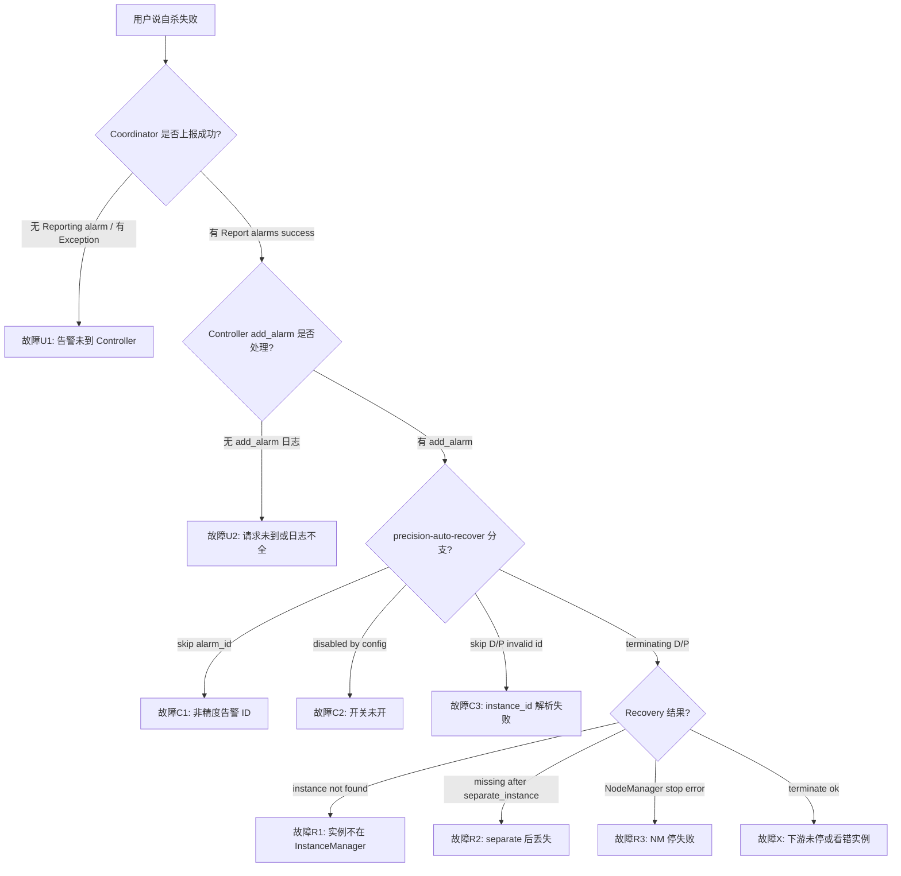

# Controller 精度自愈 terminate（「自杀」）失败 — 日志诊断

## 问题描述

**「自杀」在本场景的含义**：Controller 收到精度问题告警后，**主动**对指定 P/D 实例执行 `terminate_instance_for_recovery`（先逻辑隔离 `separate_instance`，再对各 NodeManager 发 `/node-manager/stop`）。**不是** Controller 进程自身 crash/OOM。

**涉及仓库/组件**：

| 阶段 | 组件 | 文件 |
|------|------|------|
| 上游上报 | Coordinator | `motor/coordinator/fault_tolerance/alarm/precision_alarm.py` |
| HTTP 上报 | Coordinator → Controller | `motor/coordinator/api_client/controller_api_client.py` |
| 接告警 | Controller API | `motor/controller/api_server/controller_api.py` (`_add_alarm`, `_maybe_precision_auto_recover`) |
| 执行终止 | Recovery | `motor/controller/core/recovery_service.py` |
| 停实例 | NodeManager 客户端 | `motor/controller/api_client/node_manager_api_client.py` |

**典型表现**：

- 精度链路已触发，但 P/D Pod/进程仍在跑
- 日志有 `precision-auto-recover: failed` 或 `Recovery: ... partial/failed`
- 只有 `disabled by config` / `skip alarm_id` / `invalid instance_id`，从未出现 `terminating D`

**关联问题**：

- 告警未到达 Controller → 先查 Coordinator `Reporting alarm` / `Report alarms success`
- 精度检测/拨测本身 → 见 Coordinator `PrecisionReporter` / `InternalRouterProbe` 日志
- 缩P保D、建链 → 本 skill 仅覆盖 **收到精度告警后的 terminate** 段

---

## 端到端因果链（先建立全局观）

```text
Coordinator: PrecisionReporter threshold → PrecisionAlarm.probe → report_alarms
    → POST /observability/add_alarm (alarm_id=0xFC001107)
Controller: add_alarm → _maybe_precision_auto_recover (若 precision_auto_recovery_enabled)
    → terminate_instance_for_recovery(D, "precision_alarm")
    → terminate_instance_for_recovery(P, "precision_alarm")  # p_instance_id 非空时
Recovery: separate_instance → NodeManagerApiClient.stop × N
```

**alarm_id 常量**：`PRECISION_ISSUE_ALARM_ID = "0xFC001107"`（`motor/common/alarm/precision_issue_alarm.py`）

**配置开关**：`motor_controller_config.precision_auto_recovery_enabled=true`（Controller 启动日志也有 `ControllerAPI: precision_auto_recovery_enabled=...`）

---

## 诊断入口日志

| 入口日志 | 组件 | 含义 | grep |
|----------|------|------|------|
| `precision-auto-recover: failed for D` | controller | D 实例 terminate 失败 | `grep "precision-auto-recover: failed" $LOG` |
| `Recovery: terminate_instance_for_recovery id=.* partial/failed` | controller | Recovery 层判定失败 | `grep "Recovery: terminate_instance_for_recovery.*failed" $LOG` |
| `Recovery: instance .* not found` | controller | InstanceManager 无此 id | `grep "Recovery: instance .* not found" $LOG` |
| `Error sending stop command to node manager` | controller | NM stop HTTP 异常 | `grep "Error sending stop command to node manager" $LOG` |
| `precision-auto-recover: disabled by config` | controller | 开关未开，不会杀 | `grep "precision-auto-recover: disabled" $LOG` |
| `Reporting alarm to controller` | coordinator | 开始上报 | `grep "Reporting alarm to controller" $LOG` |
| `Exception occurred while reporting alarms` | coordinator | 上报失败，Controller 收不到 | `grep "Exception occurred while reporting alarms" $LOG` |

**确认问题类型**：命中 `precision-auto-recover` 或 `Recovery:` 且与 `precision_alarm` / `0xFC001107` 同时间段 → 继续本 skill。

---

## 诊断决策树



---

## 分阶段诊断流程

### 阶段 U：Coordinator 是否把告警送到 Controller

| 步骤 | grep / 检查 | 预期 | 异常 → 根因 |
|------|-------------|------|-------------|
| U.1 | `PrecisionReporter: threshold reached` | 有则精度链已触发 | 无 → 问题在采样/检测，非本 skill |
| U.2 | `PrecisionAlarm: reporting alarm_id` | 准备上报 | 无 → probe 未走完 |
| U.3 | `Reporting alarm to controller.*0xFC001107` | 发往 controller | 无 → `report_alarms` 未调用或 standby 跳过（见 U.4） |
| U.4 | `The standby coordinator does not need to report alarms` | 备机不应出现（DEBUG） | 有且为主机场景 → 主备角色错误 |
| U.5 | `Report alarms success` | status=200 | 有 Exception → 网络/TLS/地址错 → **Controller 根本收不到** |

**standby 注意**：备 Coordinator `report_alarms` 直接 return，Controller 侧无任何日志。

---

### 阶段 C：Controller 是否进入 precision auto-recover

| 步骤 | grep | 预期 | 异常 → 根因 |
|------|------|------|-------------|
| C.1 | `add_alarm: alarm_id=.*precision_auto_recovery_enabled=` | 收到告警且打印开关 | 无 → 查 observability 路由/日志组件名 |
| C.2 | `precision-auto-recover: skip alarm_id` | 不应出现（精度场景） | 出现 → alarm_id 不是 `0xFC001107` |
| C.3 | `precision-auto-recover: disabled by config` | 不应出现（要自杀时） | 出现 → **配置未开**，不是执行失败 |
| C.4 | `precision-auto-recover: begin instance_id=` | 进入恢复逻辑 | 无 → 被 C.2/C.3 挡住 |
| C.5 | `invalid instance_id` / `skip D (empty` | 应有合法 D id | 出现 → **payload 里 instance_id 空或非数字** |
| C.6 | `skip P (empty p_instance_id` | CDP 场景 P 可为空 | 若业务要求杀 P 却无 p_id → Coordinator 上报字段问题 |

启动时核对：

```text
ControllerAPI: precision_auto_recovery_enabled=True
```

---

### 阶段 R：Recovery / NodeManager 是否真停掉

| 步骤 | grep | 预期 | 异常 → 根因 |
|------|------|------|-------------|
| R.1 | `precision-auto-recover: terminating D instance_id=` | 开始杀 D | 无 → 未进入 R（回到阶段 C） |
| R.2 | `Recovery: separate_instance id=.* reason=precision_alarm` | 逻辑隔离 | 无 → `terminate_instance_for_recovery` 未调到 |
| R.3 | `Recovery: instance .* not found` | 不应出现 | 出现 → **id 在 InstanceManager 不存在**（过期/未同步/写错 id） |
| R.4 | `Recovery: instance .* missing after separate_instance` | 不应出现 | 出现 → separate 逻辑异常 |
| R.5 | `Recovery: stop instance_id=.* node_mgr_count=` | 列出 NM 数量 | count=0 → 无 NM 可停 |
| R.6 | `Recovery: NodeManagerApiClient.stop instance_id=.* ok=True` | 每个 NM 成功 | 有 `ok=False` → 看 R.7 |
| R.7 | `Error sending stop command to node manager` | 不应出现 | 出现 → **NM 网络/端口/TLS/进程无响应** |
| R.8 | `Recovery: terminate_instance_for_recovery id=.* succeeded` | 整体成功 | partial/failed → 综合 R.6/R.7 |
| R.9 | `precision-auto-recover: D instance_id=.* terminate ok` | 上层确认 D 成功 | 有 `failed for D` → 与 R.8 一致 |

**代码注意**：`NodeManagerApiClient.stop` 在 HTTP 无异常时打 `Stop command sent`，**不校验 response 业务码**；若 NM 返回 200 但 body 表失败，日志仍可能显示 sent → 需结合 NM 侧日志交叉验证。

---

### 阶段 X：日志显示成功但「看起来没死」

| 可能 | 验证 |
|------|------|
| 杀错实例 id | 对比 `add_alarm instance_id` / `p_instance_id` 与实际 Pod |
| 只杀了 D 未杀 P | 查是否有 `skip P` 或 P terminate ok |
| NM stop 未真正杀进程 | 查 node-manager / engine 日志 |
| 杀完后又被拉起 | 查 K8s 重启策略或其它恢复流程 |

---

## 推荐 grep 一键串（Controller + Coordinator）

```bash
LOG=/path/to/logs   # 替换为实际目录或单文件

# 上游是否上报
grep -E "threshold reached|probe done|reporting alarm_id|Reporting alarm to controller|Report alarms success|Exception occurred while reporting alarms" "$LOG"

# Controller 是否接单并自杀
grep -E "add_alarm:|precision-auto-recover|Recovery:|Terminate instance|Error sending stop command" "$LOG"

# 排除：仅配置/告警类型问题
grep -E "disabled by config|skip alarm_id|invalid instance_id|skip D|skip P" "$LOG"
```

按时间戳把 **同一次** `instance_id` / `p_instance_id` 串成一条时间线再下结论。

---

## 诊断输出格式（必须遵循）

```markdown
## 结论
{一句话：自杀失败发生在哪一阶段，根因是什么}

## 证据链
1. {时间} Coordinator: {日志摘要}
2. {时间} Controller add_alarm: {摘要}
3. {时间} precision-auto-recover / Recovery: {摘要}

## 根因分类
- [ ] U 告警未到 Controller
- [ ] C 配置/告警ID/实例ID 未进入 terminate
- [ ] R InstanceManager 无实例 / separate 异常
- [ ] R NodeManager stop 失败
- [ ] X 日志成功但实际未停（杀错 id / NM 假成功 / 被拉起）

## 建议动作
{改配置 / 修 payload / 查 NM 网络 / 查 InstanceManager 同步 等，1-3 条}
```

---

## 快速诊断表

| 现象 | 最可能根因 | 关键日志 |
|------|------------|----------|
| 完全无 `precision-auto-recover` | 告警没到或未开开关 | 无 `Report alarms success` 或 `disabled by config` |
| 有 `begin` 无 `terminating D` | instance_id 无效 | `invalid instance_id` / `skip D` |
| 有 `terminating` 有 `failed for D` | Recovery/NM 失败 | `Recovery: ... partial/failed` + NM error |
| `instance not found` | Controller 实例表无此 id | `Recovery: instance X not found` |
| Coordinator 有 threshold，Controller 无 add_alarm | 上报失败或备机 | `Exception occurred while reporting alarms` |
| 只有 `terminate ok` 但实例还在 | NM 未真停或杀错 id | 对比 id + NM 日志 |

---

## 关联 skill

| 场景 | skill |
|------|-------|
| 全库 MindIE 日志分发 | `log-diagnosis-mindie` |
| Coordinator 精度/拨测 | 对话中 `InternalRouterProbe` / `PrecisionReporter` 日志表 |
| 缩P保D / 建链 | `log-diagnosis-shrink-p-reserve-d` / `log-diagnosis-pd-link-establishment` |

---

## 执行时注意

1. **先分清「没触发自杀」和「触发了但失败」**：`disabled` / `skip` 属于前者。
2. **Controller 与 Coordinator 日志都要看**：一半问题在 `report_alarms` 之前。
3. **P 实例 id 为空是设计允许**（CDP/PD_SEPARATE 侧可能不感知 P）；若期望杀 P，查 Coordinator `p_instance_id` 上报。
4. 本 skill 只读日志诊断，**不修改代码**；除非用户明确要求修复。
