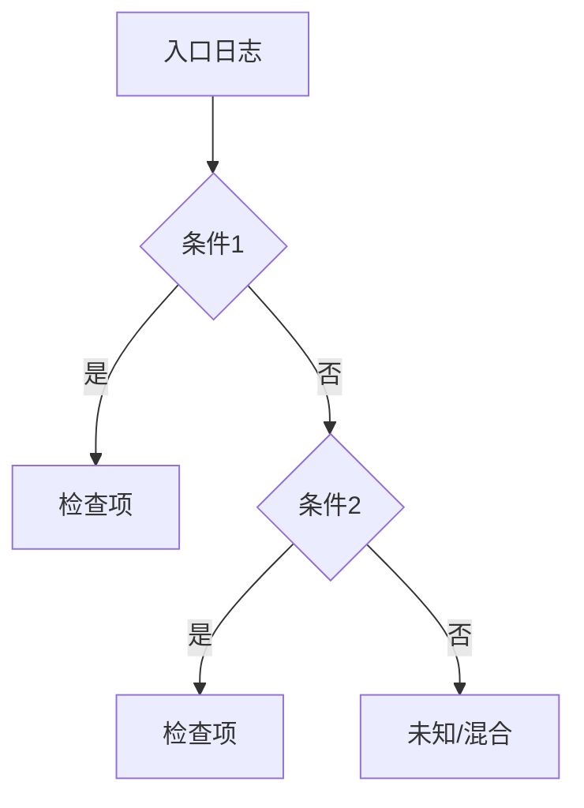

# 日志诊断 Skill 编写器

给定一个故障场景，快速生成符合 `log-diagnosis-framework` 规范的 skill 骨架。

---

## 使用方式

```
/skill log-diagnosis-skill-builder
[描述故障场景：问题现象、涉及组件、日志特征]
```

---

## Skill 生成流程

```
Step 1：解析故障场景
Step 2：提取关键要素
Step 3：生成 Skill 骨架
Step 4：输出模板
```

### Step 1：解析故障场景

从用户描述中提取：

- **问题类型**：是什么问题？（超时/崩溃/配置错误/...）
- **涉及组件**：哪些代码文件/模块？
- **入口日志**：用户看到的第一条异常日志是什么？
- **错误特征**：日志中的关键词/错误码/异常类型
- **影响范围**：是单节点还是多节点？爆炸半径多大？

### Step 2：提取关键要素

按以下模板填写：

```
问题ID（英文短横线）: [从问题类型提取]
问题名称（中文）: [一句话描述]
涉及仓库: [vllm-ascend / mindie-llm / pymotor / ...]
涉及组件: [具体文件名或模块名]
入口日志模式: [grep 用的正则或关键词]
错误类型: [TimeoutError / ValidationError / EngineDeadError / ...]
关联问题: [上游/下游/并发 的其他诊断方向]
```

### Step 3：生成 Skill 骨架

按 `log-diagnosis-framework` 规范生成以下章节：

1. **YAML Frontmatter** — name, description, parent
2. **问题描述** — 4要素（问题/组件/表现/关联）
3. **诊断入口日志** — 表格（含 grep 命令）
4. **诊断决策树** — Mermaid 格式的分支图
5. **诊断执行流程** — 分步骤的检查命令
6. **诊断输出格式** — 必须遵循的结论模板
7. **快速诊断表** — 常见现象→根因→修复 映射
8. **关联问题** — 与其他 skill 的关系

### Step 4：输出模板

完整输出一个 SKILL.md 文件内容，可直接保存。

---

## 快速模板

对于简单场景，可以直接套用以下模板生成骨架：

```markdown
---
name: log-diagnosis-{problem-id}
description: {一句话描述}。触发词：{关键词1}、{关键词2}。
---

# {问题名称}日志诊断

## 问题描述

**问题**：
**涉及组件**：
**典型表现**：
**关联问题**：

## 诊断入口日志

| 入口日志 | 组件 | 含义 | grep 命令 |
|----------|------|------|-----------|
| | | | `grep ""` |

## 诊断决策树



## 诊断执行流程

### 步骤 1：
| 检查项 | 命令 | 命中条件 |
|--------|------|----------|
| | | |

### 步骤 2：
...

## 诊断输出格式

必须包含：证据链（行号）、可信度、下一步行动（优先级P0/P1）、修复建议

## 快速诊断表

| 日志现象 | 根因 | 修复方法 | 优先级 |
|----------|------|----------|--------|

## 关联问题

| 关联问题 | 关联方向 | 对应 Skill |
|----------|----------|------------|
```

---

## 验证清单

生成的 skill 必须通过以下检查：

- [ ] YAML frontmatter 完整（name/description/parent）
- [ ] 有明确的入口日志（附 grep 命令）
- [ ] 有诊断决策树（覆盖主要分支）
- [ ] 有分步骤的执行流程（每步可执行）
- [ ] 输出格式包含：证据链（行号）、可信度、下一步行动、修复建议
- [ ] 关联问题已标注
- [ ] 不与现有 skill 重复
