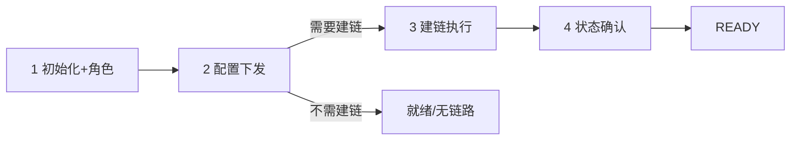
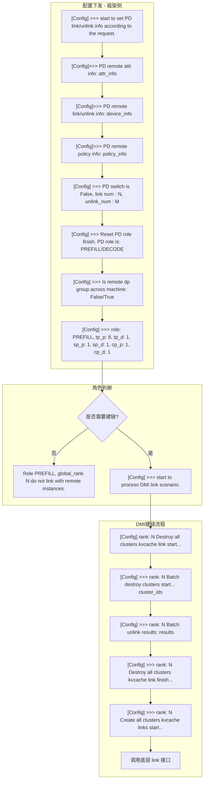
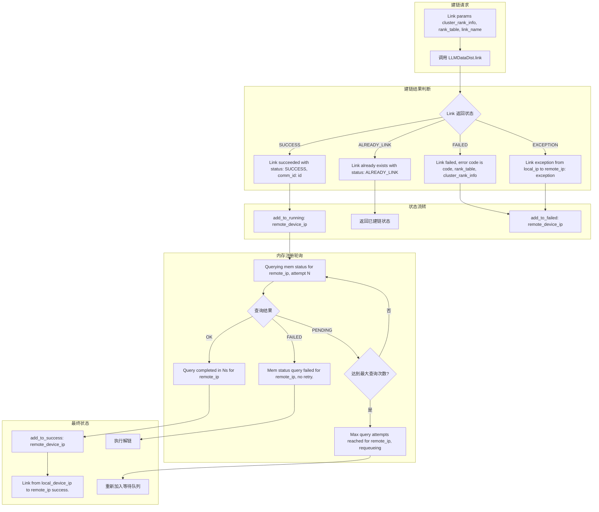
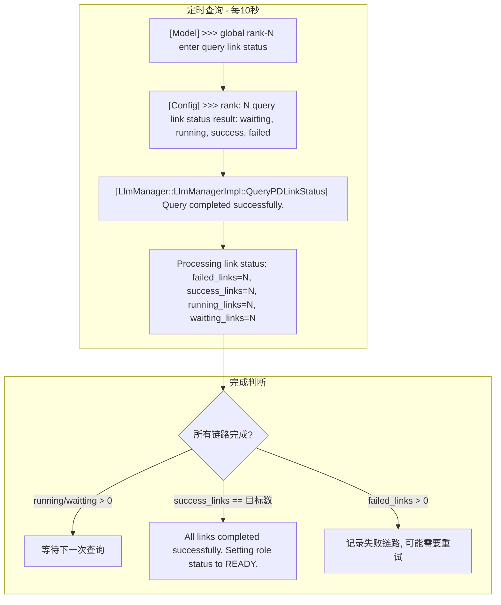
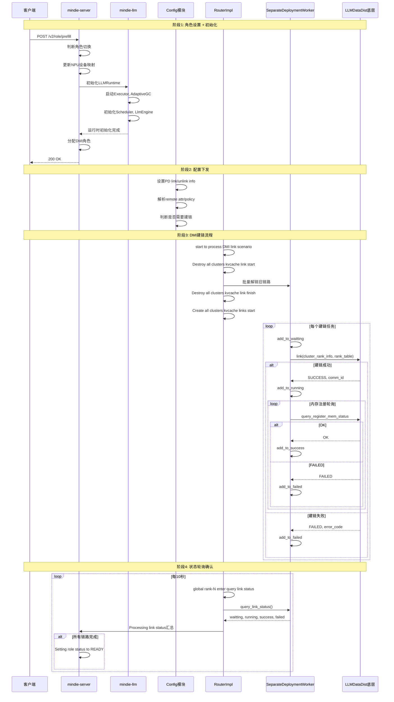
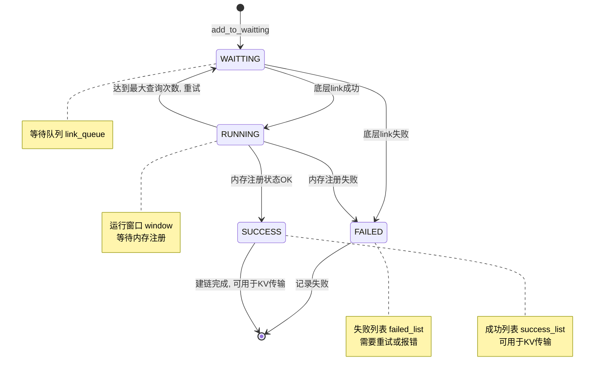
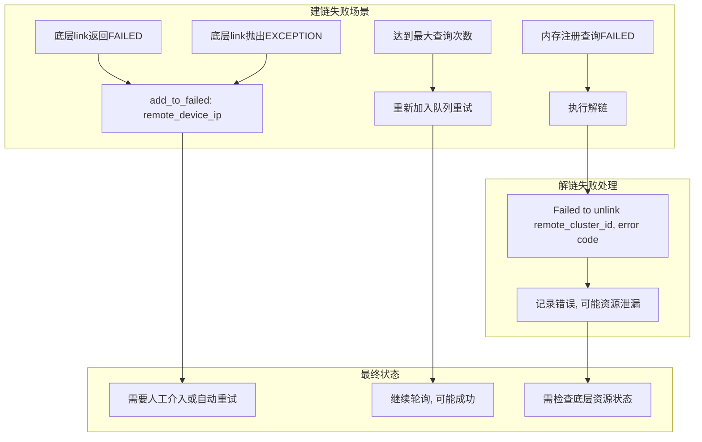

# PD 实例建链 — 日志定位指南

> **用途**：正文用于快速判断阶段与卡点；[附录](#四附录) 提供全量逐步日志明细与完整流程图（原 `PD实例建链流程图.md` 内容）。

## 目录

- [一、快速定位](#一快速定位先看这里)
- [二、分阶段详细定位](#二分阶段详细定位)
- [三、卡点速查](#三卡点速查卡在-x--查-y)
- [四、附录](#四附录)
  - [A. 涉及仓库与组件](#a-涉及仓库与组件)
  - [B. 关键配置](#b-关键配置排查时对照)
  - [C. 全量日志逐步明细](#c-全量日志逐步明细)
  - [D. 全量流程图（Mermaid）](#d-全量流程图mermaid)
  - [E. 关键节点索引](#e-关键节点索引)
  - [F. 故障场景流程](#f-故障场景流程)

---

## 一、快速定位（先看这里）

**用法**：在日志里按顺序找下面 4 步的「阶段标志日志」。**最后出现的那一步 = 当前大致卡在哪**；然后跳到 [§二](#二分阶段详细定位) 或 [§三](#三卡点速查卡在-x--查-y)。下钻顺序：**大框架（§一/§二）→ [全量表（附录 C）](#c-全量日志逐步明细) → [全量流程图（附录 D）](#d-全量流程图mermaid)**。

| 步骤 | 大阶段 | 标志日志（有任意一条即可认为「走到了」） | 正常应接着看到 | 没走到 → | 全量（表→图） |
|:----:|--------|------------------------------------------|----------------|----------|----------------|
| **1** | 系统初始化 + 角色设置 | `system init pd role success` 或 `Engine started and ready to accept requests` | 步骤 2 的配置日志 | [§2.1](#21-阶段-1系统初始化--角色设置) / [§三](#三卡点速查卡在-x--查-y) | [C.1](#c1-阶段-1系统初始化--角色设置全量日志) → [D.1](#d1-系统初始化--角色设置流程) |
| **2** | 配置下发 | `[Config] >>> start to set PD link/unlink info according to the request.` | 步骤 3 或「不需要建链」分支 | [§2.2](#22-阶段-2配置下发) / [§三](#三卡点速查卡在-x--查-y) | [C.2](#c2-阶段-2配置下发--dmi-建链入口全量日志) → [D.2](#d2-配置下发--建链流程) |
| **3** | 建链执行（含底层 link + 内存注册） | `Create all clusters kvcache links start` → `Link succeeded` / `add_to_running` | 步骤 4 的轮询汇总 | [§2.3](#23-阶段-3建链执行dmi--底层-link--内存注册) / [§三](#三卡点速查卡在-x--查-y) | [C.3](#c3-阶段-3底层建链--内存注册全量日志) → [D.3](#d3-底层建链详细流程) |
| **4** | 状态确认 / 就绪 | `Processing link status: ... success_links=N` → `All links completed successfully. Setting role status to READY.` | 流程结束，可收 KV 请求 | [§2.4](#24-阶段-4状态查询--就绪确认) / [§三](#三卡点速查卡在-x--查-y) | [C.4](#c4-阶段-4状态查询--完成确认全量日志) → [D.4](#d4-状态查询--完成确认流程) |

**一步判断口诀**：

- 只有 Server/LLM 启动日志、没有 Config → **还在步骤 1 或 2 之间**（角色/引擎未就绪或未下发配置）
- 有 Config、没有 `Create all clusters` → **步骤 2**（可能 `do not link with remote instances`，属正常跳过建链）
- 有 `Create...start`、长期没有 `success_links` 对齐 → **步骤 3**
- 有 `success_links` 但一直没有 `READY` → **步骤 4**

跨阶段总览图（表→图）：[D.5 完整时序图](#d5-完整时序图) · 链路状态：[D.6](#d6-链路状态流转图)

---

## 二、分阶段详细定位

> 每个大阶段：**先一句话目标**，再 **子环节表**（中等粒度）。下钻：**全量表 [附录 C](#c-全量日志逐步明细) → 全量流程图 [附录 D](#d-全量流程图mermaid)**。

### 2.1 阶段 1：系统初始化 + 角色设置

**在干什么**：客户端设 P/D 角色 → Server 更新 NPU 映射 → LLM Runtime/Engine 拉起来 → Server 完成 DMI 角色分配。

| 子环节 | 关键日志 | 正常含义 | 异常时常见下一步日志 |
|--------|----------|----------|----------------------|
| 角色 HTTP 入口 | `Receive request from ip:port` | 收到 `/v2/role/prefill` 或 `decode` | 无后续 → 请求未进业务逻辑 |
| 角色是否要切换 | `Whether the node's role needs to be switched: 0/1` | 0=同角色，1=需切换 | 卡在切换 → 查旧角色与请求是否一致 |
| NPU 设备映射 | `Handle update npu device ids` / `npu device ids size: N` | 设备 ID 列表已更新 | size=0 或 HealthChecker 报错 → 设备配置问题 |
| LLM 运行时 | `LLMRuntime init success` → `Engine started and ready to accept requests` | 引擎可接请求 | 中间任一 init failed → **阶段 1 失败，不会进入建链** |
| 角色分配收尾 | `system init pd role success` → `AssignDmiRole] Success` → `system update pd role to prefill/decode success` | Server 侧 PD 角色就绪 | 缺 `update pd role success` → 角色分配未完成 |

→ 全量表：[C.1](#c1-阶段-1系统初始化--角色设置全量日志) · 全量流程图：[D.1](#d1-系统初始化--角色设置流程)

---

### 2.2 阶段 2：配置下发

**在干什么**：Config 模块根据请求解析 link/unlink、policy、tp/sp/cp，判断本 rank 是否要与远端建链。

| 子环节 | 关键日志 | 正常含义 | 异常/分支 |
|--------|----------|----------|-----------|
| 开始解析 | `start to set PD link/unlink info according to the request` | 进入 PD 链路配置 | 没有这条 → 配置请求未到或未触发 |
| 远端信息落盘 | `PD remote attr/link/unlink/policy info` | 对端实例与策略已解析 | 信息为空或格式异常 → 请求体/拓扑配置错 |
| PD 开关与数量 | `PD switch is False, link num : N, unlink_num : M` | 本次要建/解几条链 | link num=0 且后续无建链 → **正常：本节点不需建链** |
| 角色与并行度 | `Reset PD role finish. PD role is: PREFILL/DECODE` + `role: PREFILL, tp_p: ...` | 本节点角色与并行参数 | 与预期 role/tp 不符 → 配置下发错误 |
| 是否建链分支 | `do not link with remote instances` **或** `start to process DMI link scenario` | 前者=跳过建链；后者=进入阶段 3 | 期望建链却只有前者 → 拓扑/rank/global_rank 判断为不需 link |

→ 全量表：[C.2](#c2-阶段-2配置下发--dmi-建链入口全量日志) · 全量流程图：[D.2](#d2-配置下发--建链流程)

---

### 2.3 阶段 3：建链执行（DMI + 底层 link + 内存注册）

**在干什么**：先批量解旧链 → 再 `Create all clusters` → 逐对远端 `link` → 轮询内存注册 → 进入 success/failed 列表。

| 子环节 | 关键日志 | 正常含义 | 异常时 |
|--------|----------|----------|--------|
| 清旧链 | `Destroy all clusters kvcache link start` → `Batch destroy` → `... finish` | 旧 KV 链路已清理 | 卡在 destroy → 旧链未释放，可能阻塞新建 |
| 发起新建链 | `Create all clusters kvcache links start` | 开始建链任务 | 有 finish 无 start → 逻辑未进入 worker |
| 底层 link | `Link succeeded with status: SUCCESS` / `ALREADY_LINK` | 传输层连通 | `FAILED` / `EXCEPTION` → 进 failed 列表，见 §三 |
| 进入运行窗口 | `add_to_running: remote_device_ip` | 等待内存注册 | 长期只有 running 无 success → 内存注册卡住 |
| 内存注册 | `Querying mem status... attempt N` → `Query completed in Ns` | 注册 OK | `Mem status query failed` → 解链；`Max query attempts` → 重排队列 |
| 单链路成功 | `add_to_success` + `Link from local_device_ip to remote_ip success` | 该对端可用 | 只有 failed 无 success → 对端或网络问题 |

→ 全量表：[C.3](#c3-阶段-3底层建链--内存注册全量日志) · 全量流程图：[D.3](#d3-底层建链详细流程)（状态机见 [D.6](#d6-链路状态流转图)）

---

### 2.4 阶段 4：状态查询 + 就绪确认

**在干什么**：定时（约 10s）汇总 waitting/running/success/failed，全部成功后置 READY。

| 子环节 | 关键日志 | 正常含义 | 异常时 |
|--------|----------|----------|--------|
| 进入轮询 | `[Model] >>> global rank-N enter query link status` | 本 rank 开始查状态 | 从不出现 → 未进入轮询线程/定时任务 |
| 汇总结果 | `query link status result: waitting, running, success, failed` | 四列表计数 | running/waitting 长期 >0 → 阶段 3 未跑完 |
| 处理汇总 | `Processing link status: failed_links=N, success_links=N, ...` | 全局进度 | failed_links>0 → 见 §三「部分失败」 |
| 完全就绪 | `All links completed successfully. Setting role status to READY.` | **建链流程成功结束** | 有 success 无 READY → 成功数未达目标或 Server 未切状态 |

→ 全量表：[C.4](#c4-阶段-4状态查询--完成确认全量日志) · 全量流程图：[D.4](#d4-状态查询--完成确认流程)

---

## 三、卡点速查（卡在 X → 查 Y）

| 你卡在这里（现象 / 最后一条典型日志） | 说明落在哪个大阶段 | 优先查什么 | 常见原因 |
|--------------------------------------|-------------------|------------|----------|
| 没有 `Engine started and ready to accept requests` | 步骤 1 | LLM 启动日志里第一条 ERROR；Executor/Scheduler init | 模型路径、rank、NPU 资源 |
| 有引擎就绪，没有 `start to set PD link/unlink info` | 1→2 之间 | 谁触发 Config：请求是否带 PD link 信息 | 配置请求未下发、角色未 update 成功 |
| 只有 `do not link with remote instances` | 步骤 2（分支） | 是否**本来就不需要**建链 | global_rank/拓扑配置为不 link；**不一定是故障** |
| 有 `Create...start`，没有 `Link succeeded` | 步骤 3·底层 | 对端 IP、rank_table、cluster_rank_info；网络 | 对端未起、防火墙、参数不一致 |
| `Link succeeded` 后长期 `add_to_running`，无 `Query completed` | 步骤 3·内存注册 | `Querying mem status` 次数与 FAILED/PENDING | 远端内存未注册、查询超时 |
| `add_to_failed` 或 `Mem status query failed` | 步骤 3·失败 | 是否伴随解链 `Failed to unlink` | 注册失败触发解链；解链失败可能泄漏 |
| `Max query attempts reached, requeueing` | 步骤 3·重试 | 是否最终进 success；轮询间隔 | 慢路径重试，可能最终成功 |
| `failed_links>0` 但 `success_links` 也在涨 | 步骤 4 | 哪几条 remote_ip 在 failed_list | 部分对端失败，未达「全部成功」 |
| `success_links` 已满，没有 `READY` | 步骤 4→收尾 | Server 侧 `Setting role status` 是否执行 | 汇总逻辑与目标 link 数不一致 |

**排查顺序建议**（与 §一 表格一致）：

`角色/引擎就绪` → `Config 是否下发、是否要 link` → `Create/Link/内存注册` → `轮询汇总与 READY`

---

## 四、附录

### A. 涉及仓库与组件

| 仓库 | 组件 | 本特性职责 |
|------|------|------------|
| mindie-server | InferInstance / LlmManager | 角色 API、READY 状态 |
| mindie-llm | Config / Router | PD 配置解析、DMI 流程编排 |
| mindie-llm | SeparateDeploymentWorker | link 队列、内存注册轮询 |
| 底层 | LLMDataDist | `link` / `query_register_mem_status` |

### B. 关键配置（排查时对照）

| 配置项 | 日志中的体现 | 说明 |
|--------|--------------|------|
| PD switch | `PD switch is False/True` | 是否走 PD 建链逻辑 |
| link / unlink 数量 | `link num : N, unlink_num : M` | 本次建链/解链规模 |
| 本节点角色 | `PD role is: PREFILL/DECODE` | P 节点与 D 节点建链方向不同 |
| 并行度 | `tp_p, tp_d, sp_p, sp_d, cp_p, cp_d` | 与 rank_table 一致性 |
| 跨机 dp | `Is remote dp group across machine` | 影响 link 拓扑判断 |

---

### C. 全量日志逐步明细

按执行顺序列出各步日志原文（`N`/`id`/`ip` 等为运行时占位）。对应正文 [§二](#二分阶段详细定位) 四个大阶段。  
**阅读链**：§一/§二（大框架）→ **本附录 C（全量表）** → [附录 D（全量流程图）](#d-全量流程图mermaid)

#### C.1 阶段 1：系统初始化 + 角色设置（全量日志）

← [§一 步骤 1](#一快速定位先看这里) · [§2.1](#21-阶段-1系统初始化--角色设置) · 流程图 → [D.1](#d1-系统初始化--角色设置流程)

| 序号 | 子模块 | 日志原文 / 动作 | 说明 |
|:----:|--------|-----------------|------|
| 1 | 外部请求 | 客户端发送 `POST /v2/role/prefill` 或 `/v2/role/decode` | 角色设置 API 入口 |
| 2 | Server·角色设置 | `Receive request from ip:port` | 收到角色请求 |
| 3 | Server·角色设置 | 判断 `Previous role vs Request role` | 分支：相同→序号4；不同→序号5 |
| 4 | Server·角色设置 | `Whether the node's role needs to be switched: 0` | 无需切换角色 |
| 5 | Server·角色设置 | `Whether the node's role needs to be switched: 1` | 需要切换角色 |
| 6 | Server·角色设置 | `linkingLinkIP_ size is N` | 待建链 IP 列表规模 |
| 7 | Server·角色设置 | `Handle update npu device ids request` | 处理 NPU 设备 ID 更新 |
| 8 | Server·角色设置 | `npu device ids size: N` | 设备 ID 数量 |
| 9 | Server·角色设置 | `HealthChecker: NPU Device Card IDs` | 健康检查设备卡 |
| 10 | LLM·运行时 | `LLMRuntime init success!` | Runtime 初始化成功 |
| 11 | LLM·运行时 | `InitModelConfig: maxSeqLen, maxInputTokenLen` | 模型配置加载 |
| 12 | LLM·运行时 | `Executor instance init with rankIdx N` | Executor 按 rank 初始化 |
| 13 | LLM·运行时 | `Execute command: mindie_llm_backend --local_rank N` | 拉起 backend 进程 |
| 14 | LLM·运行时 | `Adaptive GC initialized` | 自适应 GC 初始化 |
| 15 | LLM·运行时 | `Adaptive GC started` | 自适应 GC 启动 |
| 16 | LLM·运行时 | `SelfAttnBlockManager init success!` | 注意力块管理器就绪 |
| 17 | LLM·运行时 | `Policy create success!` | 调度策略创建成功 |
| 18 | LLM·运行时 | `Scheduler init success!` | Scheduler 初始化成功 |
| 19 | LLM·运行时 | `LlmEngine init succeeds! N enginePerDPs are created` | LlmEngine 创建完成 |
| 20 | LLM·运行时 | `[LlmEngine]Start thread(N) successfully.` | 引擎线程启动 |
| 21 | LLM·运行时 | `[LlmEngine]Engine thread(s) start successfully.` | 引擎线程组就绪 |
| 22 | LLM·运行时 | `[LaunchLlmEngine] Engine started and ready to accept requests.` | **引擎可接请求**（§一 步骤 1 标志） |
| 23 | LLM·运行时 | `LLMRuntime thread start success!` | Runtime 主线程启动 |
| 24 | Server·角色完成 | `system init pd role success` | PD 角色初始化成功（§一 步骤 1 标志） |
| 25 | Server·角色完成 | `AddDevicesToRequestGlobalIpInfo: role, localInstanceId, localDeviceIps...` | 设备 IP 写入全局信息 |
| 26 | Server·角色完成 | `hostIpInfo dpInstanceId is N` | DP 实例 ID |
| 27 | Server·角色完成 | `[LlmManagerImpl::UpdateEngineInfo] EXECUTE_TYPE is N` | 更新引擎执行类型 |
| 28 | Server·角色完成 | `[LlmManagerImpl::UpdateEngineInfo] Success.` | 引擎信息更新成功 |
| 29 | Server·角色完成 | `[ProcessFailLinkIp] All link ips succeed.` | 失败 link IP 处理完成 |
| 30 | Server·角色完成 | `[InferInstance::AssignDmiRole] Success.` | DMI 角色分配成功 |
| 31 | Server·角色完成 | `system update pd role to prefill/decode success` | **角色更新完成**，可进入配置下发 |

→ 全量流程图：[D.1](#d1-系统初始化--角色设置流程)

#### C.2 阶段 2：配置下发 + DMI 建链入口（全量日志）

← [§一 步骤 2](#一快速定位先看这里) · [§2.2](#22-阶段-2配置下发) · 流程图 → [D.2](#d2-配置下发--建链流程)

| 序号 | 子模块 | 日志原文 | 说明 |
|:----:|--------|----------|------|
| 32 | Config·框架侧 | `[Config] >>> start to set PD link/unlink info according to the request.` | **配置下发开始**（§一 步骤 2 标志） |
| 33 | Config·框架侧 | `[Config]>>> PD remote attr info: attr_info` | 远端属性 |
| 34 | Config·框架侧 | `[Config]>>> PD remote link/unlink info: device_info` | 远端设备 link/unlink |
| 35 | Config·框架侧 | `[Config]>>> PD remote policy info: policy_info` | 远端策略 |
| 36 | Config·框架侧 | `[Config] >>> PD switch is False, link num : N, unlink_num : M` | PD 开关与建链数量 |
| 37 | Config·框架侧 | `[Config] >>> Reset PD role finish. PD role is: PREFILL/DECODE` | 重置后的本节点角色 |
| 38 | Config·框架侧 | `[Config] >>> Is remote dp group across machine: False/True` | 是否跨机 DP 组 |
| 39 | Config·框架侧 | `[Config] >>> role: PREFILL, tp_p: 8, tp_d: 1, sp_p: 1, sp_d: 1, cp_p: 1, cp_d: 1` | 并行度参数 |
| 40 | 角色判断 | 是否需要建链？ | 否→序号41；是→序号42 |
| 41 | 角色判断 | `Role PREFILL, global_rank N do not link with remote instances.` | **不需建链**（正常结束建链流程） |
| 42 | DMI 入口 | `[Config] >>> start to process DMI link scenario.` | 进入 DMI 建链（接阶段 3） |
| 43 | DMI·清旧链 | `[Config] rank: N Destroy all clusters kvcache link start...` | 开始销毁旧集群链路 |
| 44 | DMI·清旧链 | `[Config] >>> rank: N Batch destroy clusters start... cluster_ids` | 批量解链开始 |
| 45 | DMI·清旧链 | `[Config] >>> rank: N Batch unlink results: results` | 批量解链结果 |
| 46 | DMI·清旧链 | `[Config] >>> rank: N Destroy all clusters kvcache link finish...` | 旧链销毁完成 |
| 47 | DMI·新建链 | `[Config] >>> rank: N Create all clusters kvcache links start...` | **开始建新链**（§一 步骤 3 标志） |
| 48 | DMI·新建链 | 调用底层 link 接口 | 进入 Worker / LLMDataDist（见 C.3） |

→ 全量流程图：[D.2](#d2-配置下发--建链流程)

#### C.3 阶段 3：底层建链 + 内存注册（全量日志）

← [§一 步骤 3](#一快速定位先看这里) · [§2.3](#23-阶段-3建链执行dmi--底层-link--内存注册) · 流程图 → [D.3](#d3-底层建链详细流程)

| 序号 | 子模块 | 日志原文 / 动作 | 说明 |
|:----:|--------|-----------------|------|
| 49 | 建链请求 | `Link params cluster_rank_info, rank_table, link_name` | 组装 link 参数 |
| 50 | 建链请求 | 调用 `LLMDataDist.link` | 底层建链调用 |
| 51 | 建链结果 | `Link succeeded with status: SUCCESS, comm_id: id` | 建链成功 |
| 52 | 建链结果 | `Link already exists with status: ALREADY_LINK` | 链路已存在 |
| 53 | 建链结果 | `Link failed, error code is code, rank_table, cluster_rank_info` | 建链失败 |
| 54 | 建链结果 | `Link exception from local_ip to remote_ip: exception` | 建链异常 |
| 55 | 状态流转 | `add_to_running: remote_device_ip` | 进入 running，等待内存注册 |
| 56 | 状态流转 | 返回已建链状态（ALREADY_LINK 路径） | 跳过注册或走已有链路逻辑 |
| 57 | 状态流转 | `add_to_failed: remote_device_ip` | 进入失败列表 |
| 58 | 内存注册 | `Querying mem status for remote_ip, attempt N` | 轮询内存注册状态 |
| 59 | 内存注册 | `Query completed in Ns for remote_ip` | 注册查询 OK |
| 60 | 内存注册 | `Mem status query failed for remote_ip, no retry.` | 注册失败，不重试 |
| 61 | 内存注册 | `Max query attempts reached for remote_ip, requeueing` | 达最大次数，重新入队 |
| 62 | 最终状态 | `add_to_success: remote_device_ip` | 加入成功列表 |
| 63 | 最终状态 | `Link from local_device_ip to remote_ip success.` | 单对端链路完成 |
| 64 | 最终状态 | 执行解链（注册失败等） | 清理失败链路 |
| 65 | 最终状态 | 重新加入等待队列 | 等待下次 link 重试 |

**链路队列状态**（与日志列表对应）：`add_to_waitting` →（link 成功）→ `add_to_running` →（内存 OK）→ `add_to_success`；失败路径 → `add_to_failed`。

→ 全量流程图：[D.3](#d3-底层建链详细流程) · 状态机：[D.6](#d6-链路状态流转图)

#### C.4 阶段 4：状态查询 + 完成确认（全量日志）

← [§一 步骤 4](#一快速定位先看这里) · [§2.4](#24-阶段-4状态查询--就绪确认) · 流程图 → [D.4](#d4-状态查询--完成确认流程)

| 序号 | 子模块 | 日志原文 / 动作 | 说明 |
|:----:|--------|-----------------|------|
| 66 | 定时查询 | `[Model] >>> global rank-N enter query link status` | 约每 10s 进入查询 |
| 67 | 定时查询 | `[Config] >>> rank: N query link status result: waitting, running, success, failed` | 四队列计数 |
| 68 | 定时查询 | `[LlmManager::LlmManagerImpl::QueryPDLinkStatus] Query completed successfully.` | Manager 查询完成 |
| 69 | 定时查询 | `Processing link status: failed_links=N, success_links=N, running_links=N, waitting_links=N` | **汇总进度**（§一 步骤 4） |
| 70 | 完成判断 | `running/waitting > 0` → 等待下一次查询 | 建链尚未全部结束 |
| 71 | 完成判断 | `success_links == 目标数` | 成功数达标 |
| 72 | 完成判断 | `All links completed successfully. Setting role status to READY.` | **全流程就绪** |
| 73 | 完成判断 | `failed_links > 0` → 记录失败链路，可能需要重试 | 部分失败 |

→ 全量流程图：[D.4](#d4-状态查询--完成确认流程)

#### C.5 故障相关日志（全量）

← [§三](#三卡点速查卡在-x--查-y) · 流程图 → [F](#f-故障场景流程)

| 序号 | 触发条件 | 日志 / 动作 | 说明 |
|:----:|----------|-------------|------|
| F1 | 底层 link 返回 FAILED | `add_to_failed: remote_device_ip` | 需重试或人工介入 |
| F2 | 底层 link 抛出 EXCEPTION | 同上 | 查网络与对端 |
| F3 | 内存注册查询 FAILED | 执行解链 | 避免脏链路 |
| F4 | 达到最大查询次数 | 重新加入队列重试 | 可能后续成功 |
| F5 | 解链失败 | `Failed to unlink remote_cluster_id, error code` | 可能资源泄漏，查底层 |

→ 全量流程图：[F](#f-故障场景流程)

---

### D. 全量流程图（Mermaid）

← 全量表：[附录 C](#c-全量日志逐步明细) · 大框架：[§一](#一快速定位先看这里) / [§二](#二分阶段详细定位)

#### D.1 系统初始化 + 角色设置流程

← 全量表 [C.1](#c1-阶段-1系统初始化--角色设置全量日志)

```mermaid
flowchart TB
    subgraph 外部请求
        A[客户端发送 POST /v2/role/prefill 或 /v2/role/decode]
    end

    subgraph Server侧 - 角色设置
        B[Receive request from ip:port]
        C{Previous role vs Request role}
        C -->|相同| D[Whether the node's role needs to be switched: 0]
        C -->|不同| E[Whether the node's role needs to be switched: 1]
        D --> F[linkingLinkIP_ size is N]
        E --> F
        F --> G[Handle update npu device ids request]
        G --> H[npu device ids size: N]
        H --> I[HealthChecker: NPU Device Card IDs]
    end

    subgraph LLM侧 - 运行时初始化
        J[LLMRuntime init success!]
        K[InitModelConfig: maxSeqLen, maxInputTokenLen]
        L[Executor instance init with rankIdx N]
        M[Execute command: mindie_llm_backend --local_rank N]
        N[Adaptive GC initialized]
        O[Adaptive GC started]
        P[SelfAttnBlockManager init success!]
        Q[Policy create success!]
        R[Scheduler init success!]
        S[LlmEngine init succeeds! N enginePerDPs are created]
        T["[LlmEngine]Start thread(N) successfully."]
        U["[LlmEngine]Engine thread(s) start successfully."]
        V["[LaunchLlmEngine] Engine started and ready to accept requests."]
        W[LLMRuntime thread start success!]
    end

    subgraph Server侧 - 角色分配完成
        X[system init pd role success]
        Y[AddDevicesToRequestGlobalIpInfo: role, localInstanceId, localDeviceIps...]
        Z[hostIpInfo dpInstanceId is N]
        AA["[LlmManagerImpl::UpdateEngineInfo] EXECUTE_TYPE is N"]
        AB["[LlmManagerImpl::UpdateEngineInfo] Success."]
        AC["[ProcessFailLinkIp] All link ips succeed."]
        AD["[InferInstance::AssignDmiRole] Success."]
        AE[system update pd role to prefill/decode success]
    end

    A --> B --> C --> D & E --> F --> G --> H --> I
    I --> J --> K --> L --> M --> N --> O --> P --> Q --> R --> S --> T --> U --> V --> W
    W --> X --> Y --> Z --> AA --> AB --> AC --> AD --> AE
```

#### D.2 配置下发 + 建链流程

← 全量表 [C.2](#c2-阶段-2配置下发--dmi-建链入口全量日志)

#### D.3 底层建链详细流程

← 全量表 [C.3](#c3-阶段-3底层建链--内存注册全量日志)

#### D.4 状态查询 + 完成确认流程

← 全量表 [C.4](#c4-阶段-4状态查询--完成确认全量日志)

#### D.5 完整时序图

← 全量表 [附录 C](#c-全量日志逐步明细)（跨阶段 C.1–C.4）

#### D.6 链路状态流转图

← 全量表 [C.3](#c3-阶段-3底层建链--内存注册全量日志)（队列状态）

---

### E. 关键节点索引

| 阶段 | 关键日志 | 说明 |
|------|----------|------|
| **角色设置** | `system update pd role to {role} success` | Server 侧完成角色分配 |
| **运行时初始化** | `Engine started and ready to accept requests` | LLM 引擎就绪 |
| **配置下发** | `start to set PD link/unlink info` | 开始解析建链配置 |
| **建链开始** | `Create all clusters kvcache links start` | 开始创建新链路 |
| **底层建链** | `Link succeeded with status: SUCCESS` | 底层链路建立成功 |
| **内存注册** | `Query completed in Ns` | 内存注册完成 |
| **建链成功** | `add_to_success: remote_device_ip` | 加入成功列表 |
| **状态轮询** | `Processing link status: success_links=N` | 汇总链路状态 |
| **完全就绪** | `All links completed successfully. Setting role status to READY` | 所有链路完成，角色就绪 |

---

### F. 故障场景流程

