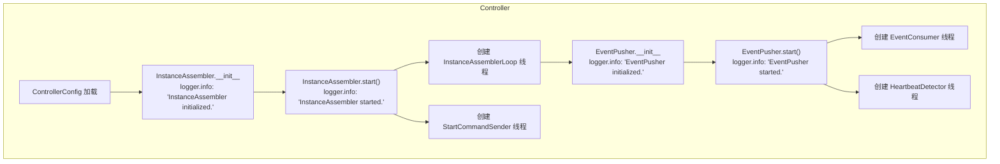
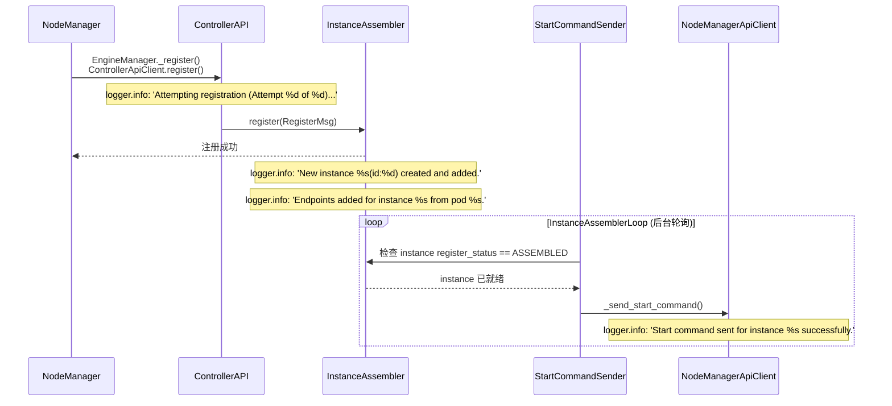
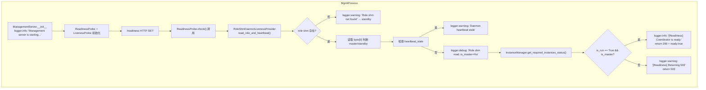
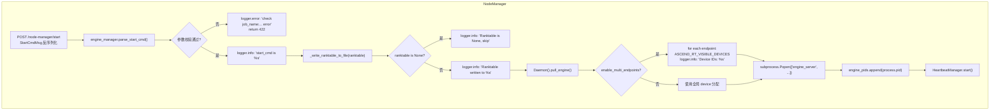
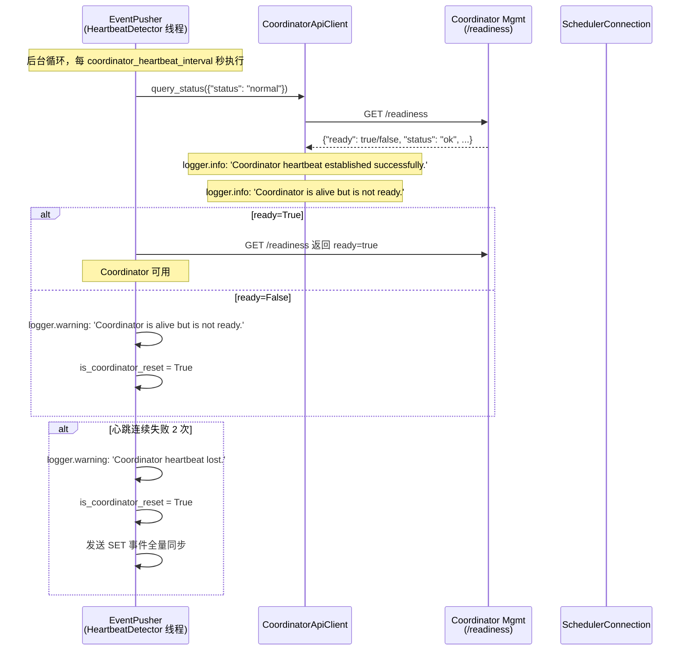
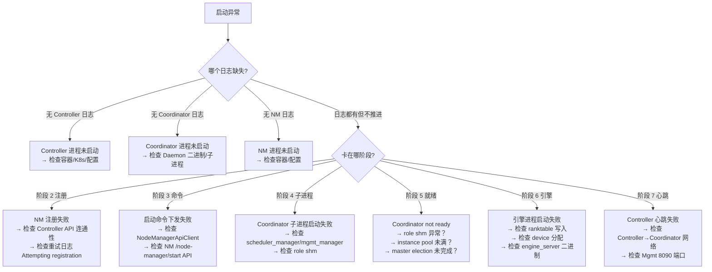

# pymotor 大EP启动 — 日志定位指南

> **这是什么**：pymotor 推理服务在大 EP（多 Endpoint）场景下的启动链路，从 NodeManager 注册到 Coordinator ready 的全流程日志定位手册。
> **覆盖范围**：从 `InstanceAssembler initialized.`（Controller 进程启动）到 `[Readiness] Coordinator is ready.`（Coordinator 探测就绪）。
> **涉及组件**：pymotor/Controller、pymotor/Coordinator（Daemon + Scheduler + Mgmt）、pymotor/NodeManager。
>
> | 术语 | 含义 |
> |------|------|
> | EP（Endpoint）| 一个推理计算单元，包含一组 device；大 EP = 多 EP 并行 |
> | Coordinator Daemon | Coordinator 主进程，管理 Scheduler/Mgmt/Infer 三子进程 |
> | role shm | Daemon 与 Mgmt 共享内存，Mgmt 用它判断 master/standby 身份 |
> | ReadinessProbe | Mgmt 进程内探针，检查 InstanceReadiness + role shm 返回 ready |
> | ranktable | HCCL 集群拓扑描述文件，写入本地供 engine_server 读取 |
>
> **你需要准备**：
> - 日志文件：Controller 日志 + Coordinator 日志 + NodeManager 日志（通常分不同文件或进程）
> - 快速过滤：`grep -E "InstanceAssembler|EventPusher|Attempting registration|Start command|Scheduler server|Mgmt server|Management server|Readiness|Device IDs|Ranktable written|Coordinator heartbeat|Instance ready" <日志文件>`
> **阅读优先级**：紧急排障 → 直接看下方「判断口诀」；系统了解 → 按 §一 → §二 → 附录顺序读

## 目录
- [一、快速定位](#一快速定位先看这里)
- [二、分阶段详细定位](#二分阶段详细定位)
- [三、卡点速查](#三卡点速查卡在-x--查-y)
- [四、附录](#四附录)

---

## 一、快速定位（先看这里）

> **30 秒速判**：在日志里搜下面几步的标志日志，**最后出现的那条 = 你卡在哪一步**，直接跳对应 §二 或 §三。

| 步骤 | 标志日志（grep 关键词） | 含义 | 你卡在这里 → 查哪里 |
|------|----------------------|------|---------------------|
| C1 | `InstanceAssembler initialized.` | Controller 进程启动 | §二.1 / §三「Controller 起不来」 |
| C2 | `InstanceAssembler started.` | 实例装配线程运行 | §三「实例装配卡住」 |
| C3 | `Attempting registration (Attempt %d of %d)...` | NodeManager 向 Controller 发起注册 | §三「注册失败」 |
| C4 | `New instance %s(id:%d) created and added.` | Controller 收到注册、创建 instance | §三「注册失败」 |
| C5 | `Start command sent for instance %s successfully.` | Controller 下发启动命令 | §三「启动命令下发失败」 |
| CO1 | `Scheduler server process starting (PID: %s)` | Coordinator Scheduler 子进程启动 | §三「Coordinator 起不来」 |
| CO2 | `Mgmt server process starting (PID: %s)` | Coordinator Mgmt 子进程启动 | §三「Coordinator 起不来」 |
| CO3 | `Management server is starting...` | Mgmt HTTP 服务开始监听 | §三「Mgmt 未监听」 |
| CO4 | `Role shm read: name=%s byte=%s is_master=%s` | Mgmt ReadinessProbe 读 role shm | §三「role shm 异常」 |
| CO5 | `[Readiness] Coordinator is ready.` | Coordinator 达到 ready 状态 | §三「Coordinator 不 ready」 |
| NM1 | `NodeManagerAPI is ready, proceeding with registration` | NodeManager API 就绪、开始注册 | §三「NodeManager 起不来」 |
| NM2 | `start_cmd is %s` | NodeManager 收到启动命令 | §三「引擎拉起失败」 |
| NM3 | `Ranktable written to %s` | ranktable 写入本地文件 | §三「ranktable 写入失败」 |
| NM4 | `Device IDs: %s` | 设备分配、engine_server 启动 | §三「引擎进程退出」 |
| CTRL1 | `Coordinator heartbeat established successfully.` | Controller 与 Coordinator 心跳建立成功 | §三「心跳失败」 |
| CTRL2 | `Instance ready: %s` | Controller 检测到 instance ready | §三「instance 不 ready」 |

**判断口诀**：
- Controller 日志先出现 → 从 C1→C5 排查
- Coordinator 日志先出现 → 从 CO1→CO5 排查
- NodeManager 日志先出现 → 从 NM1→NM4 排查
- 三方日志都无关键标志 → 进程是否真的启动了（检查容器/进程列表）

---

## 二、分阶段详细定位

### 2.1 阶段 1：Controller 进程启动

**在干什么**：Controller 进程启动，加载配置，启动 InstanceAssembler 和 EventPusher 两个后台线程。

**子环节表**：

| 子环节 | 关键日志 | 正常含义 | 异常时/分支 |
|--------|---------|---------|------------|
| 配置加载 | 无特定日志 | ControllerConfig 初始化 | 检查配置文件路径和权限 |
| InstanceAssembler 初始化 | `InstanceAssembler initialized.` | 实例装配器创建成功 | 检查 motor/controller/core/instance_assembler.py 是否正常加载 |
| InstanceAssembler 启动 | `InstanceAssembler started.` | 两个后台线程（InstanceAssemblerLoop + StartCommandSender）启动 | 如果没有这条日志，说明 start() 未被调用或线程未成功 fork |
| EventPusher 初始化 | `EventPusher initialized.` | 事件推送器创建成功 | 检查 motor/controller/core/event_pusher.py |
| EventPusher 启动 | `EventPusher started.` | 两个后台线程（EventConsumer + HeartbeatDetector）启动 | 同上 |

→ 全量表：[C.1](#c1)
→ 全量流程图：[D.1](#d1)

### 2.2 阶段 2：NodeManager 注册

**在干什么**：各 NodeManager 进程向 Controller 发起注册，Controller 接收并创建 instance 元数据。

**子环节表**：

| 子环节 | 关键日志 | 正常含义 | 异常时/分支 |
|--------|---------|---------|------------|
| NodeManager API 就绪等待 | `NodeManagerAPI is ready, proceeding with registration` | NM API 服务就绪后才注册 | 超时 30s 内未就绪则注册失败 |
| 注册重试 | `Attempting registration (Attempt %d of %d)...` | ControllerApiClient.register() 被调用 | 重试 5 次（2s→4s→8s→16s 指数退避） |
| 注册成功 | `New instance %s(id:%d) created and added.` | Controller 收到 RegisterMsg，创建 instance | 若大量重复日志，说明 NM 在反复重发 |
| 多 pod 注册 | `Endpoints added for instance %s from pod %s.` | NM 上报多个 pod，每个 pod 添加一次 endpoint | 正常路径，所有 NM 上报完毕后进入阶段 3 |
| 重复注册 | `Instance %s already registered, no need to register again.` | NM 重新上线后重注册 | 正常，不影响流程 |

→ 全量表：[C.2](#c2)
→ 全量流程图：[D.2](#d2)

### 2.3 阶段 3：Controller 下发启动命令

**在干什么**：Controller 判断 instance 已 ready，下发 StartCmdMsg 到各 NodeManager。

**子环节表**：

| 子环节 | 关键日志 | 正常含义 | 异常时/分支 |
|--------|---------|---------|------------|
| 启动命令发送 | `Start command sent for instance %s successfully.` | StartCommandSender 发送 StartCmdMsg 成功 | 日志出现后 instance 从 InstanceAssembler 中移除 |
| 命令发送失败 | （无特定日志，重试逻辑在代码中） | 最多重试 send_cmd_retry_times 次 | 检查 Controller 与 NodeManager API 连通性 |
| ranktable 下发 | 随 StartCmdMsg 下发（无独立日志） | ranktable 内容写入节点本地 | 见 §三「ranktable 写入失败」 |

→ 全量表：[C.3](#c3)
→ 全量流程图：[D.3](#d3)

### 2.4 阶段 4：Coordinator Daemon 启动（三子进程）

**在干什么**：Coordinator Daemon 进程启动，按顺序拉起 Scheduler → Mgmt → Inference 三子进程。

**子环节表**：

| 子环节 | 关键日志 | 正常含义 | 异常时/分支 |
|--------|---------|---------|------------|
| Daemon 进程启动 | `Starting Scheduler...` | Daemon 开始按顺序启动子进程 | 检查 motor/coordinator/daemon/coordinator_daemon.py |
| Scheduler 子进程启动 | `Scheduler server process starting (PID: %s)` | Scheduler 进程成功 fork | 等待 2s 后启动 Mgmt |
| Scheduler 配置监听 | `Scheduler process: config watcher started for hot-reload: %s` | Scheduler 进程加载配置并启动热更新监听 | 非关键，不影响主流程 |
| Mgmt 子进程启动 | `Mgmt server process starting (PID: %s)` | Mgmt 进程成功 fork | Mgmt 提供 /readiness 探针 |
| Mgmt 配置监听 | `Mgmt process: config watcher started for hot-reload: %s` | Mgmt 进程加载配置并启动热更新监听 | 非关键 |
| Inference 子进程启动 | `Starting Inference...` | Inference 进程启动（仅 master 节点） | 仅 master 执行，standby 跳过 |

→ 全量表：[C.4](#c4)
→ 全量流程图：[D.4](#d4)

### 2.5 阶段 5：Coordinator Mgmt 就绪探测

**在干什么**：Mgmt 进程提供 HTTP /readiness 探针，Controller 通过心跳轮询获取 Coordinator ready 状态。

**子环节表**：

| 子环节 | 关键日志 | 正常含义 | 异常时/分支 |
|--------|---------|---------|------------|
| Mgmt HTTP 服务启动 | `Management server is starting...` | FastAPI lifespan 开始 | 检查 8090 端口是否监听 |
| ReadinessProbe 执行 | `Role shm read: name=%s byte=%s is_master=%s heartbeat_stale=%s` | Probe 读 role shm 心跳 | heartbeat_stale=True → 503 |
| probe 结果 | `[Readiness] Coordinator is ready. result=%s instances_status=%s` | ready=true，Controller 可用 | 不出现 → 查 role shm 和 instance pool |
| 非 master 导致 503 | `[Readiness] Returning 503, result=not_master.` | Mgmt 进程读到自己不是 master | 正常（standby），等待 master election |
| 实例不足导致 503 | `[Readiness] Returning 503, result=not_master.`（instances_status 不足） | required instances 尚未全部注册 | 等 NM 注册完成 |
| Controller 心跳首次成功 | `Coordinator heartbeat established successfully.` | EventPusher 心跳成功建立 | 不出现 → Controller 与 Mgmt 网络不通 |
| Controller 心跳丢失 | `Coordinator heartbeat lost.` | 心跳连续失败 2 次，触发 coordinator_reset | 之后会发送 SET 事件重新同步实例 |

→ 全量表：[C.5](#c5)
→ 全量流程图：[D.5](#d5)

### 2.6 阶段 6：NodeManager 拉起推理引擎

**在干什么**：NodeManager 收到 StartCmdMsg，解析参数，分配设备，启动 engine_server 子进程。

**子环节表**：

| 子环节 | 关键日志 | 正常含义 | 异常时/分支 |
|--------|---------|---------|------------|
| 收到启动命令 | `start_cmd is %s` | StartCmdMsg 反序列化成功 | 失败 → 422 Unprocessable Entity |
| 参数校验 | （无独立日志，校验失败打 error） | job_name / endpoint_num / pod_ip 校验 | 检查配置一致性 |
| ranktable 写入 | `Ranktable written to %s` | ranktable JSON 写入 Env.ranktable_path | 失败 → 引擎启动缺少拓扑信息 |
| ranktable 跳过 | `Ranktable is None, skip writing to file` | Controller 未下发 ranktable | 某些部署模式，跳过正常 |
| 设备分配（大 EP） | `Device IDs: %s` | ASCEND_RT_VISIBLE_DEVICES 按 endpoint 分配 | 多 endpoint 并行时每个各分配一组 |
| 引擎进程启动 | （subprocess.Popen 日志） | engine_server 子进程启动 | 进程退出 → 检查 engine_server 二进制和配置 |
| 多 endpoint 并行 | （多个 endpoint 各自一条 Device IDs） | 正常并行拉起 | 检查 endpoint 数与 device 数是否匹配 |

→ 全量表：[C.6](#c6)
→ 全量流程图：[D.6](#d6)

### 2.7 阶段 7：Controller 与 Coordinator 心跳保活

**在干什么**：Controller EventPusher 心跳线程定期查询 Coordinator /readiness，维持实例同步。

**子环节表**：

| 子环节 | 关键日志 | 正常含义 | 异常时/分支 |
|--------|---------|---------|------------|
| 心跳建立 | `Coordinator heartbeat established successfully.` | 首次查询成功，is_first_heartbeat_success=True | 检查 Controller→Coordinator 网络 |
| 心跳正常 | `[Readiness] Coordinator remains ready.`（DEBUG） | Coordinator 持续 ready | 正常静默，不打进日志 |
| Coordinator not ready | `Coordinator is alive but is not ready.` | Coordinator 活着但未达到 ready 条件 | 可能实例不足或非 master |
| 心跳丢失 | `Coordinator heartbeat lost.` | 连续 2 次心跳失败，触发 reset | 发送 SET 事件重新同步 |
| 心跳异常 | `Send Coordinator heartbeat failed, Exception occurred %s` | 网络或服务异常 | 周期性日志，控制每 12 次打印一次 |
| instance ready 通知 | `Instance ready: %s` | EventPusher 检测到实例 ready，发送 ADD 事件 | 触发 Coordinator 实例刷新 |
| instance removed | `Instance removed: %s` | 实例被删除或异常，发送 DEL 事件 | 触发 Coordinator 实例更新 |

→ 全量表：[C.7](#c7)
→ 全量流程图：[D.7](#d7)

---

## 三、卡点速查（卡在 X → 查 Y）

| 你卡在这里 | 落在哪个大阶段 | 优先查什么 | 常见原因 |
|-----------|--------------|-----------|---------|
| Controller 进程未启动（无 `InstanceAssembler initialized.`） | 阶段 1 | Controller 进程是否被 K8s 拉起；配置文件是否正确挂载 | 容器启动失败 / 配置错误 / Python 依赖缺失 |
| NodeManager 注册失败（`Registration failed after maximum retries.`） | 阶段 2 | Controller API 端口是否可达；NM 与 Controller 网络联通性 | 防火墙 / Controller 未就绪 / NM 配置的 Controller 地址错误 |
| Controller 下发启动命令失败（`Start command sent` 后仍异常） | 阶段 3 | NM 的 /node-manager/start API 是否正常响应；StartCmdMsg 内容 | NM API 异常 / 权限不足 |
| Coordinator 起不来（无 `Scheduler server process starting`） | 阶段 4 | Coordinator Daemon 进程状态；Scheduler/Mgmt 子进程是否 fork 成功 | Daemon 崩溃 / 子进程配置错误 / 端口冲突 |
| Mgmt 未监听（`Management server is starting...` 后无响应） | 阶段 5 | Mgmt 进程是否存活；8090 端口是否被占用；role shm 是否创建成功 | 进程 crash / 端口被占 / shm 创建失败 |
| role shm 异常（`Role shm read` 出现 heartbeat_stale=True） | 阶段 5 | Daemon 进程是否存活；role_heartbeat_interval_sec 配置；shm 权限 | Daemon 进程死锁 / 心跳写入频率配置异常 |
| Coordinator 不 ready（反复 503，`[Readiness] Returning 503`） | 阶段 5 | instance pool 是否已满（required instances 未全部注册）；Mgmt 是否为 master | NM 注册未完成 / master election 未完成 / standby 节点上 Mgmt 查自己非 master |
| ranktable 写入失败（无 `Ranktable written to` 但引擎启动） | 阶段 6 | RANKTABLE_PATH 环境变量；写入目录权限；ranktable 内容是否合法 JSON | 路径不存在 / 权限不足 / ranktable 格式错误 |
| 引擎进程退出（`Device IDs` 后立即进程退出） | 阶段 6 | engine_server 二进制是否存在；配置文件是否正确；设备号是否超出范围 | 二进制缺失 / 配置错误 / 设备 ID 超限 |
| Controller 心跳失败（无 `Coordinator heartbeat established` 且反复重试） | 阶段 7 | Controller → Coordinator Mgmt 端口（默认 8090）网络路径；Coordinator Mgmt 是否已监听 | 网络策略 / 端口错误 / Mgmt 未就绪 |

**排查顺序**（与 §一步骤一致）：
1. **先看日志来自哪个组件**：Controller / Coordinator / NodeManager 三方日志
2. **按阶段定位**：阶段 1~7，哪个阶段无标志日志，哪个阶段就是卡点
3. **按上表查具体原因**

---

## 四、附录

### A. 涉及仓库与组件

| 仓库 | 组件 | 职责 |
|------|------|------|
| pymotor/MindIE-PyMotor_8989 | motor/controller/core/instance_assembler.py | 实例注册、装配、启动命令下发 |
| pymotor/MindIE-PyMotor_8989 | motor/controller/core/event_pusher.py | 实例 ready 事件推送、Coordinator 心跳检测 |
| pymotor/MindIE-PyMotor_8989 | motor/controller/api_client/controller_api_client.py | Controller 作为客户端，向 Coordinator 发送事件 |
| pymotor/MindIE-PyMotor_8989 | motor/controller/api_client/node_manager_api_client.py | Controller 向 NodeManager 下发 StartCmdMsg |
| pymotor/MindIE-PyMotor_8989 | motor/coordinator/daemon/coordinator_daemon.py | Coordinator Daemon 主进程，管理三子进程 + role shm |
| pymotor/MindIE-PyMotor_8989 | motor/coordinator/process/scheduler_manager.py | Scheduler 子进程管理器 |
| pymotor/MindIE-PyMotor_8989 | motor/coordinator/process/mgmt_manager.py | Mgmt 子进程管理器 |
| pymotor/MindIE-PyMotor_8989 | motor/coordinator/api_server/management_server.py | Mgmt HTTP 服务（/readiness /liveness /instances/refresh） |
| pymotor/MindIE-PyMotor_8989 | motor/coordinator/domain/probe.py | ReadinessProbe/LivenessProbe 核心实现，读 role shm |
| pymotor/MindIE-PyMotor_8989 | motor/coordinator/domain/instance_manager.py | Coordinator 侧实例池管理，InstanceReadiness 判断 |
| pymotor/MindIE-PyMotor_8989 | motor/coordinator/daemon/role_shm_holder.py | role shm 创建与写入 |
| pymotor/MindIE-PyMotor_8989 | motor/node_manager/core/engine_manager.py | NM 注册、ranktable 管理、启动命令解析 |
| pymotor/MindIE-PyMotor_8989 | motor/node_manager/core/daemon.py | NM daemon，拉起 engine_server 子进程 |
| pymotor/MindIE-PyMotor_8989 | motor/node_manager/api_server/node_manager_api.py | NM HTTP API（/node-manager/start） |

### B. 关键配置

| 配置项 | 日志体现 | 说明 |
|--------|--------|------|
| `ControllerConfig.etcd_config` | 无特定日志 | Controller 状态持久化到 ETCD |
| `instance_assemble_timeout` | 无特定日志 | 实例装配超时时间 |
| `instance_assembler_check_interval` | 无特定日志 | 启动命令检查间隔 |
| `coordinator_heartbeat_interval` | 日志中间隔体现 | Controller 轮询 Coordinator 间隔 |
| `standby_config.enable_master_standby` | 决定 role shm 行为 | master/standby 模式开关 |
| `role_heartbeat_interval_sec` | `Role shm read` 日志中间隔体现 | Daemon 写入 role shm 心跳间隔 |
| `EndpointConfig.endpoint_num` | `check job_name:... endpoint_num:... error` | 大 EP 的 EP 数量 |
| `BasicConfig.enable_multi_endpoints` | `Building multi endpoints: %d ports` | 大 EP 开关 |
| `RANKTABLE_PATH`（Env） | `Ranktable written to %s` | ranktable 写入路径 |
| `HC_CL_PATH`（Env） | `Failed to load ranktable from %s` | HCCL 文件读取路径 |
| `ASCEND_RT_VISIBLE_DEVICES` | `Device IDs: %s` | 设备可见性分配（大 EP 多 endpoint 时每 endpoint 独立分配） |

### C. 全量日志逐步明细

#### C.1 阶段 1：Controller 进程启动

| 序号 | 子模块 | 日志原文 | 说明 |
|------|--------|---------|------|
| C1 | controller/instance_assembler | `InstanceAssembler initialized.` | 实例装配器创建成功 |
| C2 | controller/instance_assembler | `InstanceAssembler started.` | 两个后台线程（InstanceAssemblerLoop + StartCommandSender）启动 |
| C3 | controller/event_pusher | `EventPusher initialized.` | 事件推送器创建成功 |
| C4 | controller/event_pusher | `EventPusher started.` | 两个后台线程（EventConsumer + HeartbeatDetector）启动 |

#### C.2 阶段 2：NodeManager 注册

| 序号 | 子模块 | 日志原文 | 说明 |
|------|--------|---------|------|
| C5 | controller/api_client | `Attempting registration (Attempt %d of %d)...` | NM 向 Controller 发起注册请求（重试最多 5 次，指数退避 2s→4s→8s→16s） |
| C6 | controller/instance_assembler | `New instance %s(id:%d) created and added.` | Controller 收到 RegisterMsg，创建新 instance 元数据 |
| C7 | controller/instance_assembler | `Endpoints added for instance %s from pod %s.` | NM 上报 pod endpoint（每个 pod 调用一次） |
| C8 | controller/instance_assembler | `Building multi endpoints: %d ports, %d devices per endpoint, total needed: %d, available: %d` | 大 EP 多 endpoint 构建过程（endpoint 数 × local_world_size vs 总 device 数校验） |
| C9 | controller/instance_assembler | `Not enough devices: need %d, have %d. Will use available devices.` | 大 EP device 数不足，发出警告并使用最大可用数 |
| C10 | controller/instance_assembler | `Instance %s already registered, no need to register again.` | NM 重注册或重复上报（忽略，不重建） |

#### C.3 阶段 3：Controller 下发启动命令

| 序号 | 子模块 | 日志原文 | 说明 |
|------|--------|---------|------|
| C11 | controller/instance_assembler | `Start command sent for instance %s successfully.` | StartCommandSender 下发 StartCmdMsg 到 NM 成功，instance 从内存移除 |
| C12 | controller/instance_assembler | `Failed to send start command for instance %s.` | 发送失败（进入下一轮重试） |

#### C.4 阶段 4：Coordinator Daemon 启动

| 序号 | 子模块 | 日志原文 | 说明 |
|------|--------|---------|------|
| CO1 | coordinator/daemon | `Starting Scheduler...` | Daemon 按顺序启动子进程，Scheduler 第一 |
| CO2 | coordinator/process/scheduler_manager | `Scheduler server process starting (PID: %s)` | Scheduler 子进程 fork 成功（PID 有效） |
| CO3 | coordinator/process/scheduler_manager | `Scheduler process: config watcher started for hot-reload: %s` | Scheduler 配置热更新监听启动（非关键） |
| CO4 | coordinator/process/scheduler_manager | `Scheduler server process stopped` | Scheduler 进程正常停止 |
| CO5 | coordinator/daemon | `Starting Mgmt...` | Mgmt 子进程启动（Scheduler 之后） |
| CO6 | coordinator/process/mgmt_manager | `Mgmt server process starting (PID: %s)` | Mgmt 子进程 fork 成功 |
| CO7 | coordinator/process/mgmt_manager | `Mgmt process: config watcher started for hot-reload: %s` | Mgmt 配置热更新监听启动（非关键） |
| CO8 | coordinator/daemon | `Starting Inference...` | Inference 子进程启动（仅 master 或非 master_standby 模式） |
| CO9 | coordinator/daemon | `[Daemon] set_daemon_pid=%s for %s` | Daemon PID 注入到子进程管理器（用于 Mgmt orphan 检测） |
| CO10 | coordinator/daemon | `[Daemon] Role shm written: byte=%s` | Daemon 写入 role shm byte（0=standby, 1=master） |

#### C.5 阶段 5：Coordinator Mgmt 就绪探测

| 序号 | 子模块 | 日志原文 | 说明 |
|------|--------|---------|------|
| CO11 | coordinator/management_server | `Management server is starting...` | Mgmt FastAPI lifespan 开始 |
| CO12 | coordinator/domain/probe | `Mgmt orphaned (parent not Daemon): ppid=%s daemon_pid=%s` | Mgmt 进程 parent 不是 Daemon（Daemon 已退出） |
| CO13 | coordinator/domain/probe | `Role shm not found: name=%s (Daemon may not have created it yet) -> standby` | role shm 不存在（Daemon 尚未创建或已删除） |
| CO14 | coordinator/domain/probe | `Role shm read: name=%s byte=%s is_master=%s heartbeat_stale=%s` | Probe 成功读取 role shm（byte0: 0=standby, 1=master；心跳 stale 判断） |
| CO15 | coordinator/domain/probe | `Daemon heartbeat stale: last_ns=%s age_sec=%.1f stale_sec=%.1f` | 心跳超时（age_sec > stale_sec），返回 HEARTBEAT_STALE |
| CO16 | coordinator/management_server | `[Readiness] Coordinator is ready. result=%s instances_status=%s` | ready=true，Controller 可用（result=ok_master 或 ok_standby） |
| CO17 | coordinator/management_server | `[Readiness] Returning 503, result=%s.` | ready=false，返回 503；result 决定 detail 消息 |
| CO18 | coordinator/management_server | `[Readiness] Coordinator is no longer ready.` | 从 ready→not ready 转换时打印 warning |
| CO19 | coordinator/event_pusher | `Coordinator heartbeat established successfully.` | Controller 首次收到心跳成功响应 |
| CO20 | coordinator/event_pouter | `Coordinator is alive but is not ready.` | 心跳成功但 response.ready=false（周期性，每 12 次打印一次） |
| CO21 | coordinator/event_pusher | `Coordinator heartbeat lost. Possible restart detected.` | 连续 2 次心跳失败，触发 coordinator_reset |
| CO22 | coordinator/event_pusher | `Controller will reset coordinator instance info.` | 触发 reset，发送 SET 事件全量同步实例 |

#### C.6 阶段 6：NodeManager 拉起推理引擎

| 序号 | 子模块 | 日志原文 | 说明 |
|------|--------|---------|------|
| NM1 | node_manager/engine_manager | `Engine Manager module start.` | EngineManager 初始化完成 |
| NM2 | node_manager/engine_manager | `Waiting for NodeManagerAPI to be ready before registering...` | 注册线程等待 NM API 就绪（超时 30s） |
| NM3 | node_manager/engine_manager | `NodeManagerAPI is ready, proceeding with registration` | NM API 就绪，注册开始 |
| NM4 | node_manager/engine_manager | `Attempting registration (Attempt %d of %d)...` | 注册重试（最多 5 次） |
| NM5 | node_manager/engine_manager | `Registration attempt %d failed. Retrying in %d seconds...` | 注册失败，指数退避重试 |
| NM6 | node_manager/engine_manager | `Registration failed after maximum retries.` | 5 次均失败，NM 进程退出（SIGTERM） |
| NM7 | node_manager/engine_manager | `start_cmd is %s` | NM 收到 StartCmdMsg，反序列化成功 |
| NM8 | node_manager/engine_manager | `check job_name:%s, endpoint_num:%d error` | job_name 或 endpoint_num 校验失败 |
| NM9 | node_manager/engine_manager | `check pod_ip %s error` | pod_ip 校验失败 |
| NM10 | node_manager/engine_manager | `Ranktable written to %s` | ranktable JSON 成功写入本地文件 |
| NM11 | node_manager/engine_manager | `Ranktable is None, skip writing to file` | Controller 未下发 ranktable，跳过写入（非错误） |
| NM12 | node_manager/engine_manager | `RANKTABLE_PATH env is not set, skip writing ranktable to file` | 环境变量未设置，跳过写入 |
| NM13 | node_manager/daemon | `Device IDs: %s` | ASCEND_RT_VISIBLE_DEVICES 已分配（大 EP 每个 endpoint 独立分配） |
| NM14 | node_manager/daemon | `Killed engine process with PID: %d` | engine_server 进程被 kill（stop 时） |

#### C.7 阶段 7：Controller 与 Coordinator 心跳保活

| 序号 | 子模块 | 日志原文 | 说明 |
|------|--------|---------|------|
| CTRL1 | controller/event_pusher | `Instance ready: %s` | EventPusher 收到 INSTANCE_READY 事件，记录实例并发送 ADD 事件到 Coordinator |
| CTRL2 | controller/event_pusher | `Instance removed: %s` | EventPusher 收到 INSTANCE_SEPARATED 事件，发送 DEL 事件到 Coordinator |
| CTRL3 | controller/event_pusher | `Pushed event: %s` | 事件入队列（ADD/DEL/SET） |
| CTRL4 | controller/event_pusher | `SET event skipped: requires at least one prefill instance` | SET 事件跳过（当前无 prefill 实例） |
| CTRL5 | controller/event_pusher | `Coordinator heartbeat established successfully.` | 首次心跳成功（is_first_heartbeat_success=True） |
| CTRL6 | controller/event_pusher | `Coordinator is alive but is not ready.` | 心跳正常但 Coordinator not ready（周期性，每 12 次打印一次） |
| CTRL7 | controller/event_pusher | `Send Coordinator heartbeat failed, Exception occurred %s` | 心跳异常（周期性，每 12 次打印一次） |
| CTRL8 | controller/event_pusher | `Coordinator heartbeat lost. Possible restart detected.` | 连续 2 次心跳失败，标记 coordinator_reset=True |
| CTRL9 | controller/event_pusher | `Failed to send instance refresh event, error: %s` | CoordinatorApiClient.send_instance_refresh() 失败 |
| CTRL10 | controller/event_pusher | `Coordinator not yet available, waiting for first successful heartbeat.` | 首次心跳前异常（周期性，每 12 次打印一次） |

---

### D. 全量流程图（Mermaid）

#### D.1 阶段 1 流程：Controller 启动

#### D.2 阶段 2~3 流程：注册 + 启动命令下发

#### D.3 阶段 4 流程：Coordinator Daemon 启动

```mermaid
flowchart TD
    subgraph CoordinatorDaemon
        D1["CoordinatorDaemon.run()<br/>_initialize_process_managers()"] --> D2["创建 role shm (enable_master_standby 时)"]
        D2 --> D3["_start_processes([SCHEDULER, MGMT])"]
        D3 --> D4["logger.info: 'Starting Scheduler...'"]
        D4 --> D5["SchedulerProcessManager.start()<br/>spawn SchedulerServer 子进程"]
        D5 --> D6["logger.info: 'Scheduler server process starting (PID: %s)'"]
        D6 --> D7["time.sleep(2)"]
        D7 --> D8["logger.info: 'Starting Mgmt...'"]
        D8 --> D9["MgmtProcessManager.start()<br/>spawn Mgmt 子进程"]
        D9 --> D10["logger.info: 'Mgmt server process starting (PID: %s)'"]
        D10 --> D11{"enable_master_standby?"}
        D11 -->|是| D12["启动 StandbyManager<br/>等待 election"]
        D11 -->|否| D13["_start_processes([INFERENCE])"]
        D12 --> D14["_on_become_master: 写 role shm=MASTER<br/>启动 Inference"]
        D13 --> D15["logger.info: 'Starting Inference...'"]
    end
```

#### D.4 阶段 5 流程：Mgmt ReadinessProbe

#### D.5 阶段 6 流程：NodeManager 拉起引擎

#### D.6 阶段 7 流程：心跳保活

---

### E. 关键节点索引

| 阶段 | 关键日志 | 说明 |
|------|---------|------|
| 阶段 1 | `InstanceAssembler initialized.` | Controller 进程启动成功，配置加载正常 |
| 阶段 1 | `EventPusher started.` | Controller 事件推送线程已就绪 |
| 阶段 2 | `Attempting registration (Attempt %d of %d)...` | NM 注册流程开始（第一步） |
| 阶段 2 | `New instance %s(id:%d) created and added.` | Controller 收到注册、instance 创建成功 |
| 阶段 2 | `Building multi endpoints: %d ports...` | 大 EP 多 endpoint 构建（仅大 EP 场景） |
| 阶段 3 | `Start command sent for instance %s successfully.` | 启动命令下发成功 |
| 阶段 4 | `Scheduler server process starting (PID: %s)` | Coordinator Scheduler 子进程启动成功 |
| 阶段 4 | `Mgmt server process starting (PID: %s)` | Coordinator Mgmt 子进程启动成功 |
| 阶段 4 | `[Daemon] Role shm written: byte=%s` | Daemon 写入 role shm（master election 完成） |
| 阶段 5 | `Management server is starting...` | Mgmt HTTP 服务启动 |
| 阶段 5 | `Role shm read: name=%s byte=%s is_master=%s heartbeat_stale=%s` | Probe 读取 role shm（判断依据） |
| 阶段 5 | `[Readiness] Coordinator is ready.` | Coordinator ready，K8s Service 可用 |
| 阶段 5 | `[Readiness] Returning 503, result=%s.` | Coordinator not ready，503 不可用 |
| 阶段 5 | `Coordinator heartbeat established successfully.` | Controller 心跳首次成功 |
| 阶段 6 | `start_cmd is %s` | NM 收到启动命令 |
| 阶段 6 | `Ranktable written to %s` | ranktable 写入成功 |
| 阶段 6 | `Device IDs: %s` | 设备分配成功，引擎启动 |
| 阶段 7 | `Instance ready: %s` | Controller 检测到 instance ready |
| 阶段 7 | `Coordinator heartbeat lost.` | 心跳丢失，触发 reset |
| 阶段 7 | `Controller will reset coordinator instance info.` | reset 触发，全量同步 |

### F. 故障场景流程

