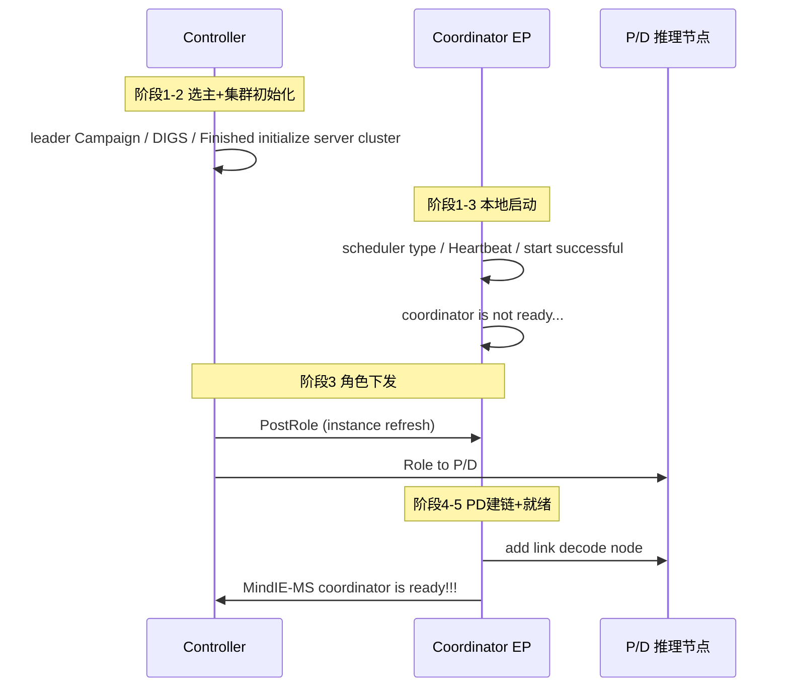
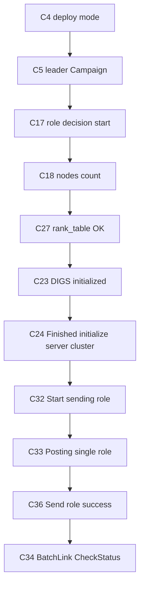
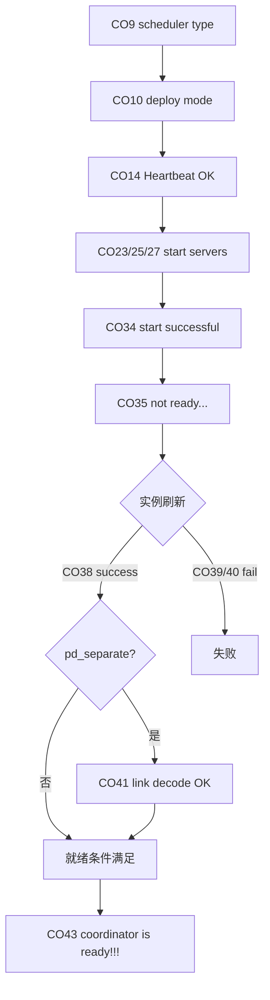
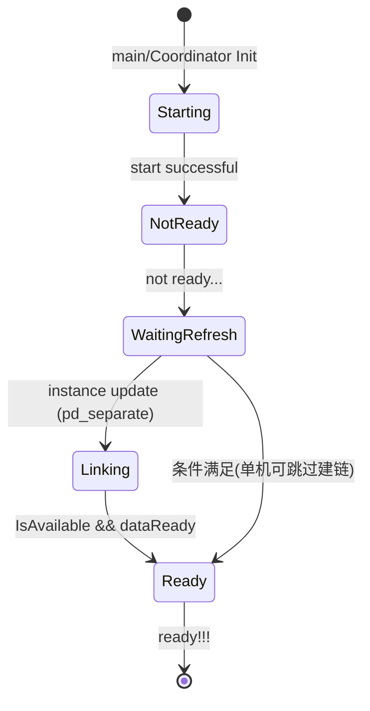
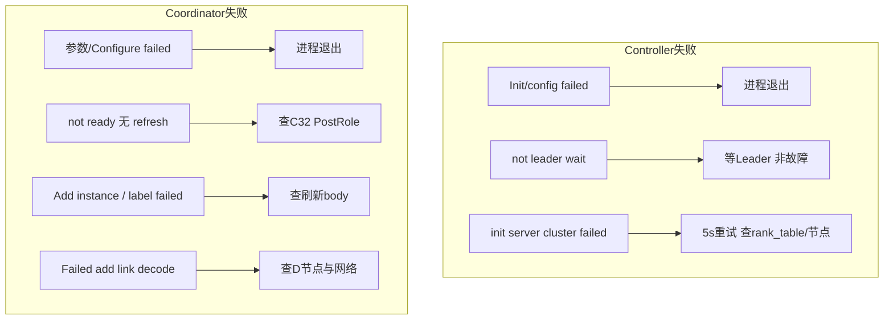

# 大 EP 场景启动 — 日志定位指南

> **用途**：正文用于快速判断大 EP 启动卡在 Controller 还是 Coordinator、哪个大阶段；[附录](#四附录) 提供全量逐步日志明细与流程图。  
> **特性边界**：Controller 与每个 Coordinator EP 从进程启动到 `MindIE-MS coordinator is ready!!!` 的日志路径。  
> **代码仓**：cmotor（`MindIE-Motor_8989`）

## 目录

- [一、快速定位](#一快速定位先看这里)
- [二、分阶段详细定位](#二分阶段详细定位)
- [三、卡点速查](#三卡点速查卡在-x--查-y)
- [四、附录](#四附录)

---

## 一、快速定位（先看这里）

**用法**：在日志里按顺序找下面 5 步的「阶段标志日志」。**最后出现的那一步 = 当前大致卡在哪**。  
- 查 **Controller 日志** 时看 C 列标志；查 **单个 Coordinator 日志** 时看 CO 列标志。  
- 备查链路：**全量表 [附录 C](#c-全量日志逐步明细) → 全量图 [附录 D](#d-全量流程图mermaid)**（下表「备查」列可直接点）。

| 步骤 | 大阶段 | Controller 标志日志 | Coordinator 标志日志 | 正常应接着看到 | 没走到 → | 备查（表 → 图） |
|:----:|--------|---------------------|----------------------|----------------|----------|-----------------|
| **1** | 进程启动 + 选主 | `[LeaderAgent] leader Campaign finish` | `[Coordinator] scheduler type` / `Current deploy mode` | 步骤 2 | [§2.1](#21-阶段-1进程启动与选主) / [§三](#三卡点速查卡在-x--查-y) | [C.1](#c1-controller-侧阶段-12) · [C.2 起](#c2-coordinator-侧阶段-13) → [D.1](#d1-大-ep-启动总览controller--coordinator) |
| **2** | 集群初始化 | `[NodeScheduler] Finished to initialize server cluster` | `[Coordinator] Heartbeat producer started`（本地组件就绪） | 步骤 3 | [§2.2](#22-阶段-2集群初始化) | [C.1](#c1-controller-侧阶段-12) · [C.2](#c2-coordinator-侧阶段-13) → [D.2](#d2-controller-集群初始化与下发) |
| **3** | 角色 / 链路下发 | `[NodeScheduler] Start sending role` → `Send role for all prefill and decode nodes success` | `[Start] MindIE-MS coordinator start successful` | 步骤 4 | [§2.3](#23-阶段-3角色下发与-coordinator-本地启动) | [C.3](#c3-controller-侧阶段-34) · [C.2](#c2-coordinator-侧阶段-13) → [D.2](#d2-controller-集群初始化与下发) · [D.3](#d3-coordinator-启动至就绪) |
| **4** | 等待实例刷新 | `[NodeScheduler] BatchLinkNodes: CheckStatus done`（PD 场景） | `MindIE-MS coordinator is not ready...` | 步骤 5 | [§2.4](#24-阶段-4等待实例刷新) | [C.4](#c4-coordinator-侧阶段-45) → [D.3](#d3-coordinator-启动至就绪) · [D.4](#d4-coordinator-就绪状态代码逻辑) |
| **5** | **就绪** | `[ServerRequestHandler] All nodes are available`（可选） | **`MindIE-MS coordinator is ready!!!`** | 可接推理请求 | [§2.5](#25-阶段-5就绪) / [§三](#三卡点速查卡在-x--查-y) | [C.4](#c4-coordinator-侧阶段-45) → [D.3](#d3-coordinator-启动至就绪) · [D.4](#d4-coordinator-就绪状态代码逻辑) |

**一步判断口诀**：

- Controller 只有 `is not leader or ready, just wait` → **非 Leader**，等 Leader 节点，不一定是故障（步骤 1 分支）
- Controller 有 `Finished to initialize server cluster`，没有 `Start sending role` → **步骤 2→3 之间**（DIGS/ProcessManager）
- Coordinator 有 `start successful`，长期只有 `not ready...`，没有 `instance update` → **步骤 4**（Controller 未 PostRole / 实例未注册）
- 有 `instance update success`，没有 `ready!!!` → **步骤 4→5**（PD 建链或 `IsAvailable && dataReady` 未满足）
- **`MindIE-MS coordinator is ready!!!` 出现 = 该 EP Coordinator 启动成功**

跨阶段总览（表→图）：[D.1 时序总览](#d1-大-ep-启动总览controller--coordinator) · 故障：[F](#f-故障场景流程)

---

## 二、分阶段详细定位

> 下钻：**全量表 [附录 C](#c-全量日志逐步明细) → 全量流程图 [附录 D](#d-全量流程图mermaid)**。

### 2.1 阶段 1：进程启动与选主

**在干什么**：Controller / Coordinator 进程入口、配置加载、etcd 选主（多节点时）。

| 子环节 | 关键日志 | 正常含义 | 异常时 |
|--------|----------|----------|--------|
| Controller 入口 | `[Controller] Init controller failed` / `Run controller failed` | 不应出现在成功路径 | 配置或 Init 失败，进程退出 |
| Controller 配置 | `Initializing controller, using deploy mode %d` | 部署模式已加载 | 紧接 `Initialize controller config failed` |
| Controller 选主 | `[LeaderAgent] leader Campaign finish, is leader: %d` | 选主结束 | `is leader: 0` → 见 §三「非 Leader」 |
| Coordinator 参数 | `Incorrect usage` / `predict_ip invalid` | 不应出现 | 启动参数错误 |
| Coordinator 配置 | `scheduler type: %s` + `Current deploy mode is %s` | 调度器与部署模式 OK | `Invalid scheduler type` → 退出 |

→ 全量表：[C.1](#c1-controller-侧阶段-12) · [C.2 起](#c2-coordinator-侧阶段-13) · 全量流程图：[D.1](#d1-大-ep-启动总览controller--coordinator)

---

### 2.2 阶段 2：集群初始化

**在干什么**：Controller 解析 rank_table、恢复节点、DIGS RoleManager 定 P/D 比例；Coordinator 初始化 Scheduler/Repeater/心跳等。

| 子环节 | 关键日志 | 正常含义 | 异常时 |
|--------|----------|----------|--------|
| RankTable | `[RankTableLoader] Parse distributed instance success, total %zu nodes` | 拓扑解析成功 | `Parse distributed instance failed` |
| 节点规模 | `Initializing server cluster, number of available nodes is %zu` | 可用节点数确定 | 为 0 → 拓扑/节点状态异常 |
| DIGS | `DIGS role manager initialized successfully: prefill rate %zu, decode rate %zu` | P/D 比例就绪 | 无此日志 → InitServerCluster 失败 |
| 集群完成 | `Finished to initialize server cluster` | **Controller 集群初始化完成** | `Run failed because failed to initialize server cluster` 循环 |
| ClusterClient | `[ClusterClient] SubscribeRankTable register success` | 与 ClusterD 通信注册 OK | `RankTable Register failed` 重试 |
| Coordinator 组件 | `Heartbeat producer started successfully` | 本地核心组件就绪 | `Failed to initialize or start heartbeat producer` |

→ 全量表：[C.1](#c1-controller-侧阶段-12) · [C.2](#c2-coordinator-侧阶段-13) · 全量流程图：[D.2](#d2-controller-集群初始化与下发)

---

### 2.3 阶段 3：角色下发与 Coordinator 本地启动

**在干什么**：Controller 向各节点 PostRole；各 Coordinator 起 Manager/Metrics/Status 服务并完成 `start successful`。

| 子环节 | 关键日志 | 正常含义 | 异常时 |
|--------|----------|----------|--------|
| 决策规模 | `[NodeScheduler] Role decisions start size %zu` | 待下发节点数 | size=0 → 无节点可下发 |
| 开始下发 | `[NodeScheduler] Start sending role. group size %lu` | 开始批量 PostRole | 无后续 → PostRole 卡住 |
| 单次下发 | `[ServerRequestHandler] Posting single role, IP %s` | 正在调 Coordinator | 无对应 Coordinator 日志 → 网络/URL |
| 下发完成 | `Send role for all prefill and decode nodes success` | 角色已全部发出 | `Some nodes' role are not ready` |
| PD 链路检查 | `BatchLinkNodes: CheckStatus done, ready %zu / postId %zu` | 链路状态检查（PD） | `CheckStatus not ready` |
| CO 服务启动 | `[Start] MindIE-MS coordinator start manager/metrics/status server` | 管理面服务拉起 | `Start manager server failed` |
| CO 启动完成 | `[Start] MindIE-MS coordinator start successful` | **本地启动完成**（尚未就绪） | 前有 ERROR 退出 |

→ 全量表：[C.3](#c3-controller-侧阶段-34) · [C.2](#c2-coordinator-侧阶段-13) · 全量流程图：[D.2](#d2-controller-集群初始化与下发) · [D.3](#d3-coordinator-启动至就绪)

---

### 2.4 阶段 4：等待实例刷新

**在干什么**：Coordinator 已起来但 `not ready`；等待 Controller 通过实例刷新接口注册 P/D 实例，PD 分离时可能还要建链。

| 子环节 | 关键日志 | 正常含义 | 异常/分支 |
|--------|----------|----------|-----------|
| 未就绪 | `MindIE-MS coordinator is not ready...` | 等待实例与 dataReady | 长期停留 → 查 Controller 是否 PostRole |
| 刷新请求 | `instance update success, add %zu instance` | 实例注册成功 | `Add instance failed` / JSON 解析失败 |
| PD 标签 | `Invalid instance label in 'pd_separate' mode` | 标签不合法 | 配置实例 label |
| PD 建链 | `Successfully add link with decode node at %s:%s` | 与 D 节点建连成功 | `Failed to add link with decode node` |
| 就绪条件 | `IsAvailable() && dataReady`（代码逻辑，不一定单独打日志） | 两者同时为真才打印 ready | 见 §三 |

→ 全量表：[C.4](#c4-coordinator-侧阶段-45) · 全量流程图：[D.3](#d3-coordinator-启动至就绪)

---

### 2.5 阶段 5：就绪

**在干什么**：该 Coordinator EP 可对外接推理请求。

| 子环节 | 关键日志 | 正常含义 | 异常时 |
|--------|----------|----------|--------|
| **最终标志** | **`MindIE-MS coordinator is ready!!!`** | **大 EP 该 EP 启动成功** | 不出现 → 回到 §2.4 |
| Controller 侧确认 | `[ServerRequestHandler] All nodes are available after detected` | 集群节点探测通过 | 仅 CO 就绪、C 侧未通过 → 查其他节点 |

→ 全量表：[C.4](#c4-coordinator-侧阶段-45) · 全量流程图：[D.3](#d3-coordinator-启动至就绪) · [D.4](#d4-coordinator-就绪状态代码逻辑)

---

## 三、卡点速查（卡在 X → 查 Y）

| 你卡在这里（现象 / 最后一条典型日志） | 大阶段 | 优先查什么 | 常见原因 |
|--------------------------------------|--------|------------|----------|
| `[Controller] Init controller failed` | 1 | Controller 配置文件路径与权限 | 配置缺失、JSON 非法 |
| `leader Campaign finish, is leader: 0` + `is not leader or ready, just wait` | 1（分支） | 哪台是 Leader；etcd | **正常备节点**，不是故障 |
| `Parse distributed instance failed` | 2 | rank_table.json 内容与路径 | JSON 格式、节点 IP 错误 |
| `failed to initialize server cluster` 每 5s 重试 | 2 | #C27 前后 ERROR；节点存活 | 节点未上线、GRT 未同步（#C16） |
| `RankTable Register failed` 重试 | 2 | ClusterD 地址、gRPC | ClusterD 未起、网络 |
| 无 `Start sending role` | 3 | #C24 是否出现；Leader 身份 | 集群初始化未完成或非 Leader |
| 有 PostRole 无 Coordinator `instance update` | 3→4 | Coordinator 管理 IP/端口；防火墙 | URL 错、CO 未监听 |
| 只有 `coordinator start successful` + `not ready...` | 4 | Controller #C32/#C33；CO #CO38 | 实例刷新未触发 |
| `Add instance failed` / JSON parse error | 4 | 刷新请求 body；pd_separate label | 请求体非法、标签错误 |
| `Failed to add link with decode node` | 4（PD） | D 节点进程与端口；PD 建链文档 | D 未就绪、网络不通 |
| 有 `instance update success` 无 `ready!!!` | 4→5 | `ControllerListener.cpp` 就绪条件 | dataReady 未置位、IsAvailable 为 false |
| 请求返回 `Coordinator is not ready` | 4 | 是否已有 #CO43 | 上游请求早于就绪 |

**排查顺序建议**：

`Controller: #C4→#C5→#C24→#C32→#C36` → `Coordinator: #CO34→#CO35→#CO38→#CO43`

**大 EP（pd_separate）与单机**：Coordinator 就绪通常需 #CO41 建链成功 + #CO43；单机往往 #CO34 后较快就绪，无 PD 建链日志。详见 [附录 · 大 EP vs 单机](#大-ep-vs-单机)。

---

## 四、附录

### A. 涉及仓库与组件

| 侧 | 组件 | 职责 |
|----|------|------|
| Controller | main / Controller | 进程入口、Init/Run |
| Controller | NodeScheduler | 选主后集群初始化、Role 下发、BatchLink |
| Controller | RankTableLoader | rank_table 解析 |
| Controller | ClusterClient | ClusterD gRPC |
| Controller | ServerRequestHandler | PostRole、节点探测 |
| Coordinator | main / Coordinator | EP 入口、服务启动 |
| Coordinator | ControllerListener | 实例刷新、就绪判断、PD 建链 |
| Coordinator | RequestRepeater | 与 Prefill 等建连 |
| Coordinator | RequestListener | 推理入口（未就绪时返回 not ready） |

### B. 关键配置（排查时对照）

| 配置项 | 日志中的体现 | 说明 |
|--------|--------------|------|
| deploy_mode | `using deploy mode` / `Current deploy mode is %s` | pd_separate vs single_node |
| rank_table | `Parse distributed instance success` | 集群拓扑 |
| prefill_rate / decode_rate | `DIGS role manager initialized: prefill rate %zu, decode rate %zu` | P/D 数量比 |
| predict_ip / manage_ip | Coordinator 启动参数 | 数据面 / 管理面 |
| scheduler_type | `scheduler type: %s` | 如 DIGS |
| 实例 label | `Invalid instance label in 'pd_separate' mode` | PD 分离必填项 |

### C. 全量日志逐步明细

**阅读链**：§一/§二（大框架）→ **本附录 C（全量表）** → [附录 D（全量流程图）](#d-全量流程图mermaid)

#### C.1 Controller 侧（阶段 1–2）

← [§一 步骤 1–2](#一快速定位先看这里) · [§2.1](#21-阶段-1进程启动与选主) · [§2.2](#22-阶段-2集群初始化) · 流程图 → [D.1](#d1-大-ep-启动总览controller--coordinator) · [D.2](#d2-controller-集群初始化与下发)

| 序号 | 子模块 | 日志原文 | 说明 |
|:----:|--------|----------|------|
| C1 | controller/main | `[Controller] Init controller failed.` | 配置初始化失败，退出 |
| C2 | controller/main | `[Controller] Run controller failed.` | Run 失败，退出 |
| C3 | controller | `[Controller] Initialize controller config failed.` | 配置文件解析失败 |
| C4 | controller | `[Controller] Initializing controller, using deploy mode %d.` | 部署模式加载 |
| C5 | controller | `[LeaderAgent] leader Campaign finish, serve ip is %s, is leader: %d.` | etcd 选主完成 |
| C6 | controller | `[Controller] Initialize print user information failed.` | 非致命 |
| C7 | controller | `[Controller] Initializing controller, create pointers failed.` | 组件构造失败 |
| C8 | controller | `[Controller] Initializing controller, initialize probe server failed.` | 探活服务失败 |
| C9 | controller | `[Controller] Initializing controller, initialize status updater or cluster status writer failed.` | 状态写入器失败 |
| C10 | controller | `[Controller] Initializing controller, initialize node scheduler failed.` | NodeScheduler 失败 |
| C11 | controller | `[Controller] Initializing controller, initialize fault manager failed.` | FaultManager 失败 |
| C12 | controller | `[Controller] Initializing controller, initialize NPURecoveryManager failed.` | NPU 恢复管理器失败 |
| C13 | controller | `[Controller] Initializing controller, initialize coordinator backup failed.` | 备份处理器失败（可继续） |
| C14 | controller | `[Controller] Initializing controller, register cluster client failed.` | ClusterClient 注册 WARN |
| C15 | node_scheduler | `[NodeScheduler] is not leader or ready, just wait.` | 非 Leader 等待 |
| C16 | node_scheduler | `[NodeScheduler] Wait for the clusterD's GRT save to complete.` | 等 GRT 同步 |
| C17 | node_scheduler | `[NodeScheduler] Starting role decision waiting process.` | 角色决策流程开始 |
| C18 | node_scheduler | `[NodeScheduler] Initializing server cluster, number of available nodes is %zu.` | 可用节点数 |
| C19 | node_scheduler | `[NodeScheduler] Start to recover servers for single node mode.` | 单机恢复（模式相关） |
| C20 | node_scheduler | `[NodeScheduler] Server cluster recovery successful, %zu available servers.` | 恢复完成 |
| C21 | node_scheduler | `[NodeScheduler] Initializing server cluster, start to initialize servers.` | 开始初始化各节点 |
| C22 | node_scheduler | `[NodeScheduler] FaultsJson is empty, keeping existing set` | 无 NPU 故障 JSON |
| C23 | node_scheduler | `[NodeScheduler] DIGS role manager initialized successfully: prefill rate %zu, decode rate %zu.` | DIGS 初始化成功 |
| C24 | node_scheduler | `[NodeScheduler] Finished to initialize server cluster.` | **集群初始化完成** |
| C25 | node_scheduler | `[NodeScheduler] Run failed because failed to initialize process manager.` | ProcessManager 失败 |
| C26 | node_scheduler | `[NodeScheduler] Run failed because failed to initialize server cluster.` | 初始化失败，5s 重试 |
| C27 | rank_table_loader | `[RankTableLoader] Parse distributed instance success, total %zu nodes` | rank_table 解析成功 |
| C28 | rank_table_loader | `[RankTableLoader] Parse distributed instance failed.` | rank_table 解析失败 |
| C29 | cluster_grpc | `[ClusterClient] SubscribeRankTable register success.` | 注册成功 |
| C30 | cluster_grpc | `[ClusterClient] RankTable Register failed, retry times is %d.` | 注册失败重试 |

→ 全量流程图：[D.2](#d2-controller-集群初始化与下发)

#### C.3 Controller 侧（阶段 3–4）

← [§一 步骤 3–5](#一快速定位先看这里) · [§2.3](#23-阶段-3角色下发与-coordinator-本地启动) · 流程图 → [D.2](#d2-controller-集群初始化与下发)

| 序号 | 子模块 | 日志原文 | 说明 |
|:----:|--------|----------|------|
| C31 | node_scheduler | `[NodeScheduler] Role decisions start size %zu.` | 待决策节点数 |
| C32 | node_scheduler | `[NodeScheduler] Start sending role. group size %lu.` | **开始下发 Role** |
| C33 | request_handler | `[ServerRequestHandler] Posting single role, IP %s, URL %s, body %s.` | 单次 PostRole |
| C34 | node_scheduler | `[NodeScheduler]BatchLinkNodes: CheckStatus done, ready %zu / postId %zu.` | PD 链路检查结果 |
| C35 | node_scheduler | `[NodeScheduler] Initialize all prefill and decode nodes in current group success.` | 组内 P/D 初始化完成 |
| C36 | node_scheduler | `[NodeScheduler] Send role for all prefill and decode nodes success.` | **角色下发完成** |
| C37 | request_handler | `[CoordinatorBackupHandler] Start Query status thread.` | 查询 Coordinator 状态线程 |
| C38 | node_scheduler | `[NodeScheduler] NodeScheduler alarm thread started.` | 告警线程 |
| C39 | node_scheduler | `[NodeScheduler] Rank table monitor thread started.` | RankTable 监控线程 |
| C40 | node_scheduler | `[NodeScheduler] Update exit.` | 主循环退出 |
| C41 | request_handler | `[ServerRequestHandler] Successfully query static and dynamic info of node with ID %lu and IP %s.` | 节点信息查询成功 |
| C42 | request_handler | `[ServerRequestHandler] All nodes are available after detected for %u times.` | 全部节点可用 |

→ 全量流程图：[D.2](#d2-controller-集群初始化与下发)

#### C.2 Coordinator 侧（阶段 1–3）

← [§一 步骤 1–3](#一快速定位先看这里) · [§2.1](#21-阶段-1进程启动与选主)–[§2.3](#23-阶段-3角色下发与-coordinator-本地启动) · 流程图 → [D.1](#d1-大-ep-启动总览controller--coordinator) · [D.3](#d3-coordinator-启动至就绪)

| 序号 | 子模块 | 日志原文 | 说明 |
|:----:|--------|----------|------|
| CO1 | main | `[Coordinator] Incorrect usage. The expected format is: %s <predict_ip> <manage_ip>` | 参数格式错误 |
| CO2 | main | `[Coordinator] Argument 'predict_ip' is invalid.` | predict_ip 无效 |
| CO3 | main | `[Coordinator] Argument 'manage_ip' is invalid.` | manage_ip 无效 |
| CO4 | main | `[Coordinator] Configure initialize failed.` | 配置初始化失败 |
| CO5 | main | `[Coordinator] Error is %s` | 主函数异常 |
| CO6 | main | `Unexpected error.` | 未知异常 |
| CO7 | log | `[Logger] Log initialize success, and log will not save to file.` | 日志初始化（不写文件） |
| CO8 | log | `[Logger] Log initialize success, run log file path is %s, operation log file path is %s.` | 日志初始化（写文件） |
| CO9 | coordinator | `[Coordinator] scheduler type: %s.` | 调度器类型 |
| CO10 | coordinator | `[Coordinator] Current deploy mode is %s.` | 部署模式 |
| CO11 | coordinator | `[Coordinator] Invalid scheduler type: %s.` | 调度器无效 |
| CO12 | coordinator | `[Coordinator] Initialize request repeater failed.` | Repeater 失败 |
| CO13 | coordinator | `[Coordinator] init globleInfo store failed` | 全局存储失败 |
| CO14 | coordinator | `[Coordinator] Heartbeat producer started successfully for SHM: %s, SEM: %s.` | 心跳就绪 |
| CO15 | coordinator | `[Coordinator] Failed to initialize or start heartbeat producer: %s` | 心跳失败 |
| CO16 | coordinator | `[Coordinator] Coordinator failed to init repeater or scheduler.` | 初始化失败 |
| CO17 | request_listener | `[RequestListener] Health monitor initialization started` | 健康监控开始 |
| CO18 | request_listener | `[RequestListener] Memory-based request interception is disabled` | 内存拦截关闭 |
| CO19 | request_listener | `[RequestListener] reqManage is null, health monitor initialization skipped` | 跳过健康监控 |
| CO20 | request_monitor | `[HealthMonitor] Initialized successfully with memory limit: %lld bytes` | 健康监控 OK |
| CO21 | request_repeater | `[RequestRepeater] Initialize HTTP client failed.` | HTTP 客户端失败 |
| CO22 | request_repeater | `Connect to prefill instance %s:%s success.` | Prefill 建连成功 |
| CO23 | coordinator | `[Start] MindIE-MS coordinator start manager server.` | Manager 服务启动 |
| CO24 | coordinator | `[Coordinator] Coordinator manager server exit` | Manager 异常退出 |
| CO25 | coordinator | `[Start] MindIE-MS coordinator start external metrics server.` | Metrics 启动 |
| CO26 | coordinator | `[Coordinator] Coordinator external server exit` | Metrics 异常退出 |
| CO27 | coordinator | `[Start] MindIE-MS coordinator start status server.` | Status 启动 |
| CO28 | coordinator | `[Coordinator] Coordinator status server exit` | Status 异常退出 |
| CO29 | coordinator | `[Coordinator] Start manager server failed.` | Manager 启动失败 |
| CO30 | coordinator | `[Coordinator] failed init request listener or exception monitor` | Listener 初始化失败 |
| CO31 | coordinator | `[Coordinator] InitLeader.` | 主备初始化 |
| CO32 | leader | `[LeaderAgent] leader Campaign finish, serve ip is %s, is leader: %d.` | Coordinator 侧选主 |
| CO33 | coordinator | `[Coordinator] I'm master.` | 本节点为 Master |
| CO34 | coordinator | `[Start] MindIE-MS coordinator start successful.` | **本地启动完成** |
| CO35 | coordinator | `MindIE-MS coordinator is not ready...` | 等待就绪 |

→ 全量流程图：[D.3](#d3-coordinator-启动至就绪)

#### C.4 Coordinator 侧（阶段 4–5）

← [§一 步骤 4–5](#一快速定位先看这里) · [§2.4](#24-阶段-4等待实例刷新) · [§2.5](#25-阶段-5就绪) · 流程图 → [D.3](#d3-coordinator-启动至就绪) · [D.4](#d4-coordinator-就绪状态代码逻辑)

| 序号 | 子模块 | 日志原文 | 说明 |
|:----:|--------|----------|------|
| CO36 | controller_listener | `[Configure] Failed to read controller instance refresh request: %s, json parse error is %s.` | 刷新 JSON 非法 |
| CO37 | controller_listener | `[ControllerListener] Exception occurred while handling instance refresh request. Error is %s` | 处理刷新异常 |
| CO38 | controller_listener | `[ControllerListener] instance update success, add %zu instance, update %zu instance` | 实例注册成功 |
| CO39 | controller_listener | `[ControllerListener] Add instance failed` | 实例注册失败 |
| CO40 | controller_listener | `[ControllerListener] Invalid instance label in 'pd_separate' mode.` | PD 模式标签错误 |
| CO41 | controller_listener | `[ControllerListener] Successfully add link with decode node at %s:%s.` | D 节点建连成功 |
| CO42 | controller_listener | `[ControllerListener] Failed to add link with decode node at %s:%s.` | D 节点建连失败 |
| CO43 | controller_listener | **`MindIE-MS coordinator is ready!!!`** | **最终就绪标志** |

（Coordinator 另有 `[Start] MindIE-MS coordinator start data server.` — 数据面启动，通常在 CO34 与 CO35 之间。）

→ 全量流程图：[D.3](#d3-coordinator-启动至就绪) · [D.4](#d4-coordinator-就绪状态代码逻辑)

#### C.5 故障相关补充

← [§三](#三卡点速查卡在-x--查-y) · 流程图 → [F](#f-故障场景流程)

| 触发 | 日志原文 | 说明 |
|------|----------|------|
| BatchLink 未就绪 | `[NodeScheduler]BatchLinkNodes: CheckStatus not ready, count %zu` | PD 链路未齐 |
| Role 未就绪 | `[NodeScheduler] Some nodes' role are not ready after checking for %u times.` | 下发后节点未确认 |
| 上游请求过早 | `MindIE-MS Coordinator is not ready`（HTTP 响应体） | RequestListener 拒绝 |

→ 全量流程图：[F](#f-故障场景流程)

---

### D. 全量流程图（Mermaid）

← 全量表：[附录 C](#c-全量日志逐步明细) · 大框架：[§一](#一快速定位先看这里) / [§二](#二分阶段详细定位)

#### D.1 大 EP 启动总览（Controller ↔ Coordinator）

← 全量表 [C.1](#c1-controller-侧阶段-12) · [C.2](#c2-coordinator-侧阶段-13) · [C.4](#c4-coordinator-侧阶段-45)

#### D.2 Controller 集群初始化与下发

← 全量表 [C.1](#c1-controller-侧阶段-12) · [C.3](#c3-controller-侧阶段-34)

#### D.3 Coordinator 启动至就绪

← 全量表 [C.2](#c2-coordinator-侧阶段-13) · [C.4](#c4-coordinator-侧阶段-45)

#### D.4 Coordinator 就绪状态（代码逻辑）

← 全量表 [C.4](#c4-coordinator-侧阶段-45) · 对应 §2.5 就绪条件

### E. 关键节点索引

| 阶段 | Controller 关键日志 | Coordinator 关键日志 |
|------|---------------------|----------------------|
| 选主 | `leader Campaign finish` | `InitLeader` / `I'm master` |
| 集群就绪 | `Finished to initialize server cluster` | — |
| DIGS | `DIGS role manager initialized` | — |
| 角色下发 | `Start sending role` / `Send role success` | — |
| 本地启动 | — | `coordinator start successful` |
| 等待 | `BatchLinkNodes CheckStatus` | `coordinator is not ready...` |
| 实例刷新 | `Posting single role` | `instance update success` |
| PD 建链 | — | `Successfully add link with decode node` |
| **就绪** | `All nodes are available`（可选） | **`coordinator is ready!!!`** |

### F. 故障场景流程

### 大 EP vs 单机

| 差异点 | 大 EP（pd_separate） | 单机（single_node） |
|--------|---------------------|---------------------|
| Controller | #C23 显示 prefill/decode rate | 相同 |
| Coordinator | #CO40 标签校验；#CO41~#CO42 建链 | 通常无 PD 建链 |
| 就绪 | #CO43 常需 dataReady + PD 链路 | 可能较早 ready |
| Role | #C32 批量 PostRole 到 P+D | 角色模型更简单 |

### 勿动区域（加日志时避免）

- `Controller.cpp` — `Controller::Init()` 配置起点
- `NodeScheduler.cpp` — `NodeScheduler::Run()` 主循环，避免高频重日志
- `ControllerListener.cpp` — `IsAvailable() && dataReady` 共同决定 #CO43，单看其一不完整
- `ClusterClient.cpp` — SubscribeRankTable 高频，避免过多 DEBUG 以上日志

### 代码位置索引（摘录）

| 日志 | 文件:行（MindIE-Motor_8989） |
|------|------------------------------|
| coordinator is ready!!! | `controller_listener/ControllerListener.cpp:136` |
| coordinator is not ready... | `coordinator/Coordinator.cpp:409` |
| start successful | `coordinator/Coordinator.cpp:408` |
| Finished to initialize server cluster | `controller/node_scheduler/NodeScheduler.cpp:826` |
| Start sending role | `controller/node_scheduler/NodeScheduler.cpp:1667` |
