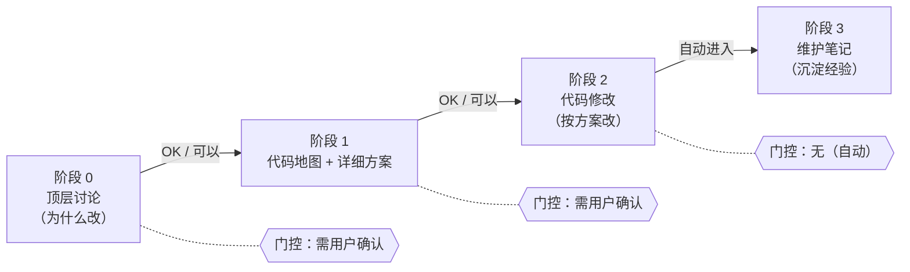

# AI 协作 4 阶段工作流——简单指南

> **来源**：`~/.cursor/rules/user-preferences-global.mdc` §Coding 任务默认 Workflow
> **用途**：分享用——演示「个人排查经验 → 团队可复用能力」这件事在 AI 协作里是怎么落地的。
> **核心理念**：阶段 3 维护笔记是「**你写一次，AI 帮你固化为可复用资产**」的钩子。

---

## 一句话总结

> **先对齐方案 → 再读代码地图 → 改完立即出维护笔记**，4 个阶段、3 个门控、1 个自动收尾。

---

## 4 阶段全图

---

## 阶段 0：顶层讨论（**必须先执行**）

**目标**：把"为什么改、改成什么样、改的边界在哪"对齐了，再进细节。

**关键动作**：
- 问清动机（性能？可定位性？易用性？）
- 划清范围（这次只动哪些模块 / 不动哪些）
- 达成共识

**门控**：用户说「写吧 / OK / 继续」才进阶段 1。

**反面案例**：
> AI 直接读代码、出方案、改代码——结果改完才发现边界理解错。

---

## 阶段 1：代码地图 + 详细方案

**目标**：把要改的代码看明白，给出可评审的方案。

**关键动作**：
- **必须**调用 `cursor-file-analysis` skill
- 输出 4 件事：
  1. 涉及文件 + 各文件职责
  2. 调用链
  3. 必改 / 勿动边界
  4. 最小修改方案

**证据分级（必须标注，禁止混写）**：

| 级别 | 含义 | 怎么写 |
|------|------|--------|
| **已验证** | 代码里直接看到的事实 | 每条带 `路径:行号` 或函数名 |
| **合理推断** | 由代码关系推出 | 必须说明推断链 |
| **待确认** | 代码中无证据 | 标出等用户确认 |

**搜索边界（必须说明）**：
- 查了哪些目录、哪些关键词
- 哪些没找到、哪些判断受搜索范围影响

**门控**：用户说「可以 / 继续」才进阶段 2。

**反面案例**：
> AI 凭"框架经验"补全不存在的 manager/service/helper，把幻觉当事实输出。

---

## 阶段 2：代码修改

**目标**：按确认的方案改代码。

**关键动作**：
- 改代码（按方案）
- 改完解释 diff + 调用链
- **不解释完就停**——这是阶段 3 自动进入的前置条件

**门控**：**无门控**，完成后**自动进入阶段 3**。

---

## 阶段 3：维护笔记（**必做收尾，自动进入**）

**目标**：把这次改动沉淀成可复用的排查资产。

**关键动作**：
- **必须**调用 `cursor-maintenance-doc` skill
- 在聊天里输出 5 件事：
  1. 改动概述
  2. 排查顺序
  3. 关键配置 / 日志
  4. 勿动区域
  5. 调用链

**门控**：用户说「跳过维护笔记」才省略。

**反面案例**：
> 阶段 2 改完说"搞定了"，用户回"OK"——AI 以为结束、维护笔记被跳过，**经验没沉淀**。

---

## 门控速查

| 过渡 | 门控 | 为什么 |
|------|------|--------|
| 0 → 1 | 需用户「可以 / 继续」 | 顶层方案对齐后再读代码 |
| 1 → 2 | 需用户「可以 / 继续」 | 代码地图与方案确认后再改 |
| 2 → 3 | **自动进入，无需再等 OK** | 用户常把阶段 2 后的 OK 当作任务结束 |
| 跳过阶段 3 | 用户明确说「跳过维护笔记」 | 仅此时可省略 |

**两条硬性禁止**：
- 禁止：未经用户确认从阶段 0/1 进入阶段 2
- 禁止：阶段 2 完成后只解释 diff 就结束、不输出维护笔记

---

## 与"日志易用性整改"的呼应（分享衔接点）

| AI 协作 4 阶段 | 日志整改对应物 |
|----------------|--------------|
| 阶段 0：顶层讨论 | 专题立项、范围划清（"做易用性 vs 做完整性"） |
| 阶段 1：代码地图 | log-analysis-locate-guide 输出定位指南 |
| 阶段 2：代码修改 | log-quality-rewrite 改不合规日志 |
| **阶段 3：维护笔记** | **故障模式库条目 / 定位指南 §三 一行卡点** |

**最关键的一句话**（分享时建议讲）：

> 你在 AI 协作里写一次维护笔记（阶段 3），就是在给团队的故障模式库「**轻量贡献**」一条排查路径——共建不用写一整篇附录，先给「卡在哪 + 查什么 + 常见原因」就够。

---

## 演示时怎么讲（30 min 建议占 1 min）

**讲法建议**：

1. **铺垫（30s）**：AI 协作也需要流程，不然阶段 2 改完说"OK 搞定"——经验就丢了
2. **贴 4 阶段图 + 门控表**（20s）：一眼看懂
3. **强调 1 句（10s）**：阶段 3 维护笔记 = 你给团队的一次轻量共建

**PPT 建议**：
- 1 页：4 阶段图 + 门控表 + 阶段 3 一句话收束

**素材源**：
- 完整规则：`~/.cursor/rules/user-preferences-global.mdc` §Coding 任务默认 Workflow
- 阶段 1 skill：`~/.cursor/skills/cursor-file-analysis/SKILL.md`
- 阶段 3 skill：`~/.cursor/skills/cursor-maintenance-doc/SKILL.md`
