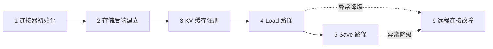
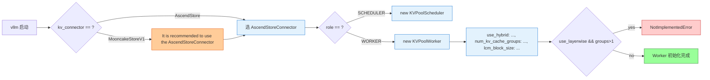
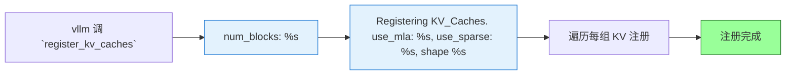
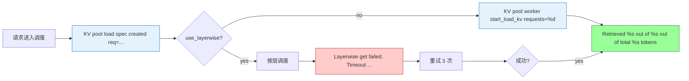
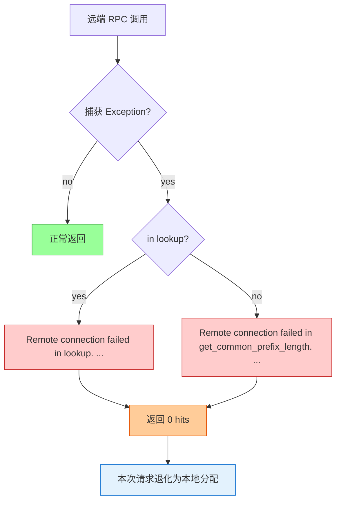
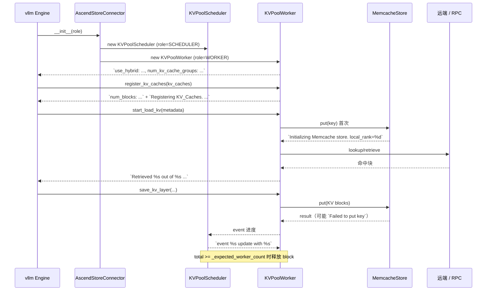
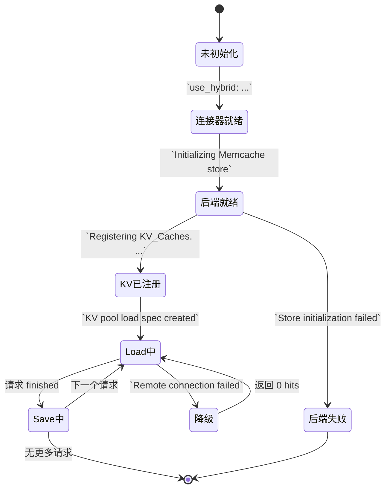
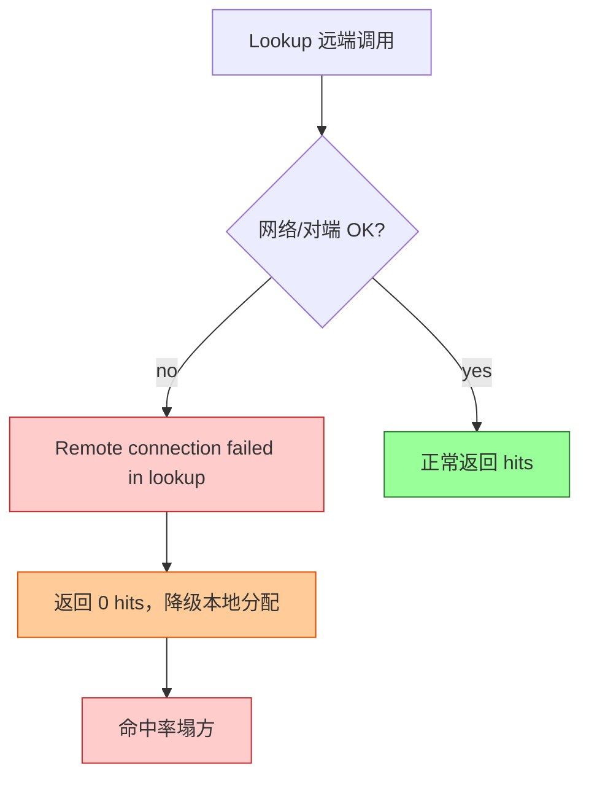
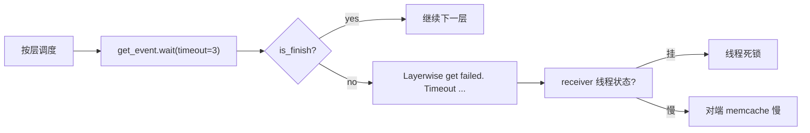
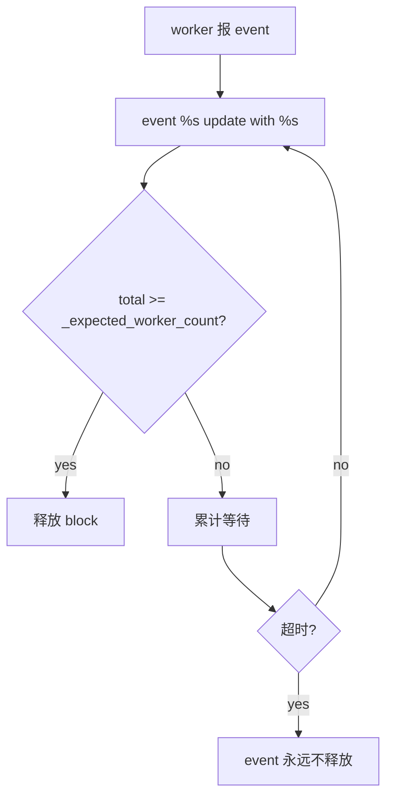

# vllm-ascend 池化 — 日志定位指南

> **这是什么**：vllm-ascend 仓的 **KV 池化**（`AscendStoreConnector` + `KVPoolScheduler` + `KVPoolWorker` + Memcache 后端）特性日志定位手册。覆盖从连接器拉起、存储后端初始化、KV 缓存注册，到 Load/Save 路径、远程连接故障的完整链路。
>
> **覆盖范围**：从 `AscendStoreConnector.__init__` 到 KV Load/Save 流程结束（含异常分支与降级）
>
> **涉及组件**：`AscendStoreConnector`（连接器入口）、`KVPoolScheduler`（调度端）、`KVPoolWorker`（执行端）、`MemcacheStore`（存储后端）（详见 [附录 A](#a-涉及仓库与组件)）
>
> | 术语 | 含义 |
> |------|------|
> | **KV Pool** | 跨实例共享 KV 缓存的逻辑池，承载 PD 分离等场景 |
> | **Connector** | vllm 与外部 KV 存储的桥接插件，本特性固定为 `AscendStoreConnector` |
> | **Memcache 后端** | 默认存储后端，封装 `memfabric_hybrid` 的 `DistributedObjectStore` |
> | **Layerwise 模式** | 按层粒度做 load/save，可降低显存峰值 |
> | **lookup** | 查询远端是否有可复用的 KV 块 |
>
> **你需要准备**：
> - 日志文件：vllm 启动后 `INFO/WARNING/ERROR` 三级的全量日志
> - 快速过滤：`grep -E "use_hybrid|Initializing Memcache|Registering KV_Caches|KV pool load spec|Remote connection failed|Layerwise get failed" <日志文件>`
>
> **阅读优先级**：紧急排障 → 直接看下方「判断口诀」；系统了解 → 按 §一 → §二 → 附录顺序读

## 目录

- [一、快速定位](#一快速定位先看这里)
- [二、分阶段详细定位](#二分阶段详细定位)
- [三、卡点速查](#三卡点速查卡在-x--查-y)
- [四、附录](#四附录)
  - [A. 涉及仓库与组件](#a-涉及仓库与组件)
  - [B. 关键配置](#b-关键配置排查时对照)
  - [C. 全量日志逐步明细](#c-全量日志逐步明细)
  - [D. 全量流程图（Mermaid）](#d-全量流程图mermaid)
  - [E. 关键节点索引](#e-关键节点索引)
  - [F. 故障场景流程](#f-故障场景流程)

---

## 一、快速定位（先看这里）

**用法**：在日志里按顺序找下面 6 步的「阶段标志日志」。**最后出现的那一步 = 当前大致卡在哪**；然后跳到 [§二](#二分阶段详细定位) 或 [§三](#三卡点速查卡在-x--查-y)。下钻顺序：**大框架（§一/§二）→ [全量表（附录 C）](#c-全量日志逐步明细) → [全量流程图（附录 D）](#d-全量流程图mermaid)**。

| 步骤 | 大阶段 | 标志日志（有任意一条即可认为「走到了」） | 正常应接着看到 | 没走到 → | 全量（表→图） |
|:----:|--------|------------------------------------------|----------------|----------|----------------|
| **1** | 连接器初始化 + 角色路由 | `use_hybrid: %s, use_mamba: %s, num_kv_cache_groups: %s, ...` | 步骤 2 的 Memcache 初始化 | [§2.1](#21-阶段-1连接器初始化--角色路由) / [§三](#三卡点速查卡在-x--查-y) | [C.1](#c1-阶段-1连接器初始化--角色路由全量日志) → [D.1](#d1-连接器初始化流程) |
| **2** | 存储后端建立 | `Initializing Memcache store. local_rank=%d` | 步骤 3 的 KV 缓存注册 | [§2.2](#22-阶段-2存储后端建立memcache) / [§三](#三卡点速查卡在-x--查-y) | [C.2](#c2-阶段-2存储后端建立全量日志) → [D.2](#d2-存储后端建立流程) |
| **3** | KV 缓存注册 | `num_blocks: %s` + `Registering KV_Caches. use_mla: %s, use_sparse: %s` | 步骤 4/5 的 Load/Save | [§2.3](#23-阶段-3kv-缓存注册) / [§三](#三卡点速查卡在-x--查-y) | [C.3](#c3-阶段-3kv-缓存注册全量日志) → [D.3](#d3-kv-缓存注册流程) |
| **4** | Load 路径 | `KV pool load spec created req=%s ...` + `Retrieved %s out of %s out of total %s tokens` | 请求正常完成 | [§2.4](#24-阶段-4load-路径lookup--加载) / [§三](#三卡点速查卡在-x--查-y) | [C.4](#c4-阶段-4load-路径全量日志) → [D.4](#d4-load-路径流程) |
| **5** | Save 路径 | （以 `event %s update with %s` + `Failed to put key` 异常分支判断） | 请求 finished | [§2.5](#25-阶段-5save-路径存储--完成确认) / [§三](#三卡点速查卡在-x--查-y) | [C.5](#c5-阶段-5save-路径全量日志) → [D.5](#d5-save-路径流程) |
| **6** | 远程连接故障处理 | `Remote connection failed in lookup. type=%s, error=%s` **或** `Layerwise get failed. Timeout waiting for get_event.` | 降级返回 0 hits / 重试 | [§2.6](#26-阶段-6远程连接故障--降级) / [§三](#三卡点速查卡在-x--查-y) | [C.6](#c6-阶段-6远程连接故障全量日志) → [D.6](#d6-远程故障降级流程) |

**一步判断口诀**：

- **步骤 1 失败**：通常在 `AscendStoreConnector.__init__` 阶段就抛错（缺配置 / MooncakeConnector 警告），根本没有 worker 日志
- **卡在步骤 2**：有 worker 日志、无 `Initializing Memcache store` → 还没触发 `put()` 触发后端建立；或者有 ERROR `Store initialization failed`
- **卡在步骤 3**：有 Memcache 初始化、无 `Registering KV_Caches` → `register_kv_caches` 未被调用或形状不对
- **卡在步骤 4**：有注册、无 `KV pool load spec created` → 一直没有新请求进入 Load 路径
- **卡在步骤 5**：长期无 `event %s update` 进度 → save 路径上的 event 计数未对齐
- **卡在步骤 6**：有 `Remote connection failed` → 查网络、对端 memcache、对端端口



跨阶段总览图（表→图）：[D.7 完整时序图](#d7-完整时序图) · 状态流转：[D.8](#d8-状态流转图)

---

## 二、分阶段详细定位

> 每个大阶段：**先一句话目标**，再 **子环节表**（中等粒度）。下钻：**全量表 [附录 C](#c-全量日志逐步明细) → 全量流程图 [附录 D](#d-全量流程图mermaid)**。

### 2.1 阶段 1：连接器初始化 + 角色路由

**在干什么**：vllm 启动时根据 `kv_connector` 配置加载 `AscendStoreConnector`，再按 `role` 创建 `KVPoolScheduler`（调度端）或 `KVPoolWorker`（执行端），Worker 解析 hybrid/mamba/group 等关键拓扑参数。

| 子环节 | 关键日志 | 正常含义 | 异常时常见下一步日志 |
|--------|----------|----------|----------------------|
| Connector 入口 | （无 INFO，构造期静默） | Connector 已选型 | 缺 `kv_connector` 配置 → vllm 启动失败，无本特性日志 |
| Connector 选型警告 | `It is recommended to use the AscendStoreConnector, as the MoonCakeStoreConnector will be removed in the future.` | 用户仍用 Mooncake（待弃用） | 见到该 warning 不算错，但已是阶段 1 边界 |
| Scheduler/Worker 分支 | （依据 `role`，无 INFO 区分） | 已选 Scheduler 或 Worker | 缺 role / role 异常 → 进程启动失败 |
| Worker 拓扑参数 | `use_hybrid: %s, use_mamba: %s, num_kv_cache_groups: %s, hash_block_size: %s, lcm_block_size: %s` | Worker 已解析出 hybrid/mamba/group | 任一字段异常 → 阶段 1 末失败，会影响后续 `register_kv_caches` |
| 不支持组合 | （无 INFO，抛 `NotImplementedError`） | layerwise + 多 KV group 暂不支持 | 抛错 → 启动中止 |

→ 全量表：[C.1](#c1-阶段-1连接器初始化--角色路由全量日志) · 全量流程图：[D.1](#d1-连接器初始化流程)

### 2.2 阶段 2：存储后端建立（Memcache）

**在干什么**：首次调用 `put()` 时通过 `memfabric_hybrid` 的 `DistributedObjectStore` 建立分布式对象存储，作为 KV Pool 的物理载体。失败时给出明确的「配置 / 依赖」定位 hint。

| 子环节 | 关键日志 | 正常含义 | 异常/分支 |
|--------|----------|----------|-----------|
| 触发建立 | `Initializing Memcache store. local_rank=%d` | 后端开始初始化 | 缺 → 没触发 `put()`（无请求或 Cache 未 miss） |
| 加载分布式存储 | （内部 `assert res == 0`） | `DistributedObjectStore.init` 成功 | `Configuration loading failed. error=%s. Check memcache config and environment.` → 配置/环境问题 |
| 整体初始化 | （`self._store_initialized = True` 后静默） | 后端可用 | `Store initialization failed. error=%s. Check memcache setup and dependencies.` → 依赖/二进制问题 |
| 提前 get | （后续 `get()` 调用时） | 正常 put 后 get | `get() called before store init. keys=%s. Call put() first to trigger initialization.` → 调用顺序错误 |

→ 全量表：[C.2](#c2-阶段-2存储后端建立全量日志) · 全量流程图：[D.2](#d2-存储后端建立流程)

### 2.3 阶段 3：KV 缓存注册

**在干什么**：vllm 把分配好的 GPU KV 缓存 tensor 注册到 `KVPoolWorker`，Worker 解析 block 数量、shape、group 拓扑，为后续 Load/Save 路径打基础。

| 子环节 | 关键日志 | 正常含义 | 异常/分支 |
|--------|----------|----------|-----------|
| 入口 | （vllm 调 `register_kv_caches`） | 进入注册 | 缺 → Worker 初始化后无注册调用，阶段 4/5 不会触发 |
| Block 数 | `num_blocks: %s` | GPU block 数已确认 | 异常值 → 显存/配置问题 |
| 缓存元信息 | `Registering KV_Caches. use_mla: %s, use_sparse: %s, shape %s` | mla/sparse 模式 + 形状已记录 | shape 与 group 不匹配 → 注册时抛错 |

→ 全量表：[C.3](#c3-阶段-3kv-缓存注册全量日志) · 全量流程图：[D.3](#d3-kv-缓存注册流程)

### 2.4 阶段 4：Load 路径（lookup + 加载）

**在干什么**：调度端算 hit 数并写进 load spec，执行端按 spec 拉远端 KV。先做 lookup（可能远程 RPC），再走 `start_load_kv` → `wait_for_layer_load` → `retrieve_layer`。

| 子环节 | 关键日志 | 正常含义 | 异常/分支 |
|--------|----------|----------|-----------|
| Load spec 生成 | `KV pool load spec created req=%s vllm_cached=%d kvpool_cached=%d need_to_allocate=%d load_async=%s use_layerwise=%s` | 调度端已决策：本次加载多少块、是否 async、是否 layerwise | kvpool_cached=0 + need_to_allocate=N → 远端无命中，转为本地分配 |
| 加载入口 | `KV pool worker start_load_kv requests=%d` | Worker 开始处理 N 个请求 | requests=0 → 调度端未下发 |
| 跨层等待（layerwise） | `Layerwise get failed. Timeout waiting for get_event. Check receiver thread status.` | 接收线程没在 3s 内完成 | 反复出现 → 见 §三「Layerwise 超时」 |
| 命中回填 | `Retrieved %s out of %s out of total %s tokens` | 本次实际拉到 N 个 token | 远小于 total → 远端 KV 缺失 |
| Lookup RPC 路径 | `Base URL: %s, RPC Port: %s` (debug) | ZMQ RPC 端点 | debug 未开 → 不出现，**改用 §三查 RPC 状态** |

→ 全量表：[C.4](#c4-阶段-4load-路径全量日志) · 全量流程图：[D.4](#d4-load-路径流程)

### 2.5 阶段 5：Save 路径（存储 + 完成确认）

**在干什么**：执行端按层把 KV 写入 Memcache 后端；调度端累计 event 计数，达到 `_expected_worker_count` 才释放 block。

| 子环节 | 关键日志 | 正常含义 | 异常/分支 |
|--------|----------|----------|-----------|
| 保存层 | （debug：`save_kv_layer` 内部） | 写入 KV block | 写失败 → `Failed to put key. keys=%s, result=%s. Check memory and store capacity.` |
| event 进度 | `event %s update with %s` (debug) | worker 报一次完成 | 长期不出现 → worker 报点链路问题 |
| event 异常 | `worker reports an invalid event: %s, count %s` | worker 报了点 scheduler 不认识的事件 | 偶发可忽略；持续出现 → 见 §三「Invalid event」 |
| 释放 | （scheduler 内部：`to_free_block_ids.extend(...)`） | 达到期望 worker 数才释放 | count 永远 < `_expected_worker_count` → 见 §三「event 计数不对齐」 |
| DSV4 首次写 | `First DSV4(compress) request failure is expected. This is normal behavior.` | DSV4 压缩模式首次失败属预期 | 是 warning，**不算故障** |

→ 全量表：[C.5](#c5-阶段-5save-路径全量日志) · 全量流程图：[D.5](#d5-save-路径流程)

### 2.6 阶段 6：远程连接故障 / 降级

**在干什么**：Load/Save 路径上的远端 RPC 调用失败时，捕获异常并**降级**为 0 hits 或重试，避免一次远端故障拖垮整条 KV 复用链路。

| 子环节 | 关键日志 | 正常含义 | 异常/分支 |
|--------|----------|----------|-----------|
| Lookup RPC 失败 | `Remote connection failed in lookup. type=%s, error=%s. Check network and remote store.` | lookup 阶段捕获异常 | 频繁出现 → 见 §三「Lookup 远端失败」 |
| 公共前缀查询失败 | `Remote connection failed in get_common_prefix_length. type=%s, error=%s. Check network and remote store.` | prefix 探测阶段捕获异常 | 频繁出现 → 同上 |
| 降级行为 | （函数返回 0） | 当次请求退化为本地分配 | 大量降级 → 命中率塌方，转附录 F 排查 |
| RPC 端口弃用警告 | `It is recommended to use the lookup_rpc_port, as the mooncake_rpc_port will be removed in the future.` | 仍用 mooncake_rpc_port | warning 不算错；建议改 `lookup_rpc_port` |

→ 全量表：[C.6](#c6-阶段-6远程连接故障全量日志) · 全量流程图：[D.6](#d6-远程故障降级流程)

---

## 三、卡点速查（卡在 X → 查 Y）

| 你卡在这里 | 落在哪个大阶段 | 优先查什么 | 常见原因 |
|-----------|---------------|-----------|---------|
| 进程起不来，零 KV pool 日志 | 阶段 1 | `grep "use_hybrid"` 是否出现 | 缺 `kv_connector` 配置 / role 异常 / 抛 `NotImplementedError` |
| 仍在用 MooncakeConnector | 阶段 1 | 搜 `MoonCakeStoreConnector will be removed` | 配置里写了 `MooncakeConnectorStoreV1`，应改 `AscendStoreConnector` |
| 后端建不起来 | 阶段 2 | 搜 `Store initialization failed` / `Configuration loading failed` | `memfabric_hybrid` 未装 / 二进制依赖缺失 / 端口冲突 |
| get 早于 put 触发 | 阶段 2 | 搜 `get() called before store init` | 调用顺序错误，业务侧在 `put()` 之前先 `get()` |
| KV 缓存注册后没动静 | 阶段 3 | 搜 `Registering KV_Caches` 是否出现 | 进程刚起没请求 / 调度端未调度到本 rank |
| Load 阶段没有 hit | 阶段 4 | 搜 `kvpool_cached=0` 的频次 | 远端无数据 / prefix 不一致 / layerwise 拆块不匹配 |
| Layerwise 卡住 | 阶段 4 | 搜 `Layerwise get failed. Timeout` | 接收线程挂 / 对端 memcache 慢 / NPU 通信阻塞 |
| Save 一直不释放 | 阶段 5 | 搜 `event %s update with` + `worker reports an invalid event` | worker 报点链路异常 / `_expected_worker_count` 配错 |
| 内存写满 | 阶段 5 | 搜 `Failed to put key` | Memcache 容量 / 块大小不匹配 |
| DSV4 首次失败 | 阶段 5 | 搜 `First DSV4(compress) request failure` | **正常**，DSV4 压缩模式首次失败属预期，**不是故障** |
| 命中率塌方（大量降级） | 阶段 6 | 搜 `Remote connection failed in lookup` | 对端 memcache 不可达 / 端口/防火墙 / RPC 路径配错 |
| 配了 `mooncake_rpc_port` | 阶段 6 | 搜 `mooncake_rpc_port will be removed` | 应改 `lookup_rpc_port` |
| 远程 get_common_prefix 失败 | 阶段 6 | 搜 `Remote connection failed in get_common_prefix_length` | 网络/对端 store 异常 |

**排查顺序**（与 §一 步骤一致）：

1. **§一步骤 1**：搜 `use_hybrid` → 没看到就查 Connector 是否被加载 / role 是否对
2. **§一步骤 2**：搜 `Initializing Memcache store` → 没看到就查请求是否触发 `put()`；有 ERROR 就查 memcache 配置和依赖
3. **§一步骤 3**：搜 `Registering KV_Caches` → 没看到就查 vllm 是否调了 `register_kv_caches`
4. **§一步骤 4**：搜 `KV pool load spec created` → 没看到就查请求是否进到 Load 路径
5. **§一步骤 5**：搜 `event %s update` + `Failed to put key` → 异常时分别查 worker 报点 / Memcache 容量
6. **§一步骤 6**：搜 `Remote connection failed` → 查网络/对端 memcache/RPC 端口配置

---

## 四、附录

### A. 涉及仓库与组件

| 仓库 | 子模块/路径 | 在本特性中的角色 |
|------|------------|-----------------|
| vllm-ascend | `vllm_ascend/distributed/kv_transfer/kv_pool/ascend_store/ascend_store_connector.py` | 连接器入口，调度 Connector 选型与角色路由 |
| vllm-ascend | `vllm_ascend/distributed/kv_transfer/kv_pool/ascend_store/pool_scheduler.py` | 调度端：建 load spec、累计 save event、释放 block |
| vllm-ascend | `vllm_ascend/distributed/kv_transfer/kv_pool/ascend_store/pool_worker.py` | 执行端：注册 KV、做 load/save、layerwise 流控 |
| vllm-ascend | `vllm_ascend/distributed/kv_transfer/kv_pool/ascend_store/backend/memcache_backend.py` | Memcache 物理存储后端（默认） |
| vllm-ascend | `vllm_ascend/distributed/kv_transfer/kv_pool/cpu_offload/` | CPU offload（备选后端，本指南仅作对照） |
| vllm-ascend | `vllm_ascend/distributed/kv_transfer/kv_pool/simple_cpu_offload/` | 简化版 CPU offload（本指南仅作对照） |

### B. 关键配置（排查时对照）

| 配置项 | 日志体现 | 说明 |
|--------|---------|------|
| `kv_transfer_config.kv_connector` | `use_hybrid: ...` 前是否出现 `MoonCakeStoreConnector will be removed` | 应填 `AscendStoreConnector`；用 Mooncake 会出弃用 warning |
| `kv_connector_extra_config.use_layerwise` | `Layerwise get failed. Timeout ...` 出现频次；`save_kv_layer` 是否带层粒度 | True=按层 load/save；与多 KV group 暂不兼容（`NotImplementedError`） |
| `kv_connector_extra_config.consumer_is_to_put` | （`save_kv_layer` 行为差异） | 决定 consumer 是否也负责 put |
| `kv_connector_extra_config.lookup_rpc_port` | `Base URL: %s, RPC Port: %s` (debug) | 新版 RPC 端口；用 `mooncake_rpc_port` 会出弃用 warning |
| `kv_connector_extra_config.mooncake_rpc_port` | `mooncake_rpc_port will be removed` | 旧版配置，建议迁移到 `lookup_rpc_port` |
| `VLLM_RPC_BASE_PATH` | `Base URL: %s, ...` | ZMQ RPC 基础路径 |
| `memfabric_hybrid` 包 | `Store initialization failed` / `ImportError: Please install memcache` | Memcache 后端的硬依赖；未装即无法初始化 |
| `data_parallel_rank` (parallel_config) | `Base URL: .../lookup_rpc_port_{port}_dp_rank{dp_rank}` | 影响 ZMQ 路径的 dp_rank 后缀 |
| 显存/KV 块配置 | `num_blocks: %s` | 异常值通常意味着上游 KV 块估算失败 |

### C. 全量日志逐步明细

> **阅读链**：§一/§二 → 附录 C → 附录 D
>
> **全量边界**：仅收录 `kv_pool/ascend_store/` 特性调用链上反映阶段推进/分支/失败/重试的关键 INFO/WARNING/ERROR；DEBUG 日志仅列代表性条目（默认不开）。

<a id="c1"></a>
#### C.1 阶段 1：连接器初始化 + 角色路由（全量日志）

← [§一步骤 1](#一快速定位先看这里) · [§2.1](#21-阶段-1连接器初始化--角色路由) · 流程图 → [D.1](#d1-连接器初始化流程)

| 序号 | 子模块 | 日志原文 | 说明 |
|------|--------|---------|------|
| 1 | connector | `It is recommended to use the AscendStoreConnector, as the MoonCakeStoreConnector will be removed in the future.` | 仍用 Mooncake；warning，不阻断 |
| 2 | pool_worker | `use_hybrid: %s, use_mamba: %s, num_kv_cache_groups: %s, hash_block_size: %s, lcm_block_size: %s` | **阶段 1 标志**（必经/唯一/可判） |
| 3 | pool_worker | `NotImplementedError("AscendStore layerwise mode does not yet support hybrid KV cache groups.")`（抛错） | layerwise + 多 KV group 不支持，启动中止 |

→ 全量流程图：[D.1](#d1-连接器初始化流程)

<a id="c2"></a>
#### C.2 阶段 2：存储后端建立（全量日志）

← [§一步骤 2](#一快速定位先看这里) · [§2.2](#22-阶段-2存储后端建立memcache) · 流程图 → [D.2](#d2-存储后端建立流程)

| 序号 | 子模块 | 日志原文 | 说明 |
|------|--------|---------|------|
| 4 | memcache_backend | `Initializing Memcache store. local_rank=%d` | **阶段 2 标志**；首次 `put()` 触发 |
| 5 | memcache_backend | `Configuration loading failed. error=%s. Check memcache config and environment.` | 配置/环境问题，会抛错 |
| 6 | memcache_backend | `Store initialization failed. error=%s. Check memcache setup and dependencies.` | 依赖/二进制问题，会抛错 |
| 7 | memcache_backend | `get() called before store init. keys=%s. Call put() first to trigger initialization.` | 调用顺序错误：get 在 put 前 |
| 8 | memcache_backend | `ImportError: Please install memcache by following the instructions at https://gitee.com/ascend/memfabric_hybrid` | `memfabric_hybrid` 未装（Python 抛错） |

→ 全量流程图：[D.2](#d2-存储后端建立流程)

<a id="c3"></a>
#### C.3 阶段 3：KV 缓存注册（全量日志）

← [§一步骤 3](#一快速定位先看这里) · [§2.3](#23-阶段-3kv-缓存注册) · 流程图 → [D.3](#d3-kv-缓存注册流程)

| 序号 | 子模块 | 日志原文 | 说明 |
|------|--------|---------|------|
| 9 | pool_worker | `num_blocks: %s` | **阶段 3 标志之一**；block 数确认 |
| 10 | pool_worker | `Registering KV_Caches. use_mla: %s, use_sparse: %s, shape %s` | **阶段 3 标志之二**；mla/sparse 模式与 shape 已记录 |

→ 全量流程图：[D.3](#d3-kv-缓存注册流程)

<a id="c4"></a>
#### C.4 阶段 4：Load 路径（全量日志）

← [§一步骤 4](#一快速定位先看这里) · [§2.4](#24-阶段-4load-路径lookup--加载) · 流程图 → [D.4](#d4-load-路径流程)

| 序号 | 子模块 | 日志原文 | 说明 |
|------|--------|---------|------|
| 11 | pool_scheduler | `KV pool load spec created req=%s vllm_cached=%d kvpool_cached=%d need_to_allocate=%d load_async=%s use_layerwise=%s` | **阶段 4 标志**；调度端已决策 |
| 12 | pool_worker | `KV pool worker start_load_kv requests=%d` | Worker 开始处理 N 个请求 |
| 13 | pool_worker | `Layerwise get failed. Timeout waiting for get_event. Check receiver thread status.` | layerwise 模式下接收线程超时 |
| 14 | pool_worker | `Retrieved %s out of %s out of total %s tokens` | 本次实际拉到 N 个 token |
| 15 | pool_worker | `KV pool lookup gates on groups %s, ignoring non-gate groups from %s` (debug) | lookup gate group 解析 |
| 16 | pool_worker | `KV pool scheduler lookup group=%d keys=%d hit=%d token_len=%d` (debug) | lookup 命中统计 |
| 17 | pool_worker | `KV pool scheduler lookup final token_len=%d groups=%s hits=%s result=%d` (debug) | lookup 终态 |

→ 全量流程图：[D.4](#d4-load-路径流程)

<a id="c5"></a>
#### C.5 阶段 5：Save 路径（全量日志）

← [§一步骤 5](#一快速定位先看这里) · [§2.5](#25-阶段-5save-路径存储--完成确认) · 流程图 → [D.5](#d5-save-路径流程)

| 序号 | 子模块 | 日志原文 | 说明 |
|------|--------|---------|------|
| 18 | pool_scheduler | `event %s update with %s` (debug) | worker 报一次完成 |
| 19 | pool_scheduler | `worker reports an invalid event: %s, count %s` | worker 报了点 scheduler 不认识的事件（warning） |
| 20 | pool_scheduler | `Delaying free of %d blocks for request %s` (debug) | 延迟释放块 |
| 21 | memcache_backend | `First DSV4(compress) request failure is expected. This is normal behavior.` | DSV4 压缩模式首次失败属预期（warning，**不是故障**） |
| 22 | memcache_backend | `Failed to put key. keys=%s, result=%s. Check memory and store capacity.` | 写 KV 失败；容量/块大小问题 |
| 23 | pool_worker | `num_blocks: %s` | Save 路径入口的块数确认（与 C.3-9 同模板但出现在 save 路径内） |
| 24 | pool_worker | `Retrieved %s tokens` (debug) | save 后回填 token 数 |

→ 全量流程图：[D.5](#d5-save-路径流程)

<a id="c6"></a>
#### C.6 阶段 6：远程连接故障（全量日志）

← [§一步骤 6](#一快速定位先看这里) · [§2.6](#26-阶段-6远程连接故障--降级) · 流程图 → [D.6](#d6-远程故障降级流程)

| 序号 | 子模块 | 日志原文 | 说明 |
|------|--------|---------|------|
| 25 | pool_worker | `Remote connection failed in get_common_prefix_length. type=%s, error=%s. Check network and remote store.` | prefix 探测阶段远程失败 |
| 26 | pool_worker | `Remote connection failed in lookup. type=%s, error=%s. Check network and remote store.` | lookup 阶段远程失败 |
| 27 | zmq_rpc | `It is recommended to use the lookup_rpc_port, as the mooncake_rpc_port will be removed in the future.` | 仍用 `mooncake_rpc_port`（warning） |
| 28 | zmq_rpc | `Base URL: %s, RPC Port: %s` (debug) | ZMQ RPC 端点解析结果 |

→ 全量流程图：[D.6](#d6-远程故障降级流程)

### D. 全量流程图（Mermaid）

<a id="d1"></a>
#### D.1 连接器初始化流程



<a id="d2"></a>
#### D.2 存储后端建立流程

```mermaid
flowchart TD
    B1["`put(key)` 首次触发"] --> B2["`Initializing Memcache store. local_rank=%d`"]:::info
    B2 --> B3{"`_setup_store` 成功?"}
    B3 -- yes --> B4["`_store_initialized = True`"]:::ok
    B3 -- "ValueError" --> B5["`Configuration loading failed. ...`"]:::err
    B3 -- "其他 Exception" --> B6["`Store initialization failed. ...`"]:::err
    B4 --> B7["`get(key)` 后续调用"]
    B7 --> B8{"store_initialized?"}
    B8 -- no --> B9["`get() called before store init. ...`"]:::err
    B8 -- yes --> B10["正常 get"]:::ok

    classDef info fill:#e3f2fd,stroke:#1976d2
    classDef err fill:#ffcccc,stroke:#c62828
    classDef ok fill:#99ff99,stroke:#2e7d32
```

<a id="d3"></a>
#### D.3 KV 缓存注册流程



<a id="d4"></a>
#### D.4 Load 路径流程



<a id="d5"></a>
#### D.5 Save 路径流程

```mermaid
flowchart LR
    S1["请求 finished"] --> S2["`save_kv_layer` 按层写"]:::info
    S2 --> S3{"`put` 成功?"}
    S3 -- yes --> S4["worker 报 event"] --> S5["`event %s update with %s`"]:::info
    S3 -- no --> S6["`Failed to put key. ...`"]:::err
    S5 --> S7{"`total >= _expected_worker_count?`"}
    S7 -- yes --> S8["释放 block"]:::ok
    S7 -- no --> S9["等待下次 event"] --> S5
    S4 --> S10{"`event_id in sending_events?`"}
    S10 -- no --> S11["`worker reports an invalid event`"]:::warn
    S10 -- yes --> S7

    classDef info fill:#e3f2fd,stroke:#1976d2
    classDef err fill:#ffcccc,stroke:#c62828
    classDef warn fill:#ffcc99,stroke:#e65100
    classDef ok fill:#99ff99,stroke:#2e7d32
```

<a id="d6"></a>
#### D.6 远程故障降级流程



<a id="d7"></a>
#### D.7 完整时序图



<a id="d8"></a>
#### D.8 状态流转图



### E. 关键节点索引

| 阶段 | 关键日志 | 说明 |
|------|---------|------|
| 1 入口 | `use_hybrid: %s, use_mamba: %s, num_kv_cache_groups: %s, hash_block_size: %s, lcm_block_size: %s` | Worker 拓扑参数，**必经**，阶段 1 标志 |
| 1 弃用 | `It is recommended to use the AscendStoreConnector, ...MoonCakeStoreConnector will be removed` | 仍用 Mooncake；warning |
| 2 入口 | `Initializing Memcache store. local_rank=%d` | Memcache 初始化，**必经**，阶段 2 标志 |
| 2 失败 | `Store initialization failed. error=%s. Check memcache setup and dependencies.` | 依赖/二进制问题 |
| 2 失败 | `Configuration loading failed. error=%s. Check memcache config and environment.` | 配置/环境问题 |
| 3 注册 | `num_blocks: %s` | KV 块数确认，**必经**，阶段 3 标志之一 |
| 3 注册 | `Registering KV_Caches. use_mla: %s, use_sparse: %s, shape %s` | mla/sparse + shape 记录，**必经**，阶段 3 标志之二 |
| 4 Load | `KV pool load spec created req=%s ...` | 调度端决策，**必经**，阶段 4 标志 |
| 4 Load 成功 | `Retrieved %s out of %s out of total %s tokens` | 本次实际拉到 token 数 |
| 4 Load 异常 | `Layerwise get failed. Timeout waiting for get_event. Check receiver thread status.` | layerwise 接收线程超时 |
| 5 Save 进度 | `event %s update with %s` (debug) | worker 报点进度 |
| 5 Save 异常 | `worker reports an invalid event: %s, count %s` | event id 未注册 |
| 5 Save 写失败 | `Failed to put key. keys=%s, result=%s. Check memory and store capacity.` | 写 KV 失败 |
| 5 Save 正常 | `First DSV4(compress) request failure is expected. This is normal behavior.` | DSV4 首次失败属预期，**不是故障** |
| 6 远端失败 | `Remote connection failed in lookup. type=%s, error=%s. ...` | lookup 远端故障，触发降级 |
| 6 远端失败 | `Remote connection failed in get_common_prefix_length. type=%s, error=%s. ...` | prefix 探测远端故障 |
| 6 弃用 | `It is recommended to use the lookup_rpc_port, ...` | `mooncake_rpc_port` 弃用 |

### F. 故障场景流程

#### F.1 命中率塌方（远端故障连锁）



| 现象 | 标志 | 排查 |
|------|------|------|
| 命中率断崖式下跌 | `Remote connection failed in lookup` 频发 | 1. 对端 memcache 状态；2. 端口/防火墙；3. `lookup_rpc_port` 是否配对 |
| 偶发一次远端失败 | 同上但低频 | 属正常降级，无需处理 |
| DSV4 首次加载失败 | `First DSV4(compress) request failure is expected` | **正常**，不处理 |

#### F.2 Layerwise 模式下接收线程挂死



| 现象 | 标志 | 排查 |
|------|------|------|
| Layerwise 模式下一直超时 | `Layerwise get failed. Timeout waiting for get_event. Check receiver thread status.` | 1. receiver 线程是否在跑；2. NPU 通信是否有阻塞；3. 对端 memcache 延迟 |
| 普通模式正常 | 不出现上述日志 | 关闭 layerwise 临时规避 |

#### F.3 Save 路径 event 计数永远不对齐



| 现象 | 标志 | 排查 |
|------|------|------|
| Save 后 block 不释放 | 长期无 `event %s update with` / 反复 `worker reports an invalid event` | 1. worker 数量是否匹配 `_expected_worker_count`；2. event_id 是否被其他模块污染；3. 是否有 worker 静默退出 |

#### F.4 配置类问题对照表

| 配置错误 | 现象 | 标志日志 |
|---------|------|---------|
| 用 `MooncakeConnectorStoreV1` | 启动 warning | `It is recommended to use the AscendStoreConnector, ...MoonCakeStoreConnector will be removed` |
| 用 `mooncake_rpc_port` | 启动 warning | `It is recommended to use the lookup_rpc_port, ...mooncake_rpc_port will be removed` |
| layerwise + 多 KV group | 启动中止 | `NotImplementedError: AscendStore layerwise mode does not yet support hybrid KV cache groups.` |
| `memfabric_hybrid` 未装 | Python 抛错 | `ImportError: Please install memcache by following the instructions at https://gitee.com/ascend/memfabric_hybrid` |
| 配置错（ValueError） | 启动中止 | `Configuration loading failed. error=%s. Check memcache config and environment.` |
| 二进制依赖缺 | 启动中止 | `Store initialization failed. error=%s. Check memcache setup and dependencies.` |

---

**版本与维护**

- 生成 skill：`log-analysis-locate-guide`
- 涉及仓：`vllm-ascend`（仅作为案例示范，不强制本仓与最新版同步）
- 反馈：补充新发现的阶段/标志日志时，更新附录 C + §一 表
