# Token Sampling 精度检测与自动恢复（详设）

> **代码仓算法说明（与实现同步维护）**：`MindIE-PyMotor_8989/docs/precision-detection-algorithm.md`  
> 本文档为特性详设（需求/影响/FMEA/API）；§4.3 流水线与上述算法文档四层结构一致。

## 1 概述

### 1.1 现状

MindIE PyMotor 作为 LLM 推理服务的统一调度与容错框架，当前在 Coordinator（调度层）和 Controller（控制面）之间已具备基于告警（OM）的故障通知通道。对于推理服务质量，现有机制主要关注实例的存活与心跳检测、负载均衡降级，但缺乏对**推理输出内容本身质量**的监控手段。具体地，当 Decode 实例因模型精度退化、显存静默错误或引擎内部状态异常而产生乱码、大段重复或生僻字泛滥时，系统无法自动发现并按实例粒度恢复。

### 1.2 需求价值

本特性在 Coordinator 侧增加**基于 token/logprob 采样的推理异常检测**能力，在 Controller 侧增加**精度告警的自动恢复**能力，形成闭环。主要价值：

1. **运维可感知**：将推理输出质量量化地暴露为可配置的检测-拨测-告警流水线，让运维人员第一时间获知精度退化事件。
2. **自动化恢复**：精度异常经拨测确认后，自动隔离并终止问题 PD 组实例（D 必终止；告警带 `p_instance_id` 时同步终止 P），减短业务受影响窗口。
3. **可控开销**：开启后每条 Decode **全量**注入并采集 logprobs（Always-On）；**送检**由 `interval_seconds` + Scheduler 出口门控控制（每 PD 组约 30s 最多 submit 一条样本）。未开启 `precision_check_enabled` 时零开销。
4. **可扩展**：检测器（`PrecisionChecker` ABC）、拨测器（`ChatProbe` ABC）、处置动作（`AlarmAction` ABC）均以接口方式定义，支持替换检测算法、拨测方式和处置策略。

## 2 特性需求概述

本特性要交付以下能力：

1. **定时采样**：按 PD 实例组维度，每隔可配置的时间窗口从推理流中采集完整一条请求的 prompt/output token_ids 以及每个输出 token 的 logprob。
2. **异常检测**：基于采样得到的 token_ids 和 logprobs，检测三种推理异常：生僻字、乱码、大段重复。
3. **精度拨测**：当连续多次采样被判定为精度异常时，向目标 Decode 实例发起 HTTP 拨测（固定问题-答案对），统计失败次数。
4. **告警与恢复**：拨测完成后生成结构化 OM 告警并上报至 Controller；Controller 侧根据配置自动终止问题实例。
5. **北向对接**：支持 CCAE 北向管理系统下发精度检测指令，完成控制面握手与状态推进。

**输入**：Coordinator 侧 Decode 实例返回的流式/非流式 OpenAI 兼容响应中的 `token_ids`、`top_logprobs`、`logprobs`；配置文件中的阈值参数。

**输出**：OM 告警（alarm_id=`0xFC001107`），包含 precision_issue_count 和 probe_failure_count；Controller 侧的实例终止操作。

**实现阶段**：
1. 采样框架搭建：`SampleController`（时间窗口控制，Scheduler ZMQ 出口门控）、`DecodeSample` 数据结构
2. 检测算法：`PrecisionChecker` ABC + `StubChecker` + `MsprobeChecker`（生产，内部调用 msprobe 包的 ILLDetector：滑窗→生僻字/乱码检测→大段重复检测）
3. 精度流水线：`PrecisionReporter`（本地检测 → Scheduler 全局连续计数 → 拨测 → 告警）+ `PrecisionAlarm` + `InternalRouterProbe`
4. Controller 恢复闭环：`terminate_instance_for_recovery` / 精度告警自动恢复
5. CCAE 北向对接：`precision_control_periodic` 及控制/上报

## 3 特性分析

### 3.1 特性概述

本方案的工作范围是利用 Coordinator 侧对 Decode 推理流完整 token 数据的访问能力，以**按时间间隔采样**的方式获取 token_ids 和 logprobs，在 Coordinator 进程内完成异常检测和精度拨测，并将确认后的告警上报至 Controller。Controller 接收告警后根据配置决定是否自动终止问题 PD 组实例（`instance_id` 为 D；`p_instance_id` 非空时一并终止 P）。Decode 实例的模型精度退化根因定位与修复属于引擎/模型运维侧的职责范畴，本文不展开。

**主要场景与风险**：
- **误触发（假阳性）**：检测算法可能将正常的低频词汇误判为生僻字，或将合理的文本重复模式误判为大段重复。缓解手段：可配置阈值（如 `category_thresh`、`distinct_n_thresh`、`acf_threshold`）、连续多次判定机制（`precision_issue_threshold`）、拨测二次确认。
- **漏检（假阴性）**：采样间隔内未命中异常窗口。缓解：降低 `interval_seconds` 提高采样密度，但需权衡性能开销。
- **检测算法本身无法判别时**：当缺少 token2category 映射表时，生僻字检测降级为仅乱码检测，不报告生僻字。

**操作粒度与影响范围**：检测和告警以单个（P 实例, D 实例）组为粒度。自动恢复以 D 为主（`instance_id`）；PD 分离且告警携带 `p_instance_id` 时同时终止 P，与 CCAE 北向终止逻辑一致。

**缓解措施（本方案侧）**：
- 多窗口滑窗 + 阈值 + 连续计数，降低偶发误报；
- 拨测作为二次确认（独立 HTTP 请求验证 Decode 实例实际输出），避免单一检测路径误触发；
- 接口化设计（`PrecisionChecker`、`ChatProbe`、`AlarmAction` 均为 ABC），允许未来替换更精确的检测实现或拨测方式。

### 3.2 特性影响分析

#### 3.2.1 硬件限制

不涉及。本特性为纯软件层面的 token 数据分析，对硬件无额外要求。

#### 3.2.2 技术限制

采样功能依赖 Decode 引擎支持 `return_token_ids` 和 `logprobs`/`top_logprobs` 参数。当引擎不支持这些参数时（例如某些轻量化推理后端），采样无法正常工作。生僻字检测依赖预生成的 token2category 映射表文件（`.json`），若对应模型类型的映射表缺失，则该类检测降级为仅乱码检测。

#### 3.2.3 对系统性能规格的影响分析

当 `precision_check_enabled=True` 时，**每条** Decode 请求经 `inject_logprobs()` 注入 `logprobs`/`top_logprobs`/`return_token_ids`，并在流式/非流式路径上收集 token 与 logprob（见 `router/precision_sample/`）。性能开销主要来自引擎返回 logprobs 的额外计算与 Coordinator 侧缓存/剥离，而非「仅命中样本才注入」。

**送检频率**由 `interval_seconds`（默认 30s）与 Scheduler `CONFIRM_SAMPLE` 门控：每 PD 组间隔内最多 **submit 一次** `DecodeSample` 进入 `PrecisionReporter.handle()`。每条 Decode 仍有一次 `CONFIRM_SAMPLE` ZMQ（O(1) 比较），相对全量 logprobs 通常可忽略。

拨测在连续异常达阈值后执行（非持续运行），开销可控。`logprobs_count` 越大，引擎与检测侧开销越高，且可启用更多 ILLDetector 检测类型（见 §4.3.3 表）。

#### 3.2.4 对系统可靠性规格的影响分析

采样失败（reporter.report() 异常）不影响主推理流程：异常被 catch 并记录日志，不会导致请求失败。拨测请求失败不影响告警生成：失败次数被记录为 `probe_failure_count` 并进入告警 payload。Controller 侧自动恢复失败时仅记录日志，不阻塞告警处理通道。

#### 3.2.5 对系统可信相关的安全性、韧性、隐私的影响分析

不涉及。Token 采样采集的为 token_id（整数序列）和 logprob（浮点数序列），不含用户原始输入文本。拨测使用固定问题（"相对论的发明人是谁"），不含用户数据。告警 payload 中的 `additional_information` 仅含统计计数和实例 ID，不传输 token 数据。

#### 3.2.6 对系统可用性的影响分析

当检测算法触发拨测且拨测确认异常时，若 Controller 侧启用 `precision_auto_recovery_enabled`，对应 D 实例被终止；告警中 `p_instance_id` 有效时同步终止 P。在途请求失败，由 Coordinator 重试/调度将新请求路由至其他实例。多实例部署下服务不中断，但短时负载转移至剩余实例。

#### 3.2.7 对系统兼容性的影响分析

采样与精度流水线由 **`token_sampling_config.precision_check_enabled`**（唯一总开关）控制，默认 `false`，不影响已有部署。新增字段均有默认值，已有配置文件可无修改升级。`precision_check_enabled=false` 时不注入 logprobs、`app.state.sampling_manager=None`，相关路径快速返回（零开销）。

若配置开启但 Inference Worker 启动时 Scheduler 客户端不可用，则 `sampling_manager=None`（仅采集不 submit），待 Scheduler 连接后需重启 Worker 或重新加载配置才能启用完整流水线（见 `inference_server.py` 启动逻辑）。

#### 3.2.8 开源及第三方软件使用选型影响分析

检测算法使用 `numpy`（FFT/ACF 计算），`pyyaml`（配置读取），均为已有依赖。拨测使用 `httpx`，与 Coordinator 已有的 HTTP 客户端一致，不引入新依赖。

### 3.3 友商实现方案分析（可选）

本特性不涉及。

## 4 特性/功能实现原理

### 4.1 总体方案

要实现**推理输出质量的在线检测与自动恢复**，Coordinator 侧按职责分层：

| 层次 | 位置 | 职责 |
|------|------|------|
| 数据面 | `router/precision_sample/` | 全量注入 logprobs；采集 token/logprob；剥离客户端多余字段 |
| 出口门控 | `SampleController` + **Scheduler** | 跨 Worker 共享 `last_exit_time`，控制 submit 频率 |
| 检测 | Worker 内 `PrecisionChecker` | Stub / MsprobeChecker（msprobe 包的 ILLDetector），产出 `has_issue` |
| 全局计数 | **Scheduler** | 跨 Worker 共享 `consecutive_count`、`probing`、`action_token` |
| 处置 | Worker 内 `PrecisionAlarm` | `InternalRouterProbe`（生产走 Router）/ `FixedQAChatProbe`（旧直连）拨测 + Controller 告警 |
| 恢复 | Controller | `terminate_instance_for_recovery` |

**Scheduler 进程**持有三类必须全局一致的状态（Key = `PDGroupKey = (p_instance_id, d_instance_id)`）：

```text
last_exit_time      # CONFIRM_SAMPLE 出口间隔
consecutive_count   # 连续异常计数
probing + action_token  # 拨测进行中 + 完成校验
```

Worker 不持有真实的 `consecutive` / `probing`（单测 fallback 除外）。

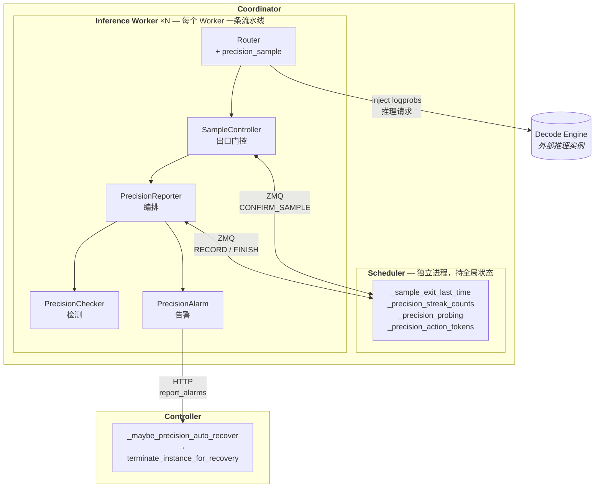

图中三个进程边界：

- **Decode Engine**（外部）：推理实例，Coordinator 向其注入 `logprobs` 参数并从响应中采集 token/logprob 数据。
- **Coordinator** 内部两个进程：**Scheduler**（独立 ZMQ 进程）持有跨 Worker 共享的全局精度状态；**Inference Worker** ×N 各自运行一条完整的采样→检测→告警流水线。Worker 与 Scheduler 之间通过 ZMQ 三类消息通信。
- **Controller**（独立进程）：接收 Coordinator 的 HTTP 告警，按配置执行自动恢复。

**Worker 内部流水线**——上图中 Inference Worker 方框的展开。四个核心组件的调用关系和数据流向：

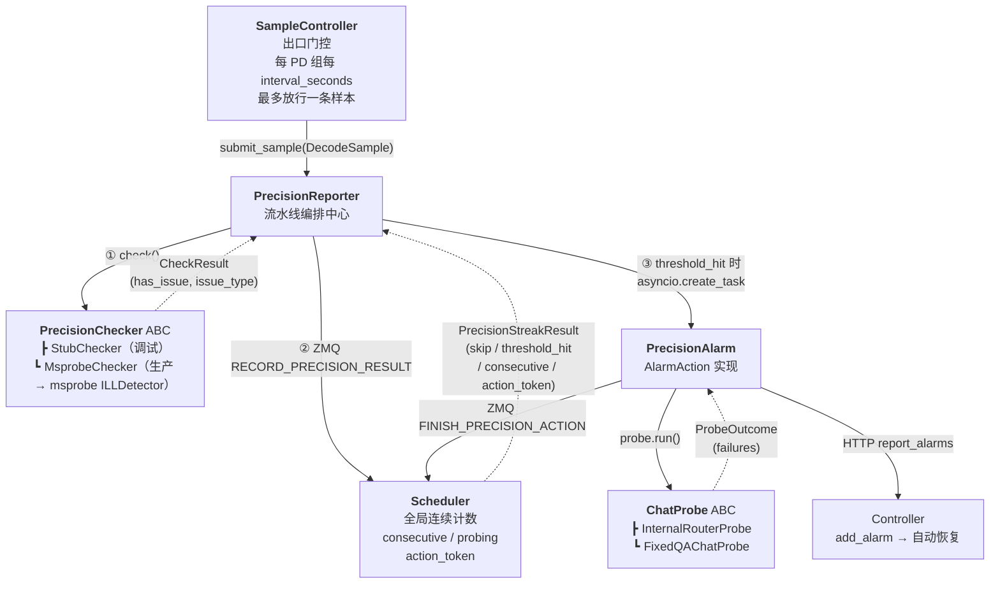

调用链说明：

1. **SampleController** 是入口。Router 每完成一条 Decode 调用 `confirm_sample()`（走 Scheduler ZMQ 出口门控），通过后 `submit_sample(DecodeSample)` 交给 `PrecisionReporter.handle()`。
2. **PrecisionReporter** 是编排中心。`handle()` 内三步顺序执行：`checker.check()` → `_record_streak()`（ZMQ 上报 Scheduler 更新全局连续计数）→ 若 `PrecisionStreakResult.threshold_hit` 则 `asyncio.create_task(_run_action())`。
3. **PrecisionChecker** 是检测器接口。`check()` 是 async 方法，返回 `CheckResult`。MsprobeChecker 内部通过 `asyncio.to_thread` + `threading.Lock` 串行调用 msprobe 的 ILLDetector。
4. **PrecisionAlarm** 是处置动作。`execute(ctx)` 先调用 `ChatProbe.run()` 拨测得到 `ProbeOutcome`，再构造 OM 告警 payload 通过 HTTP 上报 Controller，最后 ZMQ `FINISH_PRECISION_ACTION` 清理 Scheduler 的 probing 状态。

### 4.2 设计原则

1. **Scheduler 管轻状态、Worker 管重逻辑**：检测、拨测、HTTP 上报留在 Worker；仅间隔/计数/probing 在 Scheduler。
2. **全量注入、出口门控**：`precision_check_enabled` 时每条 Decode 带 logprobs；是否进入检测链由 `CONFIRM_SAMPLE` 决定。
3. **Per-PD-group 原子更新**：同一 Key 的 `last_exit`、streak、probing 在 Scheduler 侧同一把锁内更新。
4. **Fail-open**：Scheduler ZMQ 失败时不上报样本/不记 streak；检测异常返回正常。
5. **action_token 防误清理**：`FINISH_PRECISION_ACTION` 必须携带触发时的 token，避免旧 Worker 的完成消息清掉新一轮状态。
6. **异步非阻塞**：拨测与告警在 `asyncio.create_task` 中执行。

### 4.3 Token Sampling 精度检测详细设计

与代码仓 `docs/precision-detection-algorithm.md` 对齐的四层流水线：

| 层 | 组件 | 说明 |
|----|------|------|
| 1 数据采集 | `inject_logprobs` + `response.py` + `sample_builder` | `precision_check_enabled` 时每条 Decode 全量注入并缓存 logprobs/topk |
| 2 采样门控 | `SampleController.confirm_sample` | Scheduler 全局 `_sample_exit_last_time`，每 PD 组每 `interval_seconds` 最多 submit 一条 |
| 3 检测判定 | `MsprobeChecker` + Scheduler streak | 本地 `ILLDetector.run`；全局连续计数达 `precision_issue_threshold` 触发 action |
| 4 探活与恢复 | `InternalRouterProbe` + `PrecisionAlarm` + Controller | 固定 QA 拨测 → OM 告警 → 可选 `terminate_instance_for_recovery` |

```text
Client → Router(inject) → D Engine → Router(cache/strip) → confirm_sample → PrecisionReporter
  → checker → RECORD_PRECISION_RESULT → (threshold) probe+alarm → FINISH_PRECISION_ACTION
  → Controller(_maybe_precision_auto_recover)
```

#### 4.3.1 目录与出口门控（SampleController）

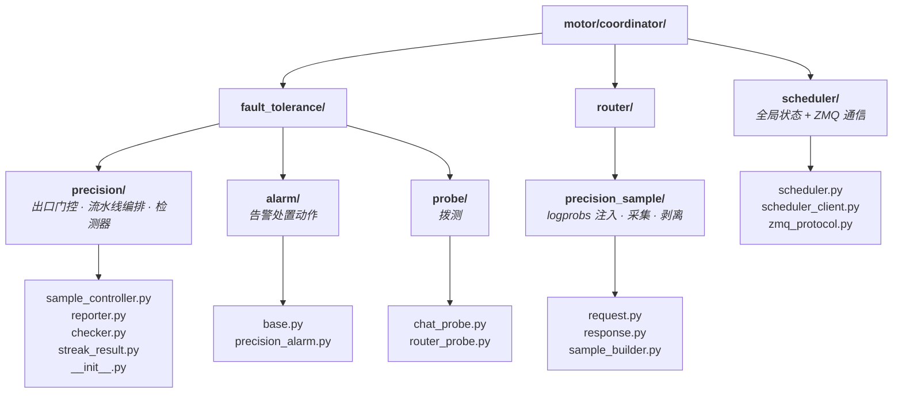

| 目录 | 职责 |
|------|------|
| `fault_tolerance/precision/` | 出口门控（`SampleController`）、精度流水线编排（`PrecisionReporter`）、检测器 ABC 与实现（`PrecisionChecker` / `StubChecker` / `MsprobeChecker`）、Scheduler 返回结构（`PrecisionStreakResult`）。工厂函数 `build_precision_reporter()` 在此装配全链路。 |
| `fault_tolerance/alarm/` | 处置动作抽象（`AlarmAction` ABC + `AlarmContext`）+ 精度告警实现（`PrecisionAlarm`：拨测→构造告警→上报 Controller）。 |
| `fault_tolerance/probe/` | 拨测抽象（`ChatProbe` ABC）+ 两个实现：`InternalRouterProbe`（生产，走 Router 管线 pin PD 组）、`FixedQAChatProbe`（测试/过渡，HTTP 直连 D 实例）。 |
| `router/precision_sample/` | 数据面：`inject_logprobs()` 全量注入、响应中缓存 token_ids/logprobs/topk_logprobs、转发客户端前 strip 多余字段、构造 `DecodeSample`。 |
| `scheduler/` | `Scheduler` 单例持有四张全局表（`_sample_exit_last_time` / `_precision_streak_counts` / `_precision_probing` / `_precision_action_tokens`）；`AsyncSchedulerClient` 封装 ZMQ 三类请求；`zmq_protocol.py` 定义消息类型枚举。 |

`precision_check_enabled=True` 时 Router 对每条 Decode 调用 `inject_logprobs`；Decode 完成后调用 `SampleController.confirm_sample()` → 仅 `confirmed=True` 时 `submit_sample(DecodeSample)` 进入 `PrecisionReporter.handle()`。

#### 4.3.2 跨 Worker 精度流水线（Scheduler 全局状态）

主流程如下（与实现一致）：

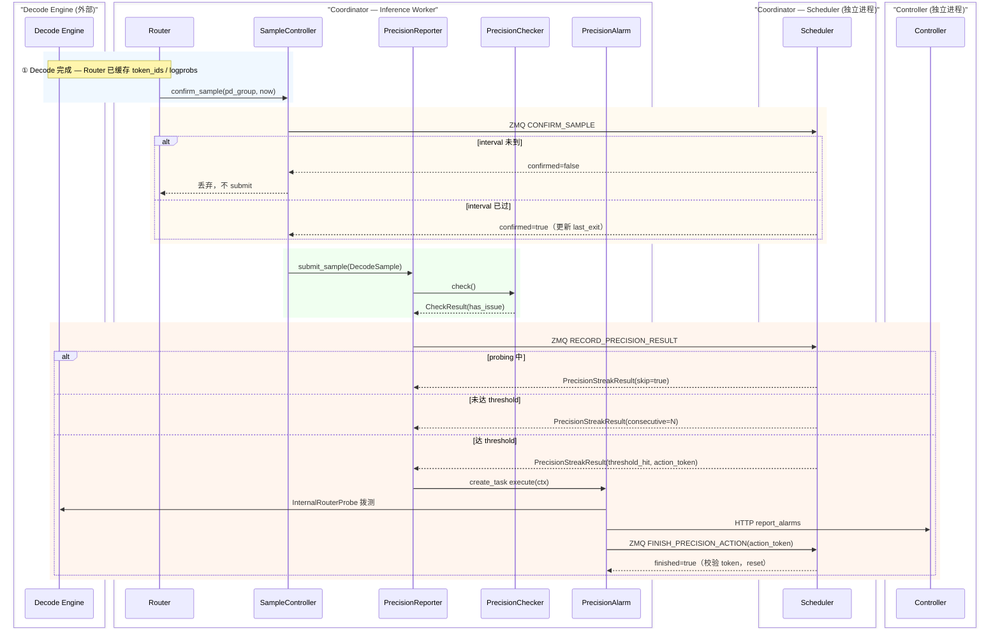

1. **Decode 完成**：Router 已从响应缓存 `token_ids` / `logprobs`（`precision_sample/response.py` + recompute token cache）。触发 `SampleController.confirm_sample(pd_group_key, now)`。
2. **CONFIRM_SAMPLE**：Worker 将 `pd_group`、`now`、`interval_seconds` 发给 Scheduler；Scheduler 在锁内比较 `now - last_exit >= interval`，通过则写入 `last_exit` 并返回 `confirmed=true`。Scheduler 方法签名：`confirm_sample_exit(p_instance_id, d_instance_id, now, interval_seconds) -> bool`。
3. **仅 confirmed 样本进入检测**：避免多 Worker 在短窗口内重复 submit（全局一本 `last_exit` 账）。`submit_sample(DecodeSample)` → `PrecisionReporter.handle(sample)`。
4. **检测在 Worker**：`checker.check()`（`StubChecker` / `MsprobeChecker`）返回 `CheckResult(has_issue, issue_type, ...)`，不迁入 Scheduler，避免大 payload 与阻塞调度进程。
5. **RECORD_PRECISION_RESULT**：`PrecisionReporter._record_streak()` 通过 `scheduler_client.record_precision_result(key, has_issue, threshold)` 上报；Scheduler 在同一 Key 锁内：若 `probing` 则 `skip`；若 `has_issue` 则 `consecutive++` 否则清零；达 `precision_issue_threshold` 时设 `probing=true` 并生成 `action_token`（`uuid.uuid4()`）。返回 `PrecisionStreakResult(skip, threshold_hit, consecutive, action_token)`。
6. **阈值触发后仅当前 Worker 执行 action**：`asyncio.create_task` 跑 `_run_action()` → `PrecisionAlarm.execute()` → 拨测+告警；其他 Worker 后续样本会得到 `skip=true`。
7. **FINISH_PRECISION_ACTION**：action 结束后 Worker 带 `action_token` 请求 `scheduler_client.finish_precision_action(key, action_token)`；Scheduler 校验 token，不匹配则拒绝清理（防止并发 Worker 的旧完成消息误清新一轮状态）。本地 fallback（`scheduler_client is None`，仅单元测试）在 lock 内直接重置 `_local_probing` 和 `_local_counter`。
8. **RPC 频率**：每条 Decode 一次 `CONFIRM_SAMPLE`；仅 confirmed 样本一次 `RECORD_*`；仅触发告警后一次 `FINISH_*`。相对全量 logprobs 开销可忽略。
9. **Stub 联调注意**：`StubChecker` 模块级序列仍 per-process；生产 `MsprobeChecker` 无此问题。若要多 Worker 联调 Stub 行为一致，需固定 `StubChecker(results=[...])` 或单 Worker。
10. **拨测**：`InternalRouterProbe` 走完整 Router + `SchedulingConstraint.for_precision_probe()` pin PD 组；`sampling_manager=None` 防止拨测再次进入采样链。`FixedQAChatProbe` 是旧直连 D HTTP 实现，仅保留作测试。

**Scheduler 侧状态表（有效范围：仅 Scheduler 进程）**

| 字段 | 含义 |
|------|------|
| `_sample_exit_last_time[key]` | 上次允许 submit 的时间戳 |
| `_precision_streak_counts[key]` | 当前连续异常次数 |
| `_precision_probing[key]` | 是否正在拨测/告警 |
| `_precision_action_tokens[key]` | 本轮 action 的 UUID，供 FINISH 校验 |

#### 4.3.3 推理异常检测（PrecisionChecker 体系）

检测器通过 `PrecisionChecker` ABC 接口接入。`build_precision_reporter()` 按优先级选择 checker：

1. 显式传入的 `checker=` 参数（测试用）
2. `token_sampling_config.precision_debug_stub=True` → `StubChecker`
3. 默认（生产）→ `MsprobeChecker`

**StubChecker** 消费模块级 `_PRECISION_DEBUG_RESULTS` 列表（或构造时注入的 `results` 列表）按顺序返回预设 bool；耗尽后 fail-open 返回 `False`。

**MsprobeChecker** 是生产检测器，内部调用 msprobe 包的 `ILLDetector`。关键约束：首次 `check()` 时延迟 import msprobe（未安装则 `ImportError` 上抛）；`ILLDetector` 实例进程级单例避免反复加载配置；所有 msprobe 调用通过 `threading.Lock` 串行化（ILLDetector 内部状态非线程安全）并通过 `asyncio.to_thread` 放入线程池执行；上游未采集 `topk_logprobs` 时 `_build_topk_fallback()` 用 token_ids + logprobs 构造降级数据。

**`logprobs_count` 与可检测类型**：

| `logprobs_count` | 可检测异常 |
|------------------|-----------|
| `1` | 大段重复（repetition） |
| `>= 3` | 上述 + 乱码（garbled） |
| `>= 5` | 上述 + 生僻字（rare character，需多 key top-k） |

**ILLDetector 检测流程**（msprobe 包内部算法）：

1. **入口校验**：token 序列长度小于 `window_size` 时直接返回正常，保证算法不处理过短序列。
2. **模型匹配**：通过 `get_tk2cat()` 用最后一个 token_id（EOS token）与 `mtype_config.json` 中预置的模型 EOS token 匹配，确定 token2category 映射表。支持 qwen/glm/deepseek/minimax 系列的模型名正则匹配（`_MODEL_PATTERNS`）。
3. **滑窗遍历**：以 `stride=64`、`window_size=128` 为默认参数逐窗处理，窗间重叠 50%。
4. **rare_code_detector（生僻字/乱码）**：在单个窗口内，先筛选 top-k logprob 的 exp 求和小于 `explogp_sum_thresh`（默认 0.4）的 token 位置；对这些位置统计 top-k token 对应类别数——超过 `category_thresh`（默认 2）则标记为生僻字 `rare_flag=True`。当异常位置比例超过 `window_ratio`（默认 0.2）时，进一步检查 top1 logprob 是否低于 `top1_logp_thresh`（默认 -5）以确认乱码。乱码需连续满足 `window_thresh`（默认 2）个窗口才触发终止。
5. **trajectory_detector（轨迹 N-gram）**：计算窗口内 token 的 N-gram（N=3）的 distinct ratio。当 distinct_n 低于 `distinct_n_thresh`（默认 0.2）且最小 logprob 高于 `logp_thresh`（默认 -0.2）时，判定为重复轨迹。
6. **acf_detector（ACF 自相关）**：对窗口 logprob 序列做归一化 → FFT → 自相关函数计算，寻找 `[min_period, max_period]` 内的最大峰值。当峰值超过 `acf_threshold`（默认 0.65）且存在谐波确认（`[2,3]` 倍周期处峰值 > 阈值 × 0.5）、序列有足够变化时，判定为周期性重复。
7. **repetitions_detector（综合判定）**：ACF 和 N-gram 同时检出时累计 `mutli_window_thresh`（默认 2）计数；单一方法检出时累计 `single_window_thresh`（默认 14）计数。任一累计超过阈值则报告重复异常。
8. **生僻字返回**：所有窗口遍历完毕后，若仅有生僻字标记而无乱码/重复，返回 `ill_type=1`。

检测算法配置文件位于 msprobe 包的 `configs/config.yaml`，模型类型映射位于 `configs/mtype_config.json`，token2category 映射表位于 `token2category/` 目录下按 `{model_type}_{vocab_size}.json` 命名的文件。

#### 4.3.4 拨测（ChatProbe 体系）

当 `PrecisionStreakResult.threshold_hit` 时，`PrecisionReporter` 通过 `asyncio.create_task` 异步启动拨测。拨测的目标是向疑似异常的 D 实例发送固定问答，验证模型是否真的在产出劣质输出——这是一道**二次确认**防线，避免仅凭 token 统计误触发恢复。

**类体系**：

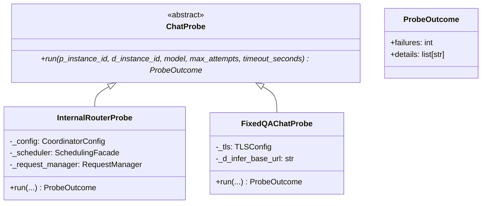

**InternalRouterProbe**（生产用）——走完整 Coordinator 推理管线：

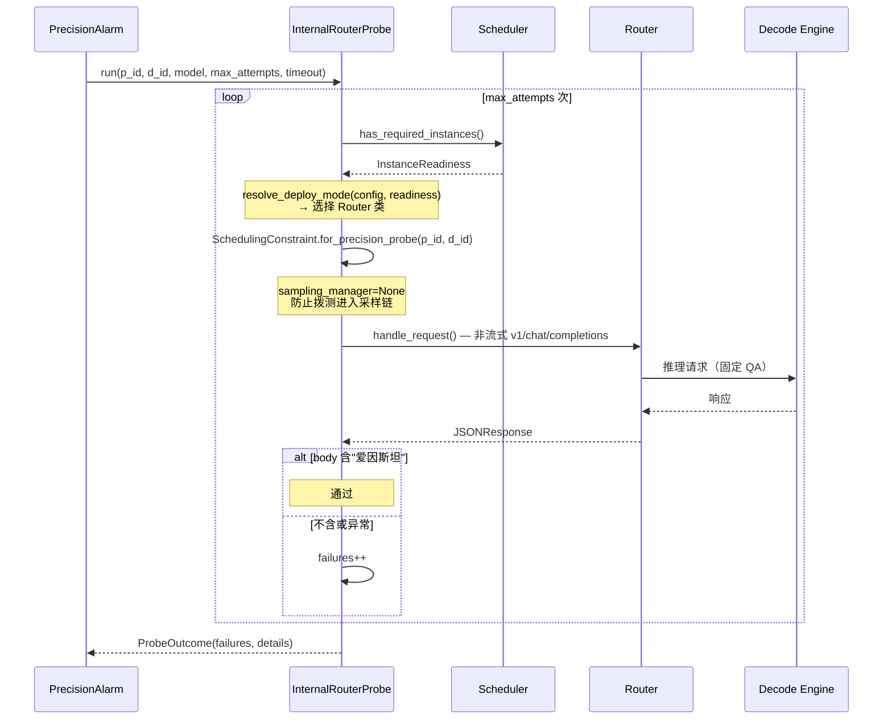

关键设计点：

1. **pin PD 组**：`SchedulingConstraint.for_precision_probe(p_instance_id, d_instance_id)` 确保拨测请求路由到触发告警的同一对 PD 实例。
2. **不走采样链**：`sampling_manager=None` 传给 Router，防止拨测请求自身再次触发 `inject_logprobs` → `confirm_sample` → 嵌套拨测。
3. **适配 deploy_mode**：根据 `deploy_mode` 和当前 `InstanceReadiness` 选择对应 Router（PD_SEPARATE→SeparatePDRouter，CDP_SEPARATE→SeparateCDPRouter 等）。
4. **固定 QA**：问题「相对论的发明人是谁」→ 响应需含「爱因斯坦」，`max_tokens=64`，`stream=False`。

**FixedQAChatProbe**（测试/过渡用）——HTTP 直连 D 实例的 `/v1/chat/completions`：

```
PrecisionAlarm → FixedQAChatProbe → httpx → D Engine HTTP API
```

不经过 Router 和 Scheduler，`d_infer_base_url` 从 `DecodeSample.extra` 传入。仅在 `InternalRouterProbe` 不可用时作为降级方案。

#### 4.3.5 告警上报与恢复闭环

精度异常的处置链路有**两条独立的入口**：Coordinator 侧的自动检测触发（PrecisionAlarm），和 CCAE 北向系统的指令下发。二者最终都汇聚到 Controller 的 `terminate_instance_for_recovery`。

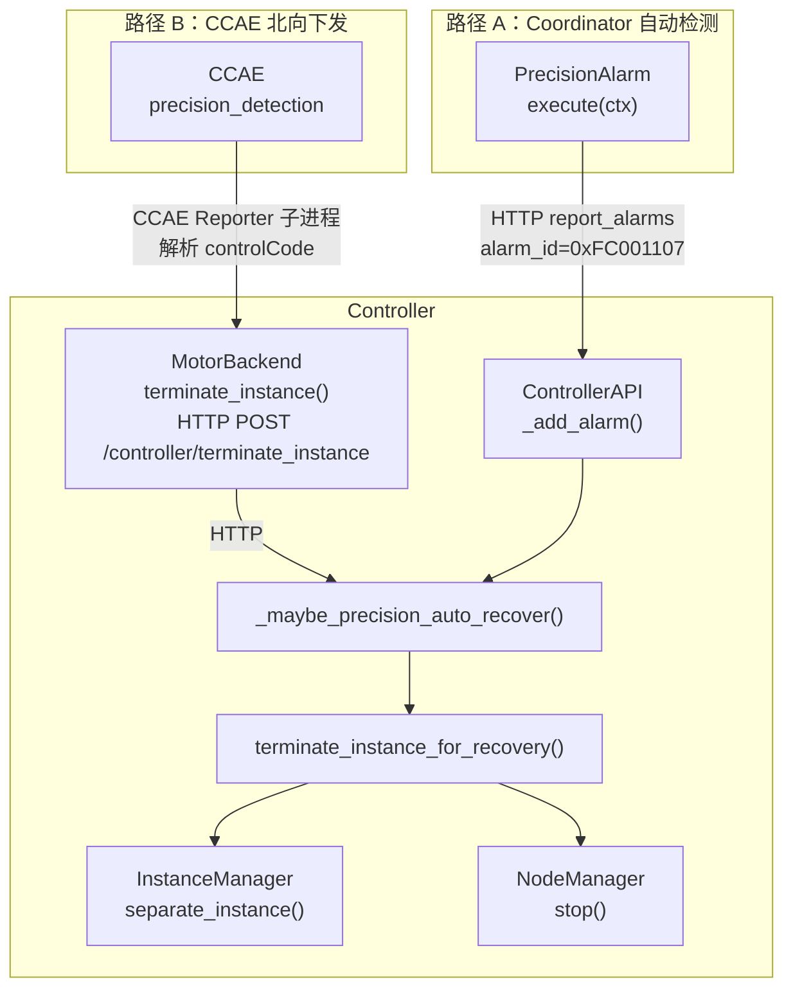

**告警 payload**（`motor/common/alarm/precision_issue_alarm.build_precision_issue_alarm` 构造）：

| 字段 | 值 | 说明 |
|------|-----|------|
| alarm_id | `0xFC001107` | 精度问题专用告警 ID |
| alarm_name | `精度异常告警` | 告警名 |
| severity | `MAJOR` | 严重级别 |
| event_type | `PROCESSING_ERROR` | 事件类型 |
| instance_id | D 实例 ID（str） | 受影响实例（主恢复对象） |
| p_instance_id | P 实例 ID 或空 | PD 分离时携带，同时终止 P |
| additional_information | `precision_issue_count=N, probe_failure_count=M, p_instance_id=X, d_instance_id=Y` | 补充信息 |

##### 路径 A：Coordinator 自动检测 → Controller 恢复

`PrecisionAlarm.execute()` 在拨测完成后：

1. 调用 `build_precision_issue_alarm()` 构造告警 payload。
2. `ControllerApiClient.report_alarms(payload)` → HTTP POST `/observability/add_alarm` 到 Controller。
3. `PrecisionReporter._run_action()` 的 `finally` 块中 ZMQ `FINISH_PRECISION_ACTION(action_token)` 清理 Scheduler 的 `probing` 和 `consecutive`。

Controller 侧 `_maybe_precision_auto_recover(record)`（**不依赖** OM observability 是否开启）：

1. 检查 `record.alarm_id == PRECISION_ISSUE_ALARM_ID` 且 `precision_auto_recovery_enabled=True`（Controller 配置项，默认 `false`）。
2. 解析 `record.instance_id` → D 实例 ID，调用 `terminate_instance_for_recovery(d_id, "precision_alarm")`。
3. 若 `record.p_instance_id` 非空，追加 `terminate_instance_for_recovery(p_id, "precision_alarm")`。

`terminate_instance_for_recovery` 实现（`motor/controller/core/recovery_service.py`）：

1. `InstanceManager.separate_instance(instance_id)` —— 从调度池隔离。
2. 遍历实例的 node manager 列表，`NodeManagerApiClient.stop(node_mgr)` —— 逐个停服。
3. 全部成功返回 `True`；任一步失败返回 `False`（仅记日志，不阻塞告警 HTTP 200 响应）。

##### 路径 B：CCAE 北向指令 → Controller 恢复

CCAE Reporter 位于 `examples/features/observability/ccae_reporter/reporters/ccae_reporter.py`（独立子进程），周期性轮询 CCAE `/rest/ccaeommgmt/v1/managers/mindie/precisioncontrol` 端点。

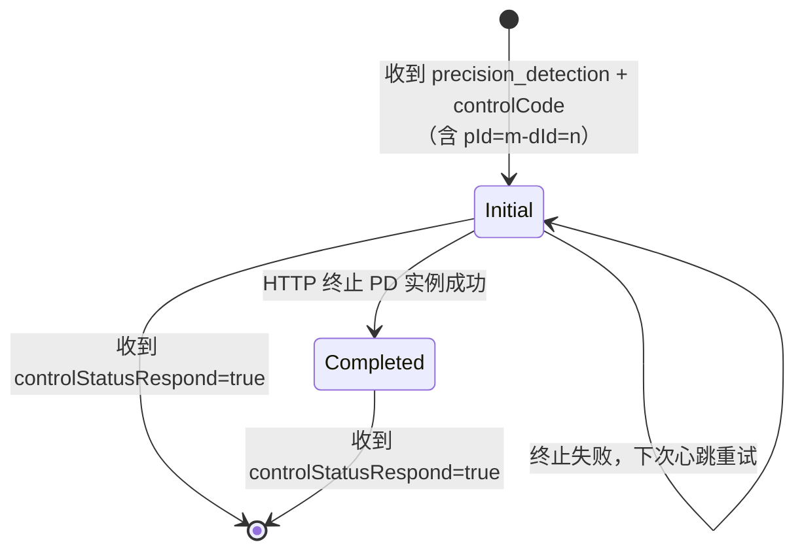

1. **触发条件**：`identity == "Controller"` 且 backend 存活时执行。
2. **controlCode 解析**：格式 `...-pId=m-dId=n`，从中解析 p_id 和 d_id。
3. **终止走 HTTP**：ccae_reporter 是独立子进程，`InstanceManager` 为进程内单例——不能直接 `import terminate_instance_for_recovery`（会查空表）。正确做法是调 `MotorBackend.terminate_instance()` → HTTP `POST /controller/terminate_instance` 落到 Controller 主进程。
4. **状态上报**：成功 → `Completed`，失败保持 `Initial`（下次心跳重试）。CCAE 通过 `controlStatusRespond=true` 确认后 task 删除。
5. **重试**：CCAE 对 `Initial` 状态 task 重新下发同一 `controlCode` 时，再次执行终止。

`switchControl` 和 `immediateDelivery` 字段已存储但运行时行为待 Phase 2 实现。

#### 4.3.6 Stream 处理的 Token 缓存与清理

采样数据采集嵌入在请求处理路径中，对客户端透明。流式和非流式路径各有独立的采集点。

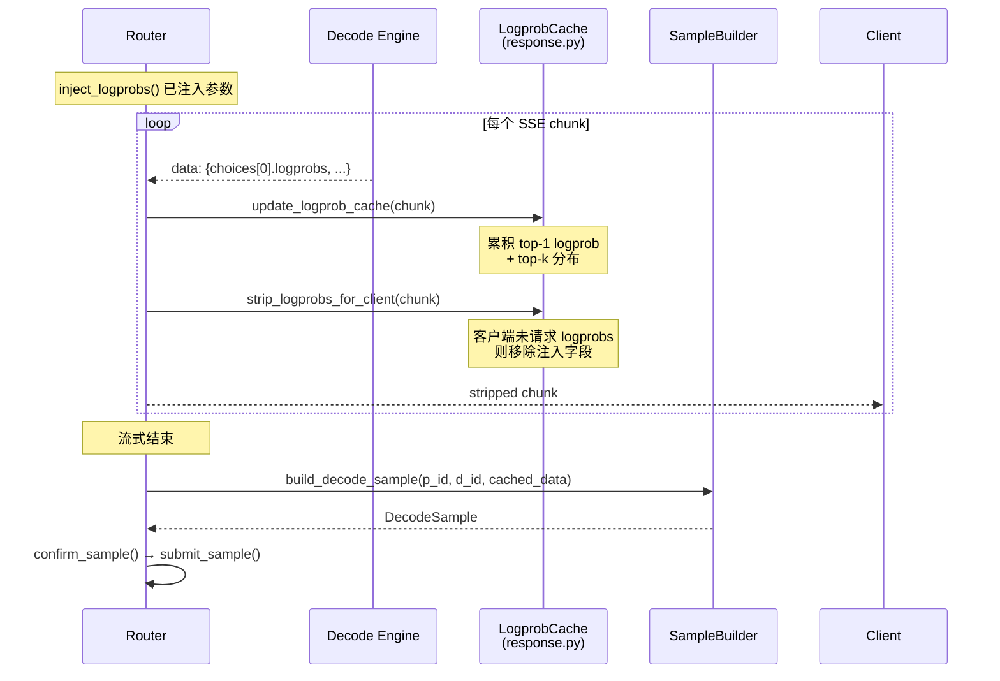

| 能力 | 文件 | 说明 |
|------|------|------|
| `update_token_id_cache()` | `recompute/stream.py` | 从 SSE chunk 累积 `prompt_token_ids` 和 `choices[0].token_ids` |
| `process_stream_chunk(..., cache_token_ids)` | 同上 | 新增 `cache_token_ids` 参数：`recompute_enabled=false` 纯采样场景下仍走 token_id 收集，但不执行 recompute |
| `update_logprob_cache()` | `precision_sample/response.py` | 从 chunk 提取每个 output token 的 top-1 logprob 和 top-k `logprobs` 字典；兼容 Chat completion（`content[*].logprob`）和 Text completion（`token_logprobs[*]`）两种格式；当 chunk 不含 logprobs 时用 top token_id 构造 fallback token |
| `strip_logprobs_for_client()` | 同上 | 客户端原始请求未指定 `logprobs` 时，从 chunk JSON 中移除注入的 logprobs 字段再转发 |
| `build_decode_sample()` | `precision_sample/sample_builder.py` | 流式结束后将缓存的 prompt token_ids、output token_ids、logprobs、topk_logprobs 组装为 `DecodeSample` |

非流式路径在 `_fetch_nonstream_decode_body`（PD 分离）和 `_generate_response`（CDP）中收集完整响应 body 后直接构造 `DecodeSample` 并 submit。

#### 4.3.7 核心类关系

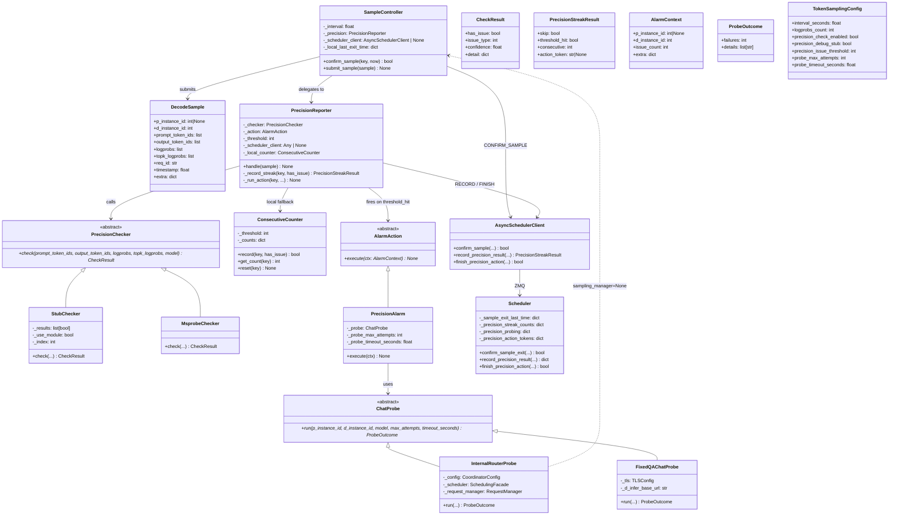

1. **SampleController** 是整个精度采样子系统的入口，持有 `PrecisionReporter` 引用。`confirm_sample()` 通过 `AsyncSchedulerClient` 走 ZMQ `CONFIRM_SAMPLE` 实现跨 Worker 出口门控；`submit_sample(DecodeSample)` 将采集数据交给 `PrecisionReporter.handle()`。当 `scheduler_client` 为 `None` 时（仅单元测试），降级为本地 `asyncio.Lock`。
2. **DecodeSample** 是纯数据载体（dataclass），在 Router 层构造，经 `SampleController` 传递给 `PrecisionReporter`。`topk_logprobs` 为每个 output token 位置的 top-k logprob 字典（`logprobs_count == 1` 时为单 key 字典），供 `MsprobeChecker` 使用。
3. **PrecisionChecker** 为 ABC，`check()` 方法为 `async`，返回 `CheckResult`。两个实现：`StubChecker`（顺序消费 bool 列表）和 `MsprobeChecker`（生产，内部调用 msprobe 包的 ILLDetector）。
4. **PrecisionReporter** 编排检测→全局计数→处置的完整流水线。`_record_streak()` 通过 Scheduler ZMQ（或本地 `ConsecutiveCounter` fallback）原子更新全局连续计数，返回 `PrecisionStreakResult`。阈值触发后在独立 Task 中执行 `_run_action()` → `PrecisionAlarm.execute()`。
5. **PrecisionStreakResult** 是 Scheduler 返回的不可变 dataclass，承载 `skip`（probing 中则跳过）、`threshold_hit`、`consecutive`（当前连续次数）、`action_token`（阈值触发时生成的 UUID）。
6. **AlarmAction** 为处置动作的 ABC，`AlarmContext` 携带 PD 组信息、异常次数和扩展字段。`PrecisionAlarm` 是唯一实现：拨测（`ChatProbe.run()`）→ 构造告警 payload → 上报 Controller。
7. **ChatProbe** 为拨测的 ABC，`ProbeOutcome` 记录失败次数和详情。`InternalRouterProbe` 走完整 Router + Scheduler 管线，用 `SchedulingConstraint.for_precision_probe()` pin PD 组；`FixedQAChatProbe` 是兼容旧实现的 HTTP 直连路径。
8. **Scheduler** 持有四张全局表（`_sample_exit_last_time`、`_precision_streak_counts`、`_precision_probing`、`_precision_action_tokens`），均在 `_sample_exit_lock(key)` 锁内原子更新。`AsyncSchedulerClient` 封装 ZMQ 通信，传输失败时返回 `None`（Worker 侧 skip 本条样本）。

### 4.4 用例设计

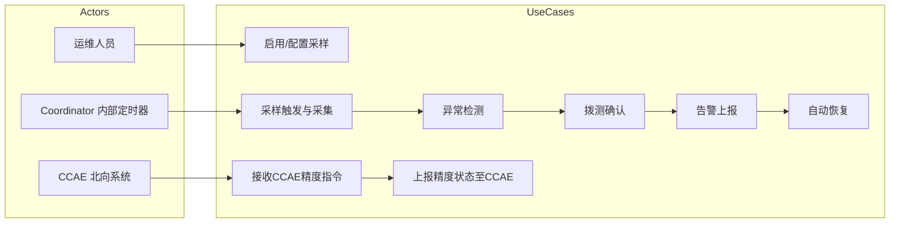

1. **启用/配置采样**：运维人员通过 JSON 配置文件设置 `token_sampling_config` 各参数，Coordinator 启动时加载。
2. **采样触发与采集**：开启后每条 Decode 全量注入 logprobs；窗口到期后 `confirm_sample` 通过的首条请求 submit 样本进入检测链。
3. **异常检测**：`MsprobeChecker`（内部调用 msprobe 包的 ILLDetector）对采样数据的 token 序列执行滑窗分析，判定是否异常。
4. **拨测确认**：连续多次采样异常后，`PrecisionReporter` → `PrecisionAlarm` 触发拨测（`InternalRouterProbe`）二次确认。
5. **告警上报**：确认异常后生成 OM 告警（alarm_id=0xFC001107），上报至 Controller。
6. **自动恢复**：Controller 接收精度告警，根据配置终止 D（及告警中的 P，若有）。
7. **接收 CCAE 精度指令**：CCAE Reporter 周期性轮询 CCAE 端点，接收 `precision_detection` 指令。
8. **上报精度状态至 CCAE**：`controlStatus` 反映实际终止结果——终止成功上报 `Completed`，未成功保持 `Initial` 等待重试。CCAE 通过 `controlStatusRespond=true` 确认后 task 删除。

## 5 Function Safety设计

### 5.1 FMEA（失效模式和影响分析）

| 失效模式 | 可能原因 | 局部影响 | 最终影响 | 检测/缓解措施 | 严重度 |
|----------|---------|---------|---------|-------------|--------|
| 采样未触发 | `precision_check_enabled=false`、Scheduler 未连接导致 `sampling_manager=None`、或间隔过大 | 无法 submit 样本 | 精度异常漏检 | 启动日志、确认 Scheduler ZMQ、调小 `interval_seconds` | 中 |
| 检测误判（假阳性） | 阈值过于敏感、模型正常低频词被误判 | 触发不必要的拨测 | 实例被误终止 | 连续多次判定阈值（`precision_issue_threshold=10`）、拨测二次确认 | 高 |
| 检测漏判（假阴性） | 阈值过于宽松、采样窗口未命中异常段 | 异常未被发现 | 用户持续收到劣质输出 | 运维监控告警频率、可调阈值 | 中 |
| token2category 映射缺失 | 新模型类型无预设映射文件 | 生僻字检测降级为仅乱码检测 | 生僻字类型异常漏检 | 日志记录降级行为、后续补充映射文件 | 低 |
| msprobe 未安装 | MsprobeChecker 首次 `check()` import 失败 | `ImportError` 向上抛出 | 精度检测不可用（submit 后 handle 失败） | 部署安装 msprobe；联调设 `precision_debug_stub=true` 或测试注入 `StubChecker` | 中 |
| msprobe ILLDetector 线程竞态 | 多 PD 组并发调用 `detector.run` 共享可变状态 | 检测结果随机错误 | 可能误触发或漏检 | `_msprobe_lock`（`threading.Lock`）进程级串行化所有 msprobe 调用 | 中 |
| topk_logprobs 缺失 | 上游流式/非流式路径未采集 `topk_logprobs` | MsprobeChecker 无法调用 ILLDetector | 本条样本 fail-open | `_build_topk_fallback` 用 `token_ids + logprobs` 构造单 key topk；长度不匹配则 fail-open 返回 `False` | 低 |
| 拨测请求失败 | D 实例不可达、Router 异常、TLS 配置异常、超时 | 拨测失败次数被记录 | 告警仍可生成（carry 失败次数） | `probe_max_attempts` 重试、`InternalRouterProbe` 内 catch 所有异常不向上传播 | 低 |
| 告警上报失败 | Controller API 不可达 | 告警丢失 | 精度异常无人感知 | 日志记录失败、`ControllerApiClient` 异常处理 | 中 |
| 自动恢复失败 | `InstanceManager` 中实例不存在、`NodeManager` 停止失败 | 问题实例继续服务 | 持续产出劣质输出 | 日志记录失败原因、返回 False 让调用方感知 | 高 |
| Scheduler ZMQ 传输失败 | Scheduler 进程不可达或 ZMQ 超时 | `AsyncSchedulerClient` 返回 `None`，Worker skip 本条样本 | 本条精度事件不被记录 | fail-open，不触发误恢复；ZMQ 重连由 client 层处理 | 中 |
| `action_token` 不匹配 | 旧 Worker 的 `FINISH_PRECISION_ACTION` 在新一轮 probing 启动后到达 | Scheduler 拒绝清理 | 旧消息不影响新状态 | `uuid.uuid4()` 生成唯一 token，Scheduler 侧 `finish_precision_action` 校验 | 低 |
| `StubChecker` 耗尽后 fail-open | 注入的 `results` 列表或模块级 `_PRECISION_DEBUG_RESULTS` 耗尽 | 固定返回 `CheckResult(has_issue=False)` | 精度检测静默失效 | 日志记录耗尽状态、生产环境使用 `MsprobeChecker` | 高 |

## 6 特性非功能性质量属性相关设计

### 6.1 可测试性

- `DecodeSample` 和 `_PrecisionControlTask` 均为 dataclass，可直接构造单元测试 fixture。
- `PrecisionChecker`（ABC）和 `ChatProbe`（ABC）均为可独立实例化的接口，支持 mock 注入。`SampleController` 和 `PrecisionReporter` 接受 `scheduler_client=None` 时自动启用本地 fallback（`ConsecutiveCounter` + local lock），无需启动 Scheduler 进程即可测试。
- `StubChecker` 支持两种模式：构造时注入 `results=[True, False, ...]`（单测用），或 `use_module_debug_sequence=True`（联调用，消费模块级 `_PRECISION_DEBUG_RESULTS` 列表）。
- `reset_stub_debug_sequence(results)` 和 `reset_msprobe_detector()` 提供模块级状态重置，保证测试隔离。
- `PrecisionAlarm` 接受 `ChatProbe` 接口，可通过 mock probe 验证告警上报逻辑。
- 配置项均为 dataclass 默认值，测试时可显式构造任意参数组合。
- 已有测试覆盖：
  - [tests/coordinator/sampling/test_precision_reporter.py](tests/coordinator/sampling/test_precision_reporter.py)：精度上报器单元测试
  - [tests/coordinator/core/test_config.py](tests/coordinator/core/test_config.py)：TokenSamplingConfig 配置校验测试
  - [tests/controller/core/test_recovery_service.py](tests/controller/core/test_recovery_service.py)：恢复服务测试
  - [tests/controller/core/test_controller_config.py](tests/controller/core/test_controller_config.py)：Controller 精度配置测试
  - [tests/coordinator/router/test_recompute_common.py](tests/coordinator/router/test_recompute_common.py)：Stream 处理 token 缓存测试
  - [tests/coordinator/router/test_router_pd_separation.py](tests/coordinator/router/test_router_pd_separation.py) 和 [test_router_cdp_separation.py](tests/coordinator/router/test_router_cdp_separation.py)：Router 采样集成测试
  - [tests/coordinator/sampling/test_msprobe_checker.py](tests/coordinator/sampling/test_msprobe_checker.py)、[test_precision_logprob_cache.py](tests/coordinator/sampling/test_precision_logprob_cache.py)、[test_sample_builder.py](tests/coordinator/sampling/test_sample_builder.py)、[test_precision_e2e_chain.py](tests/coordinator/sampling/test_precision_e2e_chain.py)
  - [tests/coordinator/scheduler/test_confirm_sample_exit.py](tests/coordinator/scheduler/test_confirm_sample_exit.py)、[test_precision_streak_scheduler.py](tests/coordinator/scheduler/test_precision_streak_scheduler.py)

### 6.2 可扩展性

- `PrecisionChecker` 为 ABC，新增检测算法只需实现 `async check()` 方法并注入 `build_precision_reporter(checker=...)`。
- `ChatProbe` 为 ABC，新增拨测方式只需实现 `async run()` 方法并注入 `PrecisionAlarm(probe=...)`。
- `AlarmAction` 为 ABC，新增处置方式（如直接 kill 实例、切换模型版本）只需实现 `execute(ctx)` 并替换 `PrecisionAlarm`。
- `DecodeSample.extra` 为 `dict` 预留字段，可携带额外上下文（如 `model`、`d_infer_base_url`）而不改数据结构。
- `MsprobeChecker` 内部使用的 ILLDetector 的三个子检测器（`rare_code_detector`、`trajectory_detector`、`acf_detector`）为独立方法，可单独替换或组合。
- `checker` 选择链（`build_precision_reporter` 中显式 > debug_stub > `MsprobeChecker`）允许通过配置切换检测实现。
- CCAE 精度指令的 `switchControl` 和 `immediateDelivery` 字段已存储，后续接入运行时控制只需在相关组件中添加条件判断。

### 6.3 性能

- **注入**：`precision_check_enabled=true` 时每条 Decode 均注入 logprobs（引擎侧为主要开销）。
- **送检**：`interval_seconds`（默认 30s）控制每 PD 组 submit 频率；`confirm_sample=false` 时仍有一次 CONFIRM_SAMPLE ZMQ + O(1) 时间戳比较。
- 流式响应的 logprob 收集在 `process_stream_chunk` 中与 token_id 缓存同路径，无额外 JSON 解析开销。
- msprobe ILLDetector 算法复杂度：滑窗 O(n/stride) 个窗口，每窗口 ACF 计算 O(window_size log window_size)（FFT），N-gram 计算 O(window_size)。检测在 `asyncio.to_thread` 中执行（线程池），通过 `_msprobe_lock`（`threading.Lock`）进程级串行化以避免竞态，不阻塞事件循环。
- 拨测仅在精度异常触发时执行，非持续开销。

### 6.4 可靠性

- 采样采集失败不影响请求处理（`SampleController.submit_sample` 内 try-except catch，log warning）。
- 检测算法异常不影响请求处理（`MsprobeChecker.check` fail-open 返回 `CheckResult(has_issue=False)`；`StubChecker` 耗尽后同样 fail-open）。
- Scheduler ZMQ 传输失败时：`confirm_sample` 返回 `false`（不 submit）；`record_precision_result` 返回 `None`（skip 本条 streak/action）。
- `precision_check_enabled=true` 但启动时无 Scheduler 客户端：`sampling_manager=None`，Router 不 submit（fail-open）。
- 拨测/告警在独立 `asyncio.Task` 中执行，Task 异常不传播至主流程。
- Controller 恢复失败仅记录日志，不阻塞告警处理通道。
- Per-group Lock（Scheduler 侧 `_sample_exit_lock`）确保并发安全，无死锁风险（锁仅在同步块内持有，I/O 操作在释放锁后执行）。
- `action_token`（UUID）防止旧 Worker 的 `FINISH_PRECISION_ACTION` 消息误清新一轮 probing 状态。

### 6.5 安全及隐私

本特性不涉及。

### 6.6 可用性

每次采样和检测均为无状态操作，Coordinator/Scheduler 重启后 `_sample_exit_last_time` 与 streak 表清零。自动恢复影响告警中的 D（及 P，若有），多实例部署下不引起全局服务中断。

### 6.7 兼容性

- 新增 `TokenSamplingConfig` 所有字段有默认值，已有配置文件无需修改即可正常运行。
- `precision_check_enabled=false` 时所有精度路径快速返回，完全向后兼容。
- 新增的 `return_token_ids` 注入参数在不支持该参数的旧版引擎上会被忽略（引擎通常忽略未识别参数）。
- Controller `precision_auto_recovery_enabled` 默认 `false`，不改变已有告警处理行为。

### 6.8 资料

本特性涉及的主要配置项说明：

| 配置项 | 默认值 | 说明 |
|-------|--------|------|
| `token_sampling_config.precision_check_enabled` | `false` | **唯一总开关**：采集 + 检测 + 拨测 + 告警；false 时零开销 |
| `token_sampling_config.interval_seconds` | `30.0` | 每 PD 组采样 submit 间隔（秒）；CONFIRM_SAMPLE 门控 |
| `token_sampling_config.logprobs_count` | `1` | top-k 宽度；1=重复，≥3=+乱码，≥5=+生僻字 |
| `token_sampling_config.precision_debug_stub` | `false` | true → `StubChecker`（联调）；false → `MsprobeChecker`（生产） |
| `token_sampling_config.precision_issue_threshold` | `10` | 连续 `has_issue` 次数阈值后触发拨测与告警 |
| `token_sampling_config.probe_max_attempts` | `3` | 拨测次数 |
| `token_sampling_config.probe_timeout_seconds` | `600.0` | 单次拨测超时（秒） |
| `precision_auto_recovery_enabled` | `false` | Controller：收到精度告警后 terminate D（及 P，若告警携带） |

## 7 安全/隐私/韧性设计

### 7.1 安全韧性设计模式应用（可选）

本特性不涉及。

### 7.2 Low Level威胁分析

本特性不涉及。Token 采样数据在 Coordinator 进程内存中处理，不落盘、不外发（告警 payload 仅含统计计数，不含 token 数据）。拨测使用固定问题文本，不含用户信息。

### 7.3 隐私风险分析与设计

本特性不涉及。采集的数据为 token_id（整数）和 logprob（浮点数），无法还原为用户原始文本，不构成隐私数据。

## 8 API特性设计

### 8.1 Scheduler ZMQ — 精度全局状态

三类请求均由 `AsyncSchedulerClient` 发起，Scheduler 进程内 `Scheduler` 单例处理。

#### CONFIRM_SAMPLE（出口门控）

| 项目 | 说明 |
|------|------|
| 用途 | 跨 Worker 判定 PD 组是否可 submit 样本 |
| 请求 data | `p_instance_id`, `d_instance_id`, `now`, `interval_seconds` |
| 响应 data | `confirmed: bool` |

#### RECORD_PRECISION_RESULT（全局连续计数）

| 项目 | 说明 |
|------|------|
| 用途 | 上报一次检测结果，更新 Scheduler 内 `consecutive` / `probing` |
| 请求 data | `p_instance_id`, `d_instance_id`, `has_issue`, `threshold` |
| 响应 data | `skip`, `threshold_hit`, `consecutive`, `action_token`（阈值触发时非空 UUID） |
| 错误契约 | 传输失败时 Worker 返回 `None`，本条样本不触发 action |

#### FINISH_PRECISION_ACTION（拨测/告警收尾）

| 项目 | 说明 |
|------|------|
| 用途 | 校验 `action_token` 后清除 `probing` 并重置 `consecutive` |
| 请求 data | `p_instance_id`, `d_instance_id`, `action_token` |
| 响应 data | `finished: bool`（token 不匹配为 false） |

### 8.2 Coordinator 进程内接口

#### PrecisionReporter.handle(DecodeSample)

| 项目 | 说明 |
|------|------|
| 调用方 | `SampleController.submit_sample` |
| 流程 | 本地 `checker.check()` → `_record_streak()` → 可选 `create_task(_run_action())` → `finish_precision_action` |

**DecodeSample 字段**：`p_instance_id`, `d_instance_id`, `prompt_token_ids`, `output_token_ids`, `logprobs`, `topk_logprobs`, `req_id`, `extra`（含 `model`、`d_infer_base_url`）。

#### build_precision_reporter()

| 项目 | 说明 |
|------|------|
| 用途 | 装配 checker + probe + alarm 的工厂函数 |
| 参数 | `token_sampling_config`, `infer_tls_config`, `config`（CoordinatorConfig）, `scheduler`, `request_manager`, `scheduler_client`, `checker`（显式覆盖） |
| 返回 | `PrecisionReporter` |
| Checker 选择 | `checker=` 显式传入 > `precision_debug_stub=True` → `StubChecker` > 默认 `MsprobeChecker` |
| Probe 选择 | 生产装配 `InternalRouterProbe`（走 Router + SchedulingConstraint pin PD 组） |

### 8.3 Controller API — 精度告警自动处理

| 项目 | 说明 |
|------|------|
| 用途 | 接收告警，当 alarm_id 为精度告警时触发自动恢复 |
| 调用方 | Coordinator（ControllerApiClient.report_alarms） |
| 被调方 | ControllerAPI._add_alarm → _maybe_precision_auto_recover |
| 同步/异步 | 异步 |
| 鉴权 | 继承 Controller API 的 TLS/mTLS 鉴权 |
| 错误契约 | 自动恢复失败仅 log error，不影响告警处理主流程的 HTTP 200 响应 |

**告警 payload 关键字段**（由 `build_precision_issue_alarm` 生成）：

| 字段 | 值 | 说明 |
|------|-----|------|
| alarm_id | `0xFC001107` | 精度问题专用告警 ID |
| alarm_name | `精度异常告警` | 告警名（`motor/common/alarm/precision_issue_alarm.py`） |
| p_instance_id | P 实例 ID（str，可空） | 自动恢复时用于终止 P |
| severity | `MAJOR` | 严重级别 |
| category | `ALARM` | 告警类别 |
| event_type | `PROCESSING_ERROR` | 事件类型 |
| cleared | `NO` | 是否需要清除 |
| clear_category | `AUTO` | 清除方式 |
| instance_id | D 实例 ID（str） | 受影响实例 |
| additional_information | `precision_issue_count=N, probe_failure_count=M, p_instance_id=X, d_instance_id=Y` | 补充信息 |

### 8.4 CCAE 北向 Precision Control API

| 项目 | 说明 |
|------|------|
| 用途 | Controller 向 CCAE 同步精度检测任务状态，接收 CCAE 指令 |
| 调用方 | `examples/.../ccae_reporter.py` — `CCAEReporter.precision_control_periodic()` |
| 被调方 | CCAE `/rest/ccaeommgmt/v1/managers/mindie/precisioncontrol` |
| 同步/异步 | 同步（在线程中运行，1s 周期） |
| 鉴权 | 继承 CCAE Reporter 的 HTTP 鉴权 |
| 错误契约 | 请求失败仅 log error，不影响下个周期重试 |

**请求字段**：

| 字段 | 类型 | 必填 | 说明 |
|------|------|------|------|
| timeStamp | int | 是 | 毫秒时间戳 |
| modelServiceInfo | list[dict] | 是 | 模型服务信息列表 |
| modelServiceInfo[].modelID | str | 是 | 模型 ID（从 model_id_period 获取） |
| modelServiceInfo[].modelName | str | 是 | 模型名（从 MODEL_NAME 环境变量获取） |
| modelServiceInfo[].controlCode | str | 否 | CCAE 下发的 controlCode |
| modelServiceInfo[].controlStatus | str | 否 | 当前状态：Initial / Completed |

**响应字段**（`reqList` 中的每项）：

| 字段 | 类型 | 说明 |
|------|------|------|
| modelID | str | 模型 ID |
| precisionCommand | str | 精度指令，当前仅处理 `precision_detection` |
| controlCode | str | CCAE 分配的控制码 |
| controlStatusRespond | bool | true 时删除本地任务 |
| inferencePrecisionControl.switchControl | str | 后续 Phase 的控制开关（当前已存储未执行） |
| inferencePrecisionControl.immediateDelivery | bool | 后续 Phase 的即时下发标志（当前已存储未执行） |

## 9 词汇表

| 术语 | 定义 |
|------|------|
| Token/Decode Sampling | 按时间间隔从推理请求中采集完整 token_ids、logprobs、topk_logprobs 的过程 |
| DecodeSample | 单条采样数据 dataclass，含 `prompt_token_ids`、`output_token_ids`、`logprobs`、`topk_logprobs` |
| PD 实例组 / PDGroupKey | 以 `(p_instance_id, d_instance_id)` 为 Key 标识的一个 Prefill+Decode 实例组合 |
| SampleController | 出口门控控制器，通过 Scheduler ZMQ 实现跨 Worker 采样节奏协调 |
| PrecisionReporter | 编排 check → record_streak → probe+alarm → finish 流水线的核心组件 |
| PrecisionChecker（ABC） | 检测器抽象基类，`async check()` 返回 `CheckResult`。实现：`StubChecker`、`MsprobeChecker` |
| MsprobeChecker | 生产检测器，调用 msprobe 包的 `ILLDetector`；延迟初始化 + 进程级单例 + 线程串行化 |
| StubChecker | 调试用检测器，顺序消费 `results` 列表或模块级 `_PRECISION_DEBUG_RESULTS`，耗尽后 fail-open |
| CheckResult | 检测结果 dataclass：`has_issue`、`issue_type`、`confidence`、`detail` |
| PrecisionStreakResult | Scheduler 返回的不可变 dataclass：`skip`、`threshold_hit`、`consecutive`、`action_token` |
| ConsecutiveCounter | 本地连续计数器（`ConsecutiveCounter`），`PrecisionReporter` 在无 `scheduler_client` 时的 fallback |
| AlarmAction（ABC） | 处置动作抽象基类，`execute(ctx: AlarmContext)` |
| AlarmContext | 处置上下文 dataclass：`p_instance_id`、`d_instance_id`、`issue_count`、`extra` |
| PrecisionAlarm | 精度告警处置实现：`InternalRouterProbe` 拨测 → `build_precision_issue_alarm` → 上报 Controller |
| ChatProbe（ABC） | 拨测抽象基类，`run()` 返回 `ProbeOutcome(failures, details)` |
| InternalRouterProbe | 生产拨测实现，走完整 Router + Scheduler 管线，`SchedulingConstraint.for_precision_probe()` pin PD 组 |
| FixedQAChatProbe | HTTP 直连 D 实例的拨测实现（旧代码，测试/过渡用） |
| ProbeOutcome | 拨测结果 dataclass：`failures`（失败次数）、`details`（每尝试的描述） |
| 生僻字（Rare Character） | 模型推理输出的 token 对应的类别数过多、logprob 偏低，可能表示模型在生成不常见的字符 |
| 乱码（Garbled） | 连续多个 token 的 top1 logprob 极低且比例超过阈值，通常为模型输出不可读字符 |
| 大段重复（Repetitions） | 模型输出中反复出现相同的 token 模式，通过 N-gram distinct ratio 和 ACF 自相关检测 |
| 滑窗（Sliding Window） | 以固定 stride 步长移动的定长窗口，对长 token 序列分段分析 |
| ACF（Autocorrelation Function） | 自相关函数，通过 FFT 计算序列的周期性，检测重复模式 |
| N-gram Trajectory | 对 token 序列取连续 N 个 token 作为单元，统计唯一单元比例来检测重复 |
| 拨测（Probe） | 向 D 实例发送已知问题-答案对的 HTTP 请求，验证模型实际输出质量 |
| Precision Issue | 经连续采样检测判定为异常的推理输出质量事件 |
| Fail-open | 检测组件异常或不可用时默认返回"正常"，避免误触发恢复操作 |
| OM（Operation & Maintenance） | 运维管理告警系统 |
| CCAE | 北向云管理平台，负责集中化运维管理 |
| Per-PD-group Lock | Scheduler 内针对每个 PD 组的 `asyncio.Lock`（`_sample_exit_lock`），保护 `last_exit`、`consecutive`、`probing`、`action_token` 的原子更新 |
| action_token | 阈值触发时 Scheduler 生成的 `uuid.uuid4()`，`FINISH_PRECISION_ACTION` 时必须匹配方可清理全局状态 |
| CONFIRM_SAMPLE | 出口门控 ZMQ 请求，Worker → Scheduler，方法 `confirm_sample_exit()` |
| RECORD_PRECISION_RESULT | 全局连续计数 ZMQ 请求，Worker → Scheduler，方法 `record_precision_result()` |
| FINISH_PRECISION_ACTION | 拨测/告警完成后清理全局状态的 ZMQ 请求，Worker → Scheduler，方法 `finish_precision_action()` |
| NodeManager | 每个推理实例对应的管理代理，负责实例的启停控制 |
| Instance Separation | 将实例从调度池中隔离，使其不接收新请求 |

### 9.1 待确认与修订建议

**已与代码同步（2026-06）**：总开关 `precision_check_enabled`、Always-On 注入 + 出口门控、Controller/CCAE 终止 D+P、`logprobs_count` 分级、告警名中文。算法细节以代码仓 `docs/precision-detection-algorithm.md` 为准。

待确认：
- CCAE 精度指令中的 `switchControl` 和 `immediateDelivery` 的运行时生效逻辑待 Phase 2 实现。
- token2category 映射文件的生成流程和更新机制待与模型团队对齐。
- 告警 ID `0xFC001107` 是否已在 OM 系统中正式注册。
